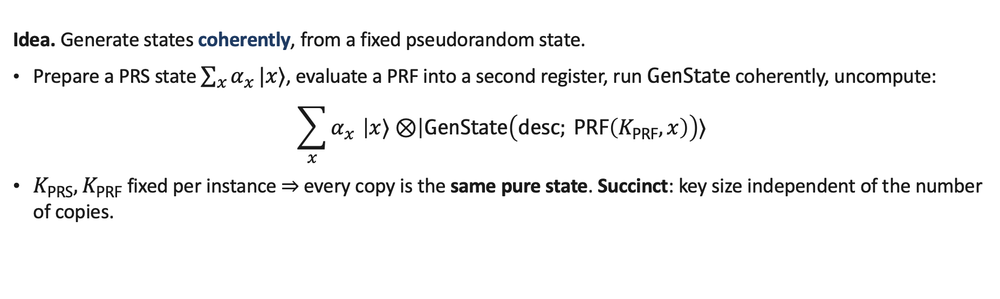
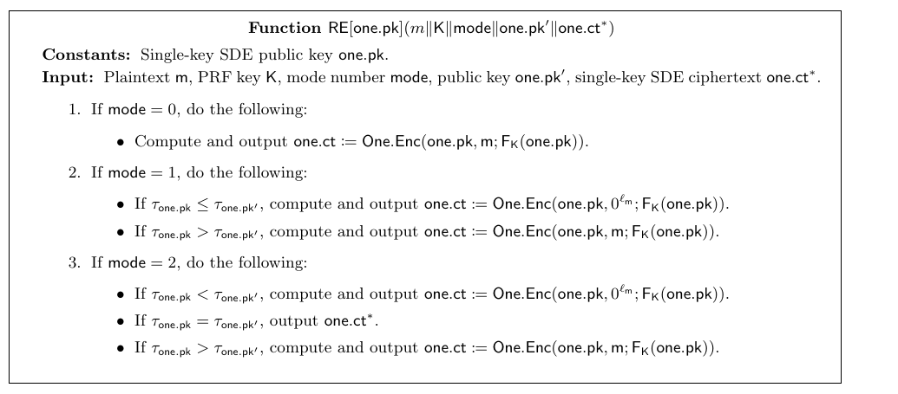

# Unclonable cryptography 的 multi-copy security：从 collusion-resistance 到"完全相同的多份拷贝"

> **Multi-Copy Security in Quantum Cryptography and More**（ePrint 版标题：*Multi-Copy Security in Unclonable Cryptography*）
> Alper Çakan (CMU), Vipul Goyal (NTT Research & CMU), Fuyuki Kitagawa, Ryo Nishimaki, Takashi Yamakawa (NTT Social Informatics Laboratories)
> CRYPTO 2026 · Quantum Cryptography I (2026-08-19) · **L1 入门导读**
> [ePrint 2025/1921](https://eprint.iacr.org/2025/1921) · [Slides](https://iacr.org/submit/files/slides/2026/crypto/crypto2026/145/145_slides.pptx)
>
> 注：会议 slides 比 ePrint 2025/1921 多出若干结果（quantum pigeonhole lemma、collusion-resistant O2H、QROM 下 indistinguishability 安全的 multi-copy UE 等），本文以 ePrint 版为准，只在末尾提一句。

## §1 研究什么

Unclonable cryptography 里的标准安全性是 $1\to2$：敌手拿到**一份**量子态，不能造出两份。本文关心的是 $q\to q+1$，而且区分两种"多份"：

- **Collusion-resistance**：敌手拿到 $q$ 个**独立**运行生成算法得到的态（同一个 mixed state 的 $q$ 个样本）。
- **Multi-copy security**：敌手拿到同一个 **pure state 的 $q$ 份精确拷贝** $|\phi\rangle^{\otimes q}$，$q$ 是任意多项式（unbounded）。

后者严格更强：同一个 pure state 的拷贝可以用 SWAP test 互相比对（secure key leasing 里可以核对归还的 key），完全相同的 banknote 天然带来匿名性（quantum coins，Mosca–Stebila 2010），而且"拷贝"这个词在概念上本来就该指完全相同的物理对象。

要让"同一个 pure state 的多份拷贝"有意义，生成算法必须满足：

> **定义 6（classically determined outputs）**：一个量子算法 $\mathsf{GenState}$ 取 classical 输入 $z$ 与 classical randomness $\mathsf{rand}\in\{0,1\}^{r}$，输出一个**由 $(z,\mathsf{rand})$ 完全确定的 pure state** $|\phi_{z,\mathsf{rand}}\rangle$。

现有的大多数构造（subspace-state 的 quantum money、CLLZ21 型 single-decryptor encryption 等）都满足这一点：随机性只用来选 subspace 或 key，态本身由它们决定。

本文用到的两个标准原语：

- **PRF**：$F(K,\cdot):\{0,1\}^{\lambda}\to\{0,1\}^{r}$，QPT 区分者无法把它与真随机函数区分（定义 1）。
- **Pseudorandom quantum state（PRS，JLS18）**：key $k\leftarrow\mathsf{PRS.Setup}(1^\lambda)$ 决定一个 $\lambda$-qubit 态 $|\psi_k\rangle=\sum_x\alpha_{k,x}|x\rangle$，对任意多项式 $t$，$|\psi_k\rangle^{\otimes t}$ 与 Haar random 态的 $t$ 份拷贝计算不可区分。OWF 存在则 PRS 存在（定理 6）。

被"编译"的对象是一类安全实验：challenger 有 classical 内部状态 $\mathsf{st}$，实验里有 $\ell$ 个 **state-query 阶段**，每个阶段敌手报一个数 $t$，challenger 用独立随机性跑 $t$ 次 $\mathsf{GenState}(\mathsf{st})$ 把 $t$ 个态交给敌手。quantum money 的 unforgeability、SDE 的 anti-piracy、UE 的 multi-challenge 安全都能写成这个形式。

## §2 为什么研究它

已知的 multi-copy 结果非常少：Mosca–Stebila 2010 只在 quantum oracle model 里造出 quantum coins，plain model 一直是开放问题；Ji–Liu–Song 2018 用 PRS 做了 **private-key** 的 multi-copy money；Ananth–Mutreja–Poremba 2025 与 Poremba–Ragavan–Vaikuntanathan 2024 分别做了 certified deletion 与 UE 的 multi-copy 版本，但都只在 **oracular** 安全性（第二阶段敌手只拿 oracle 而不是 key）下成立，且 PRV24 只允许 $q=o(n/\log n)$ 份拷贝（$n$ 为 key 长度）。相比之下 collusion-resistance 已经有不少构造：AC13 用签名把 mini-scheme 升级成 collusion-resistant public-key money，ÇG24 的 collusion-resistant SDE，KNP25 的 collusion-resistant SKL。

所以自然的问题是：**能否把 collusion-resistance 通用地升级成 multi-copy security？** 本文的答案是：只要生成算法有 classically determined outputs，只用 OWF 就够。

## §3 核心定理与做法

### 3.1 Purification compiler（定理 7）

*图 1（slides）：把"每次独立采样"改成"在一个固定 PRS 态上 coherently 地跑生成算法"，于是每一份输出都是同一个 pure state；PRS/PRF key 固定后 key 长度与拷贝数无关。*

设 $\mathsf{GenState}$ 有 classically determined outputs，randomness 长 $r$。对 PRS key $k$（$\lambda$-qubit 输出）和 PRF key $K$（$F(K,\cdot):\{0,1\}^\lambda\to\{0,1\}^r$），定义

$$|\Psi_{z,k,K}\rangle=\sum_x\alpha_{k,x}\,|x\rangle\otimes|\phi_{z,F(K,x)}\rangle ,\qquad |\psi_k\rangle=\sum_x\alpha_{k,x}|x\rangle .$$

这个态可以高效制备：先做 $|\psi_k\rangle$，coherently 算 $F(K,x)$ 到第二个寄存器，再 coherently 跑 $\mathsf{GenState}$，最后 uncompute 随机性寄存器。

> **定理 7（purifying state games）**：把上述实验 $\mathsf{Exp}$ 改成 $\mathsf{Exp}_{\mathrm{pure}}$：challenger 为每个阶段 $i\in[\ell]$ 各采样 $(k_i,K_i)$，在第 $i$ 阶段不再独立跑 $t$ 次 $\mathsf{GenState}(\mathsf{st})$，而是交出 $t$ 份 $|\Psi_{\mathsf{st},k_i,K_i}\rangle$。则在 PRS 与 PRF 安全的假设下，对任意 QPT 敌手 $\mathcal{A}$（针对 $\mathsf{Exp}_{\mathrm{pure}}$）存在 QPT 敌手 $\mathcal{A}'$（针对 $\mathsf{Exp}$）使
> $$\bigl|\Pr[\mathsf{Exp}^{\mathcal{A}}_{\mathrm{pure}}=1]-\Pr[\mathsf{Exp}^{\mathcal{A}'}=1]\bigr|\le\mathsf{negl}(\lambda).$$
> 若每阶段的拷贝数被固定多项式 $q(\lambda)$ 限制，则用 statistical $q$-design 代替 PRS、$2q$-wise independent function 代替 PRF，结论**无条件**成立。

**证明**（论文的 hybrid 链很短，全部列出）。记 $\mathcal{H}_n$ 为 $n$-qubit Haar 分布，$S_t$ 为 $[t]$ 上的置换群，对两两不同的 $x_1,\dots,x_t\in\{0,1\}^n$ 定义 **type state**

$$|\mathrm{type}(x_1,\dots,x_t)\rangle\ \propto\ \sum_{\pi\in S_t}\bigotimes_{i\in[t]}|x_{\pi(i)}\rangle .$$

> **引理 5（AKY25）**：$\bigl\|\mathbb{E}_{|\psi\rangle\leftarrow\mathcal{H}_n}(|\psi\rangle\langle\psi|)^{\otimes t}-\mathbb{E}_{x_1,\dots,x_t\ \text{两两不同}}\,|\mathrm{type}(x_1,\dots,x_t)\rangle\langle\mathrm{type}(x_1,\dots,x_t)|\bigr\|\le O(t^2/2^n)$。

也就是说：Haar 态的 $t$ 份拷贝，看起来就像 $t$ 个不同的 classical 串的"对称化叠加"。于是

| Hybrid | 改动 | 为什么不可区分 |
|---|---|---|
| $\mathsf{Hyb}_0$ | $\mathsf{Exp}_{\mathrm{pure}}^{\mathcal{A}}$ | — |
| $\mathsf{Hyb}_1$ | 每阶段把 $F(K_i,\cdot)$ 换成 $2t$-wise independent 函数 $H_i$ | PRF 安全 + Zhandry 2012（$t$ 次量子查询分不清真随机与 $2t$-wise independent） |
| $\mathsf{Hyb}_2$ | 把 $|\psi_{k_i}\rangle$ 换成 Haar 态 $|\psi'_i\rangle$ | PRS 安全（实验变得低效，无妨） |
| $\mathsf{Hyb}_3$ | 把 $(|\psi_i'\rangle)^{\otimes t}$ 处换成两两不同的 $x^i_1,\dots,x^i_t$ 的 type state | 引理 5 |

$\mathsf{Hyb}_3$ 里敌手收到的是

$$|\eta\rangle=\sum_{\pi\in S_t}\ |x^i_{\pi(1)}\rangle|\phi^i_{\pi(1)}\rangle\otimes\cdots\otimes|x^i_{\pi(t)}\rangle|\phi^i_{\pi(t)}\rangle,\qquad |\phi^i_j\rangle=\mathsf{GenState}(\mathsf{st};H_i(x^i_j)),$$

而 $H_i(x^i_j)$ 在不同的 $j$ 上是**独立随机**的——这正是原实验 $\mathsf{Exp}$ 交出的 $t$ 个独立样本 $|\phi^i_1\rangle,\dots,|\phi^i_t\rangle$。所以 $\mathcal{A}'$ 就是：自己采样两两不同的 $x^i_1,\dots,x^i_t$，收到 challenger 的 $t$ 个独立样本后把它们**对称化**成 $|\eta\rangle$ 交给 $\mathcal{A}$。对称化可高效完成：用量子 Fisher–Yates（BKS+18）制备 $\sum_\pi|\pi(1)\rangle\cdots|\pi(t)\rangle$，controlled-SWAP 按 $\pi$ 排列 $t$ 个寄存器，再因为 $x^i_j$ 两两不同，可以从排好的寄存器读回 $\pi$ 并擦掉置换寄存器。这就完美地造出 $|\eta\rangle$。最后再把 $\mathcal{A}'$ 那边的真随机函数换回 $2t$-wise independent（同样由 Zhandry 2012），两边的最终 hybrid 完全相同。$\square$

一句话：**"给 $t$ 份同一个 pure state"在计算上等价于"给 $t$ 个独立样本再对称化"**，而对称化是敌手自己能做的事，所以不会增加它的能力。

### 3.2 应用 I：plain model 里的 quantum coins

> **定义 13/14**：public-key **mini-scheme** $(\mathsf{GenBanknote},\mathsf{Verify})$：$\mathsf{GenBanknote}(1^\lambda)\to(\mathsf{sn},\mathsf{R})$，$\mathsf{Verify}(\mathsf{sn},\mathsf{R})\in\{0,1\}$；unforgeability 要求敌手拿 $(\mathsf{sn},\mathsf{R})$ 造不出两个都通过 $\mathsf{Verify}(\mathsf{sn},\cdot)$ 的寄存器。完整的 quantum money 有 $(\mathsf{vk},\mathsf{sk})$，$\mathsf{GenBanknote}(\mathsf{sk})$ 输出 banknote，安全性是 $t\to t+1$。若 $\mathsf{GenBanknote}(\mathsf{sk})$ 输出**固定的 pure state** $|\psi_{\mathsf{sk}}\rangle$，就叫 **quantum coin**。

构造（§6.1，PRS compiler）。设 mini-scheme 的 $\mathsf{MiniBank.Gen}$ 有 classically determined outputs，$\mathsf{SIG}$ 是 deterministic 的 classical 签名，$F$ 是 PRF，PRS key 记 $k$：

- $\mathsf{Setup}$：$K\leftarrow F.\mathsf{Setup}$，$(\mathsf{vk},\mathsf{sgk})\leftarrow\mathsf{SIG.Setup}$，$k\leftarrow\mathsf{PRS.Setup}$；$\mathsf{sk}=(\mathsf{sgk},K,k)$。
- $\mathsf{GenBanknote}(\mathsf{sk})$：输出
$$|\mathsf{coin}\rangle=\sum_x\alpha_{k,x}\,|x\rangle\,|\mathsf{sn}_x\rangle\,|\mathsf{SIG.Sign}(\mathsf{sgk},\mathsf{sn}_x)\rangle\,|\phi_x\rangle,\qquad(\mathsf{sn}_x,|\phi_x\rangle)=\mathsf{MiniBank.Gen}(1^\lambda;F(K,x)).$$
- $\mathsf{Verify}(\mathsf{vk},\mathsf{R})$：coherently 地（gentle measurement 后 rewind）测出 $(x,\mathsf{sn},\mathsf{sig})$，检查 $\mathsf{SIG.Verify}(\mathsf{vk},\mathsf{sn},\mathsf{sig})$ 与 $\mathsf{MiniBank.Verify}(\mathsf{sn},\cdot)$。

> **定理 11 / 推论 2、3**：上述 $\mathsf{Bank}$ 是 unforgeable 的 quantum coin。证明：由定理 7，安全性归约到"敌手拿到 $t$ 个独立生成、带签名 serial number 的 mini-banknote"的情形，那正是 AC13 证过的 collusion-resistant money。因此：**存在 classically-determined-output 的 public-key mini-scheme + OWF $\Rightarrow$ public-key quantum coin**；特别地 subspace-hiding obfuscation + OWF 即可（Zha19b 给出 mini-scheme）。这解决了 MS10 的开放问题。

论文还证明了"folklore"的 **equal-superposition** 版本（§6.2：把 $\sum_x\alpha_{k,x}|x\rangle$ 换成 $\sum_{\mathsf{id}\in\{0,1\}^{\nu}}|\mathsf{id}\rangle$，$\nu$ superlogarithmic）也安全，但需要额外工具：BZ-secure（Boneh–Zhandry 的 plus-one 安全：$k$ 次量子签名查询后造不出 $k+1$ 个不同消息的签名）的 **deterministic** 签名（定理 10，由 subexponentially secure CRHF 构造）以及一个新的 *quantum-state read-once small-range distribution* 引理（定理 9）。这些属于重机器，此处略。

### 3.3 应用 II：single-decryptor encryption（SDE）

SDE 是解密 key 被 copy-protect 的 PKE：$(\mathsf{pk},\mathsf{msk})\leftarrow\mathsf{Setup}$，$\mathsf{KG}(\mathsf{msk})$ 输出量子 key，$\mathsf{Enc}(\mathsf{pk},m)$ classical。Collusion-resistant strong anti-piracy（定义 21）：敌手拿 $q$ 把 key，输出 $q+1$ 个（可纠缠的）quantum decryptor 和消息对 $(m_{i,0},m_{i,1})$，若 $q+1$ 个 decryptor 都通过"$\gamma$-good 测试"（Zhandry 的 threshold implementation $\mathsf{TI}_{1/2+\gamma}$：对随机 $\mathsf{coin}$ 的密文猜对的概率 $\ge\tfrac12+\gamma$）则敌手赢；要求对任意 inverse-polynomial 的 $\gamma$ 赢的概率 negligible。Search 版本（定义 22）把"猜 coin"换成"猜随机消息"。

已知 ÇG24 有 collusion-resistant SDE，但要 subexponential iO + LWE；KY25 有 **single-key** SDE，只要 polynomial iO + OWF（定理 14），且 $\mathsf{KG}$ 有 classically determined outputs。本文给出**通用**的 single-key $\to$ collusion-resistant 编译器（§8.2），用 adaptively secure public-key **functional encryption**（FE）和 puncturable PRF：

*图 2（论文 Fig. 1）：FE 的 functional key 里嵌的重加密电路 $\mathsf{RE}[\mathsf{one.pk}]$。$\mathsf{mode}=1,2$ 与 tag 比较只在安全证明的 hybrid 里用到；正常运行永远走 $\mathsf{mode}=0$。*

- $\mathsf{Setup}$：$(\mathsf{fe.pk},\mathsf{fe.msk})\leftarrow\mathsf{FE.Setup}$，$\mathsf{pk}=\mathsf{fe.pk}$。
- $\mathsf{KG}(\mathsf{msk})$：**每个用户一个全新的 single-key 实例** $(\mathsf{one.pk},\mathsf{one.sk})\leftarrow\mathsf{One.Setup}$，量子 key $\mathsf{one.sk}\leftarrow\mathsf{One.KG}$；再发 FE 的 functional key $\mathsf{fe.fsk}\leftarrow\mathsf{FE.KG}(\mathsf{fe.msk},\mathsf{RE}[\mathsf{one.pk}])$。用户 key 为 $(\mathsf{one.sk},\mathsf{fe.fsk})$。
- $\mathsf{Enc}(\mathsf{pk},m)$：选 PRF key $K$，输出 $\mathsf{FE.Enc}(\mathsf{fe.pk},\,m\|K\|0\|0^{\ell_{\mathsf{pk}}}\|0^{\ell_{\mathsf{ct}}})$。
- $\mathsf{Dec}$：$\mathsf{FE.Dec}(\mathsf{fe.fsk},\mathsf{fe.ct})$ 得到 $\mathsf{One.Enc}(\mathsf{one.pk},m;F_K(\mathsf{one.pk}))$，再用 $\mathsf{one.sk}$ 解。

想法：一份密文经 FE 解密后，**每个用户拿到的是自己那个 single-key 实例下的一份新鲜密文**，所以 $q$ 个用户之间互不相干；证明沿 LLQZ22 的思路按 tag 顺序逐个把实例的密文换成 $0^{\ell_m}$ 的加密（$\mathsf{mode}=1,2$ 就是为此设计的）。

> **定理 15**：$\mathsf{One}$ single-key strong anti-piracy 安全，FE adaptively 安全，PRF puncturable $\Rightarrow$ 上述 $\mathsf{SDE}$ 满足 collusion-resistant strong anti-piracy 与 strong search anti-piracy。§8.4 进一步证明它满足 **identical-challenge** search 安全（定义 24：$q+1$ 个 decryptor 收到**同一份**随机消息的密文，全都解出来的概率 $\le\tfrac1{|\mathcal{M}|}+\gamma+\mathsf{negl}$）。
>
> **定理 17**：polynomial iO + OWF $\Rightarrow$ 存在 **multi-copy** strong anti-piracy / strong search / identical-challenge search 安全的 public-key SDE。（对定理 15 的方案套定理 7 即得。）

### 3.4 应用 III：unclonable encryption（UE）

UE 是 one-time secret-key 加密，密文是量子态、不可克隆。$\mathsf{KG}\to(\mathsf{ek},\mathsf{dk})$（本文允许加解密 key 不同，附录 A 说明可用 one-time pad 变回相同）。**Multi-challenge search 安全**（定义 27）：$\mathcal{A}_0$ 收到同一随机消息 $m$ 在独立随机性下的 $q$ 份密文，分成 $q+1$ 份交给 $\mathcal{A}_1,\dots,\mathcal{A}_{q+1}$，它们各自拿到 $\mathsf{dk}$ 后**全部**答出 $m$ 的概率 $\le\tfrac1{|\mathcal{M}|}+\mathsf{negl}$。此前**没有任何假设下的 multi-challenge UE**：因为有多个互不通信的敌手，标准的 hybrid 归约到 single-challenge 走不通。

本文的办法是把 SDE 的**密文和 key 互换角色**（§9.2）。设 $\mathsf{SDE}$ 消息空间 $\{0,1\}^\ell$：

- $\mathsf{UE.KG}$：$(\mathsf{sde.pk},\mathsf{sde.msk})\leftarrow\mathsf{SDE.Setup}$，$s\leftarrow\{0,1\}^\ell$，$\mathsf{sde.ct}\leftarrow\mathsf{SDE.Enc}(\mathsf{sde.pk},s)$；$\mathsf{ek}=(\mathsf{sde.msk},s)$，$\mathsf{dk}=\mathsf{sde.ct}$。
- $\mathsf{UE.Enc}(\mathsf{ek},m)$：$\mathsf{sde.sk}\leftarrow\mathsf{SDE.KG}(\mathsf{sde.msk})$，输出 $(\mathsf{sde.sk},\,m\oplus s)$。
- $\mathsf{UE.Dec}(\mathsf{dk},(\mathsf{sde.sk},\mu))$：$s'\leftarrow\mathsf{SDE.Dec}(\mathsf{sde.sk},\mathsf{sde.ct})$，输出 $\mu\oplus s'$。

> **定理 18**：$\mathsf{SDE}$ collusion-resistant identical-challenge search 安全 $\Rightarrow$ $\mathsf{UE}$ multi-challenge search 安全。

**证明**（两行归约）。给定 UE 敌手 $(\mathcal{A}_{\mathsf{UE},0},\dots,\mathcal{A}_{\mathsf{UE},q+1})$，SDE 敌手向自己的 challenger 要 $q$ 把 key $\mathsf{sde.sk}_1,\dots,\mathsf{sde.sk}_q$，自选随机串 $u\leftarrow\{0,1\}^\ell$，把 $(\mathsf{sde.sk}_i,u)$ 当作 UE 密文交给 $\mathcal{A}_{\mathsf{UE},0}$——由于 $u$ 均匀，这与真实的 $(\mathsf{sde.sk}_i,m\oplus s)$ 分布完全相同。得到 $q+1$ 个寄存器后，第 $i$ 个 quantum decryptor 定义为"收到 SDE 密文 $\mathsf{sde.ct}$，把它当 $\mathsf{dk}$ 跑 $\mathcal{A}_{\mathsf{UE},i}$ 得 $m'_i$，输出 $m'_i\oplus u$"。SDE challenger 加密随机 $s$，若 UE 敌手全对，则 $m'_i=u\oplus s$，每个 decryptor 都输出 $s$——这正是 identical-challenge 游戏里的赢。$\square$

> **定理 19**：polynomial iO + OWF $\Rightarrow$ 存在 **multi-copy search 安全**的 UE（对上面的 UE 套定理 7；$\mathsf{UE.Enc}$ 的输出在 SDE 的 $\mathsf{KG}$ 有 classically determined outputs 时也有）。

与 PRV24 相比：本文是 unbounded 拷贝数、第二阶段拿到完整的 $\mathsf{dk}$（非 oracular）；代价是假设从 OWF 变成 iO + OWF，且若坚持 $\mathsf{ek}=\mathsf{dk}$ 则密文不再由 $(\mathsf{key},m)$ 唯一决定（Remark 5）。

### 3.5 其他直接推论（§1.1.4）

对 KNP25 的 collusion-resistant SKL 套定理 7 得 LWE 下的 multi-copy SKL；对 KNY23/BKM+23 的 publicly verifiable certified deletion 得 OWF（resp. PKE）下的 multi-copy 版本，且是标准（非 oracular）安全；对 CKNY25 的 untelegraphable encryption 得首个 multi-copy UTE。**Upgradable quantum coins**（§7）：先在只有 PKE 的假设下发行只能 comparison-based 验证的硬币，将来银行公布一个 classical 串即可升级为完全 public-key 验证（需 subexponential PKE + subspace-hiding obfuscation）。

## §4 一句话带走

> **给敌手 $t$ 份同一个 pure state，计算上不比给它 $t$ 个独立样本再自己对称化更强**——只要生成算法的输出由 classical 随机性完全确定，用 PRS 把随机性"提纯"进叠加态（$\sum_x\alpha_{k,x}|x\rangle|\phi_{z,F(K,x)}\rangle$），collusion-resistance 就自动变成 multi-copy security，代价只有 OWF。由此得到 plain model 里首个 public-key quantum coin、首个 multi-challenge/multi-copy 的 UE（polynomial iO + OWF）、以及一个用 FE 把 single-key SDE 通用升级为 collusion-resistant 的编译器。

**局限**：编译器要求 classically determined outputs（不适用于输出 mixed state 的方案；同期的 Ananth–Goldin 处理了一般 mixed state）；不保持 everlasting security；UE 只有 search 安全（indistinguishability 版本 slides 里在 QROM 下给出，plain model 仍开放）；quantum coin 的匿名性只是 semi-honest 的，投影式验证的 public-key coin 仍未知。
