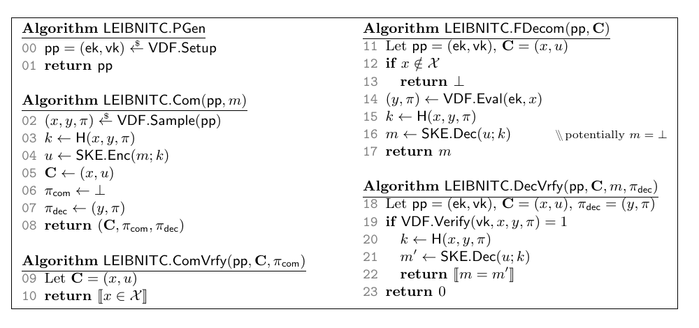
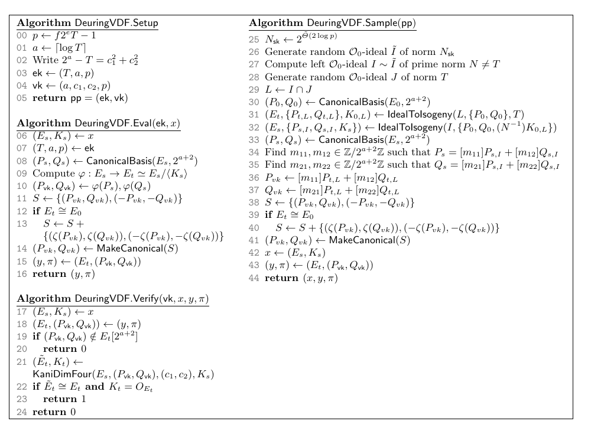

# Timed commitment 与 timed encryption：通用构造及其 isogeny 实例化

> **Timed Commitments and Timed Encryption: Generic Constructions and Instantiations from Isogenies**
> Mingjie Chen (COSIC, KU Leuven), Jonas Meers (Ruhr University Bochum)
> CRYPTO 2026 · Lattice Cryptanalysis II + Isogenies (2026-08-17) · **L1 入门导读**
> [ePrint 2026/057](https://eprint.iacr.org/2026/057) · [Slides](https://iacr.org/submit/files/slides/2026/crypto/crypto2026/199/199_slides.pdf)

## §1 研究什么

**Non-Interactive Timed Commitment (NITC)** 是带"保质期"的 commitment：hiding 只保证到时间 $t$，之后任何人都能强制打开；binding 则永久成立。

> **定义 8（NITC，Katz–Loss–Xu 2020）**：$(t_{\mathrm{com}},t_{\mathrm{cv}},t_{\mathrm{dv}},t_{\mathrm{fo}})$-NITC 由五个算法组成：
> - $\mathsf{pp}\leftarrow\mathsf{PGen}$；
> - $(C,\pi_{\mathrm{com}},\pi_{\mathrm{dec}})\leftarrow\mathsf{Com}(\mathsf{pp},m)$，时间 $\le t_{\mathrm{com}}$；
> - $\mathsf{ComVrfy}(\mathsf{pp},C,\pi_{\mathrm{com}})\in\{0,1\}$，时间 $\le t_{\mathrm{cv}}$：$C$ 是合法 commitment；
> - $\mathsf{DecVrfy}(\mathsf{pp},C,m,\pi_{\mathrm{dec}})\in\{0,1\}$，时间 $\le t_{\mathrm{dv}}$：$C$ 里装的是 $m$；
> - $\mathsf{FDecom}(\mathsf{pp},C)\to m$ 或 $\bot$，时间 $\ge t_{\mathrm{fo}}$：强制打开。
>
> 正确性：诚实生成的 $(C,\pi_{\mathrm{com}},\pi_{\mathrm{dec}})$ 两个验证都通过，且 $\mathsf{FDecom}(\mathsf{pp},C)=m$。

两条安全性质。**NITC-CCA**（hiding）：敌手 $\mathcal{A}$ 在询问 challenge $\mathsf{Chal}(m_0,m_1)$ 前有充裕的预计算时间 $\tau_{\mathrm{pre}}$，之后只有紧的时间 $\tau_{\mathrm{post}}$，并行度 $n$；全程可向 oracle $\mathsf{FDecomO}$ 询问任意 $C\ne C^*$ 的强制打开结果；优势为 $|\Pr[b'=b]-\tfrac12|$。**NITC-BND**（binding）：$\mathcal{A}$ 赢若它给出通过 $\mathsf{ComVrfy}$ 与 $\mathsf{DecVrfy}$ 的 $(C,m,\pi_{\mathrm{dec}})$，并且要么另有 $m'\ne m$ 与 $\pi'_{\mathrm{dec}}$ 也通过 $\mathsf{DecVrfy}$，要么 $\mathsf{FDecom}(\mathsf{pp},C)\ne m$。

**Timed PKE (TPKE)**：$(\mathsf{pk},\mathsf{sk})\leftarrow\mathsf{KGen}$，$\mathsf{ct}\leftarrow\mathsf{Enc}(\mathsf{pk},m)$，持 $\mathsf{sk}$ 的快速解密 $\mathsf{Dec}_f$ 与只用 $\mathsf{pk}$ 的慢速解密 $\mathsf{Dec}_s$（时间 $\ge t_{\mathrm{sd}}$）；TPKE-CCA 类似定义。KLX 证明 TPKE 可黑盒转换为 NITC。

**Verifiable Delay Function (VDF，本文的变体)**：$\mathsf{pp}=(\mathsf{ek},\mathsf{vk})\leftarrow\mathsf{Setup}$，指定输入空间 $\mathcal{X}$（成员可高效检测）与输出空间 $\mathcal{Y}$；$(x,y,\pi)\leftarrow\mathsf{Sample}(\mathsf{pp})$ **快速**产生实例连同解；$(y,\pi)\leftarrow\mathsf{Eval}(\mathsf{ek},x)$ 需并行时间 $t_\Delta$；$\mathsf{Verify}(\mathsf{vk},x,y,\pi)$ 时间 $t_{\mathrm{vrfy}}\ll t_\Delta$。要求 $\mathrm{Im}(\mathsf{Sample})=\mathcal{X}$，且 $\mathsf{Sample}$ 的输出与 $\mathsf{Eval}$ 一致。与 Boneh 等 2018 的定义不同，实例不要求可公开采样，只要求由"知道答案的人"采样；对 NITC 这没问题，committer 本来就知道 $m$。三条性质：

- **Sequentiality**：$\mathcal{A}_0$ 用时间 $\sigma_{\mathrm{pre}}$ 预处理，$\mathcal{A}_1$ 用并行时间 $\sigma_{\mathrm{post}}$、并行度 $n$ 由 $x$ 算出 $y$ 的概率 $\mathrm{Adv}^{\mathrm{SeqVDF}}$。
- **Unconditional uniqueness（定义 14）**：对**无界**的 $\mathcal{A}$，$\Pr[(y',\pi')\ne(y,\pi)\wedge\mathsf{Verify}(\mathsf{vk},x,y',\pi')=1]=0$。比 soundness 强：连 proof 都唯一，且是信息论性质。
- **$\gamma$-spreadness（定义 16）**：对任意 $x\in\mathcal{X}$，$\Pr[x^*=x]\le\gamma$，$x^*$ 为 $\mathsf{Sample}$ 的输出。

**Trapdoor Delay Function (TDF)**：$(\mathsf{ek},\mathsf{td})\leftarrow\mathsf{Setup}$；$\mathsf{Eval}(\mathsf{ek},x,\mathsf{td})$ 快（时间 $t_{\mathrm{td}}$），$\mathsf{Eval}(\mathsf{ek},x,\bot)$ 慢（并行时间 $t_\Delta$），两者输出相同；不要求可验证。安全假设 **SeqDist**：在 $\sigma_{\mathrm{post}}$ 内区分 $\mathsf{Eval}(\mathsf{ek},x,\mathsf{td})$ 与随机 $y\in\mathcal{Y}$。

## §2 为什么研究它

Timed commitment（Boneh–Naor 2000，源自 Rivest–Shamir–Wagner 的 time-lock puzzle）用于密封拍卖、电子投票、合同签署：出价者事后拒绝开标时，拍卖方可以强制打开。**几乎所有实用构造都基于 unknown-order 群里的重复平方** $g^{2^t}\bmod N$（RSA 群或 class group），量子计算机面前不安全（分解 $N$；class group 有 Biasse–Song 的量子多项式算法）；可能后量子安全的构造依赖 iO，不实用。此外"commit 快"与"打开可验证"很难同时满足：KLX 的构造 commit 与强制打开一样慢，TARDIS commit 快但不可验证。isogeny 计算慢，在别处是缺点，在 delay 原语里恰好是特性。

此前的后量子尝试：Ahrens 的 SIGNITC（ePrint 2024/1225）只满足一个改过的、非标准的 IND-CCA（禁止会泄露 challenge 消息的 $\mathsf{FDecomO}$ 询问），标准游戏下有攻击，且无紧归约；Freitag 等的 VDF 构造只在 auxiliary-input ROM 等强模型下安全；Ambrona 等的构造只有被动安全。FHE 造的 homomorphic time-lock puzzle 与 NITC 的非延展性目标正交。

## §3 核心定理与做法

### 3.1 LEIBNITC：VDF 管 binding 与 delay，SKE 管 hiding

*图 1（论文 Fig. 5）：LEIBNITC 的五个算法。commitment 是 $(x,u)$；$\pi_{\mathrm{com}}=\bot$（验证 commitment 只需检查 $x\in\mathcal{X}$）；$\pi_{\mathrm{dec}}=(y,\pi)$；强制打开就是跑一次 $\mathsf{Eval}$。*

设 $\mathsf{VDF}$ 满足 unconditional uniqueness 与 $\gamma$-spreadness，$\mathsf{SKE}$ 为 IND-CCA 安全的对称加密（密钥记 $\eta$），$H$ 为 random oracle。

- **Com($\mathsf{pp},m$)**：$(x,y,\pi)\leftarrow\mathsf{VDF.Sample}(\mathsf{pp})$；$\eta\leftarrow H(x,y,\pi)$；$u\leftarrow\mathsf{SKE.Enc}(m;\eta)$；输出 $C=(x,u)$，$\pi_{\mathrm{com}}=\bot$，$\pi_{\mathrm{dec}}=(y,\pi)$。
- **ComVrfy**：返回 $[\![x\in\mathcal{X}]\!]$。
- **DecVrfy($\mathsf{pp},C,m,(y,\pi)$)**：若 $\mathsf{VDF.Verify}(\mathsf{vk},x,y,\pi)=1$，令 $\eta\leftarrow H(x,y,\pi)$，返回 $[\![m=\mathsf{SKE.Dec}(u;\eta)]\!]$；否则 0。
- **FDecom($\mathsf{pp},C$)**：若 $x\notin\mathcal{X}$ 返回 $\bot$；$(y,\pi)\leftarrow\mathsf{VDF.Eval}(\mathsf{ek},x)$；$\eta\leftarrow H(x,y,\pi)$；返回 $\mathsf{SKE.Dec}(u;\eta)$。

commit 很快（$\mathsf{Sample}$ 快），打开可验证（$\mathsf{Verify}$ 快），强制打开慢（$\mathsf{Eval}$ 慢）。

> **定理 18（NITC-CCA）**：对任意并行度 $n$、时间 $(\tau_{\mathrm{pre}},\tau_{\mathrm{post}})$ 的敌手 $\mathcal{A}$，存在 $\mathcal{B},\mathcal{D}$ 使
> $$\mathrm{Adv}^{\mathrm{NITC\text{-}CCA}}_{\mathrm{LEIBNITC}}(\mathcal{A})\ \le\ \mathrm{Adv}^{\mathrm{SeqVDF}}_{\mathsf{VDF}}(\mathcal{B})+2\,\mathrm{Adv}^{\mathrm{SKE\text{-}CCA}}_{\mathsf{SKE}}(\mathcal{D})+(q_{\mathrm{FDecom}}+q_H)\,\gamma ,$$
> 其中 $q_{\mathrm{FDecom}},q_H$ 为 $\mathcal{A}$ 对两个 oracle 的询问次数，$\mathcal{B}$ 的并行度同为 $n$，时间
> $$\sigma_{\mathrm{pre}}=(q_{\mathrm{FDecom}}+q_H)^2\,t_{\mathrm{vrfy}}+\tau_{\mathrm{pre}},\qquad\sigma_{\mathrm{post}}=(q_{\mathrm{FDecom}}+q_H)^2\,t_{\mathrm{vrfy}}+\tau_{\mathrm{post}} .$$

归约在优势和时间上都是紧的（slides 提到用排序可把平方项降到 $(q_{\mathrm{FDecom}}+q_H)\,t_{\mathrm{vrfy}}$ 加一个 $\log$ 因子）。为什么时间上紧很关键：NITC 的假设本身带有具体时间 $t$，若归约自身跑得比 $t$ 还久，就得把假设里的 $t$ 放大，参数随之膨胀。

**核心难点与解法：怎样在不跑 $\mathsf{Eval}$ 的情况下模拟 $\mathsf{FDecomO}$。** 归约不能自己跑 $\mathsf{Eval}$（那就是它要打破的假设），而 $\mathcal{A}$ 可以对精心构造的 $C$ 询问很多次。观察：在 random oracle 模型里，打开 $C=(x,u)$ 所需的密钥是 $H(x,y,\pi)$，而由 unconditional uniqueness，对每个 $x$ **只有一个** $(y,\pi)$ 能通过 $\mathsf{Verify}$。于是模拟器收到 $(x,u)$ 时：

1. 扫描 $H$ 的询问记录中所有形如 $(x,y_i,\pi_i)$ 的条目，用快速的 $\mathsf{Verify}$ 找出那个（至多一个）通过验证的；
2. 找到则取其密钥解密 $u$；
3. 找不到则新造一条占位记录 $(x,\bot,\bot,\eta)$、随机选 $\eta$ 解密；日后 $\mathcal{A}$ 若向 $H$ 询问真正的 $(x,y,\pi)$，就把占位记录补全为 $(x,y,\pi,\eta)$。

每次询问代价至多 $(q_{\mathrm{FDecom}}+q_H)\,t_{\mathrm{vrfy}}$，这就是定理中平方项的来源。证明的其余部分是四步 game hop（重的部分本文省略）：先用 spreadness 排除 $x^*$ 已被询问过（损失 $(q_{\mathrm{FDecom}}+q_H)\gamma$）；把 $\mathsf{FDecomO}$ 换成上面的模拟（纯句法改动）；把 challenge 密钥换成随机的，$\mathcal{A}$ 能察觉当且仅当它在 $\tau_{\mathrm{post}}$ 内向 $H$ 询问了 $(x^*,y^*,\pi^*)$，而这一询问可用 $\mathsf{Verify}$ 检测并直接交给 SeqVDF 游戏（得到 $\mathcal{B}$）；最后把 $u^*$ 换成 $0$ 的加密，归约到 SKE-CCA（得到 $\mathcal{D}$，系数 2 来自标准的 $\Pr[\mathcal{D}\text{ 赢}]-\tfrac12=\tfrac12(\Pr[G_3\Rightarrow1]-\Pr[G_4\Rightarrow1])$）。

> **定理 19（NITC-BND，完美 binding）**：$\mathsf{VDF}$ 满足 unconditional uniqueness 时，任何（无界）敌手赢 NITC-BND 的概率为 0。

**证明**（简单的情形分析）。设 $(C=(x,u),m,\pi_{\mathrm{dec}}=(y,\pi))$ 通过两个验证。第一种赢法要求 $m'\ne m$、$\pi'_{\mathrm{dec}}=(y',\pi')$ 也通过 $\mathsf{DecVrfy}$。若 $\pi'_{\mathrm{dec}}=\pi_{\mathrm{dec}}$，两次验证算出同一密钥 $\eta$，确定性解密给出同一个 $m$，与 $m'\ne m$ 矛盾。若 $\pi'_{\mathrm{dec}}\ne\pi_{\mathrm{dec}}$，两者都通过 $\mathsf{Verify}$ 违反 unconditional uniqueness；这里用到 $\mathcal{A}$ 选的 $x$ 也在 $\mathcal{X}=\mathrm{Im}(\mathsf{Sample})$ 中（$\mathsf{ComVrfy}$ 检查过），所以不存在"恶意构造的弱实例"，否则它也会以正概率被诚实 $\mathsf{Sample}$ 采到，与概率为 0 矛盾。第二种赢法 $\mathsf{FDecom}(\mathsf{pp},C)\ne m$ 同理与正确性矛盾。$\square$

顺带一个两行引理（论文 Lemma 15）：unconditional uniqueness 蕴含 $(0,\infty)$-soundness，理由同上：任何能造出 $y'\ne y$ 的验证元组的实例，都可能被 $\mathsf{Sample}$ 采到。

### 3.2 NYTPKE：KLX 的推广，标准模型

用 TDF 与 Naor–Yung 双加密加 simulation-sound NIZK：

- **KGen**：两份 $(\mathsf{ek}_i,\mathsf{td}_i)\leftarrow\mathsf{TDF.Setup}$，$\mathsf{crs}\leftarrow\mathsf{NIZK.Gen}$；$\mathsf{pk}=(\mathsf{ek}_1,\mathsf{ek}_2,\mathsf{crs})$，$\mathsf{sk}=(\mathsf{crs},\mathsf{td}_1)$。
- **Enc($\mathsf{pk},m$)**：$x_i\leftarrow\mathcal{X}$，$y_i\leftarrow\mathsf{TDF.Eval}(\mathsf{ek}_i,x_i,\bot)$，$z_i\leftarrow f_{\mathrm{bij}}(y_i)\oplus m$（$f_{\mathrm{bij}}:\mathcal{Y}\to\{0,1\}^{|m|}$ 为双射），$\pi\leftarrow\mathsf{NIZK.Prove}(\mathsf{crs},(x_1,x_2,z_1,z_2),m)$ 证明两份密文装同一 $m$；$\mathsf{ct}=(x_1,x_2,z_1,z_2,\pi)$。
- **Dec$_f$**：验 $\pi$，用 $\mathsf{td}_1$ 快速算 $y_1$，输出 $z_1\oplus f_{\mathrm{bij}}(y_1)$。**Dec$_s$**：同上但用 $\bot$ 慢速算 $y_1$。

> **定理 23**：$\mathrm{Adv}^{\mathrm{TPKE\text{-}CCA}}_{\mathrm{NYTPKE}}(\mathcal{A})\le2\,\mathrm{Adv}^{\mathrm{SeqDist}}_{\mathsf{TDF}}(\mathcal{B})+\mathrm{Adv}^{\mathrm{ZK}}_{\mathsf{NIZK}}+\mathrm{Adv}^{\mathrm{SS}}_{\mathsf{NIZK}}$，参数关系 $\sigma_{\mathrm{pre}}=t_{\mathrm{sgen}}+\tau_{\mathrm{pre}}t_{\mathrm{vrfy}}$，$\sigma_{\mathrm{post}}=t_{\mathrm{sprv}}+\tau_{\mathrm{post}}t_{\mathrm{vrfy}}$（证明与 KLX Theorem 4 几乎相同，论文省略）。

用重复平方作 TDF 就还原出 KLX 的原构造；再经 KLX 转换（用两个 NIZK 分别证明 "$C$ 是合法密文" 与 "$C$ 装的是 $m$"）得到标准模型下的 NITC（推论 27）。代价：commit 不快，且依赖 NIZK 的大小。

### 3.3 DeuringVDF：把 Leroux 的 VRF 变成 VDF

*图 2（论文 Fig. 11）：Setup、Sample、Eval、Verify。核心：算一个素数次 $T$ 的 isogeny 很慢，但 committer 借 Deuring correspondence 与 $\mathrm{End}(E_s)$ 可以瞬间算出。*

**参数**：素数 $T$（delay），$a=\lceil\log T\rceil$ 且 $2^a-T=c_1^2+c_2^2$；素数 $p=f\cdot2^eT-1$，$e>a$，$f$ 小 cofactor；$E_0:y^2=x^3+x$，$\mathcal{O}_0\cong\mathrm{End}(E_0)$。$\mathsf{ek}=(T,a,p)$，$\mathsf{vk}=(a,c_1,c_2,p)$。输入空间 $\mathcal{X}=\{(E,K):E\in\mathcal{E}\ell\ell(\mathbb{F}_{p^2}),K\in E[T]\}$，输出 $\mathcal{Y}=\{(E,(P,Q)):(P,Q)\in E[2^{a+2}]\}$。

- **Sample**：取随机 $\mathcal{O}_0$-ideal $I$（素范数 $N\ne T$，由范数 $2^{\tilde\Theta(2\log p)}$ 的随机 ideal 等价而来）与随机范数 $T$ 的 ideal $J$，$L=I\cap J$。用 $\mathsf{IdealToIsogeny}$ 得 $\varphi_L$ 的 codomain $E_t$、$\varphi_I$ 的 codomain $E_s$，以及 $K_s\in E_s[T]$ 生成推前 isogeny $\varphi'_J:E_s\to E_t$ 的 kernel（$\varphi_L=\varphi'_J\circ\varphi_I$）。取 $E_s[2^{a+2}]$ 的 canonical basis $(P_s,Q_s)$，用 $E_0[2^{a+2}]$ 的像把 $\varphi'_J(P_s,Q_s)$ 表达出来，经 $\mathsf{MakeCanonical}$ 消掉 $\pm1$（及 $E_t\cong E_0$ 时的 $\zeta$）带来的歧义，得 $(P_{\mathrm{vk}},Q_{\mathrm{vk}})$。输出 $x=(E_s,K_s)$，$y=E_t$，$\pi=(P_{\mathrm{vk}},Q_{\mathrm{vk}})$。
- **Eval**：由 $(E_s,K_s)$ 直接算 $\varphi:E_s\to E_s/\langle K_s\rangle$（$T$ 次 Vélu，慢），求 $\varphi(P_s,Q_s)$，$\mathsf{MakeCanonical}$。
- **Verify**：检查 $(P_{\mathrm{vk}},Q_{\mathrm{vk}})\in E_t[2^{a+2}]$；用 $\mathsf{KaniDimFour}$ 在 4 维上重建把 $(P_s,Q_s)$ 送到 $(P_{\mathrm{vk}},Q_{\mathrm{vk}})$、次数 $2^a-c_1^2-c_2^2=T$ 的唯一 isogeny，检查其 codomain $\cong E_t$ 且把 $K_s$ 送到 $0$。

三条性质：
- **正确性（定理 29）**：$\ker\varphi'_J=\langle K_s\rangle$，且 $\varphi'_J(P_s,Q_s)=\varphi_L(\text{对应的 }E_0\text{ 点})=(P_{\mathrm{vk}},Q_{\mathrm{vk}})$，故 $\mathsf{Eval}$ 重算出同样的 $(y,\pi)$；$\mathsf{Verify}$ 通过因为 4 维重建的 isogeny 就是 $\varphi$。
- **Unconditional uniqueness（定理 30）**：次数 $T$ 的 isogeny 由它在 $2^{a+2}$-torsion 上的像唯一决定（Kani），而 kernel 已固定为 $\langle K_s\rangle$，所以任何通过 $\mathsf{Verify}$ 的 $(y',\pi')$ 必有 $j(E_t')=j(E_t)$，$\pi'$ 亦由 $\mathsf{MakeCanonical}$ 唯一。
- **Spreadness（定理 31）**：$\gamma\le p^{-1/2}$，因为 $E_s$ 是 2-isogeny graph 上长随机游走的终点，与均匀分布统计接近。
- **Sequentiality（定理 33）**：归约到假设 Seq-Isog：给随机 $E$ 与随机 $K\in E[T]$，在并行度 $n$、时间 $\omega_t=\sigma_{\mathrm{pre}}+\sigma_{\mathrm{post}}$ 内算出 $E/\langle K\rangle$。

**DeuringTDF**：输入 $x\in\{0,1\}^{\lfloor\log T\rfloor}$ 单射到 $(r,s)\in\mathbb{P}^1(\mathbb{Z}/T)$，kernel 点 $K=[r]R+[s]S\in E[T]$（$R,S$ 在 $\mathsf{ek}$ 中），输出 $(E/\langle K\rangle,\varphi(P))$；trapdoor 是把 $E$ 连到 $E_0$ 的 ideal $I$、一个矩阵 $M\in\mathrm{GL}_2(\mathbb{Z}/T)$ 与一个 endomorphism $\kappa$，持有者把 $\langle K\rangle$ 翻译成 kernel ideal $I_x$，用 $\mathsf{IdealToIsogeny}(I\cap I_x,P)$ 快速求值（定理 34）。安全假设 Seq-Isog-Dist 是 Seq-Isog 的判定版。

### 3.4 delay 到底有多"sequential"：并行 Vélu

> **命题 37**：用 Vélu 公式在 $n$ 个核上算 $\varphi:E\to E/\langle K\rangle$（$\mathrm{ord}K=T$ 素数）的并行代价为 $T/n+\log n$ 次域运算。

Vélu 就是对 kernel 逐点累乘，二叉树合并即可完美并行，所以 **DeuringVDF 不能提供无条件的 delay**。$\sqrt{\text{élu}}$ 顺序代价约 $O(\sqrt T)$，并行版（Chávez-Saab 等 2024）大致按 $\tfrac{128}{3}\sqrt{(T-1)/2n}+\tfrac{39}{2}n$ 缩放，合并线程的开销随 $n$ 增长，存在最优并行度。其他策略更差：算 $\mathrm{End}(E)$ 要 $O(p^{1/2})$，与 $T$ 无关，靠 $p$ 够大挡住；modular polynomial 找 $j(E/\langle K\rangle)$ 无法求 isogeny 在 torsion 点上的像，需猜 $\varphi(P)$，$O(2^{2e})$。

因此参数选取时**先固定 delay $t$ 与并行度上界 $n$**，取素数 $T$ 使 $\min(C^{\mathrm{Vel}}_{\mathrm{par}},C^{\sqrt{\mathrm{Vel}}}_{\mathrm{par}})\ge t$；再取 $a=\lceil\log T\rceil$，$e=\max\{4\lambda-(a+2),\,a+2\}$ 保证 $\log p\ge4\lambda$（使 $\gamma\le2^{-2\lambda}$、$\mathrm{End}(E)$ 远比算 isogeny 难、$E[2^{a+2}]$ 可用、$2^e>\sqrt p$）；若 $2^a-T$ 不是两平方和就换下一个素数。$\lambda=128$、$t=2^{32}$、$n=2^{16}$ 时 $p$ 为 518 bit：
$$p=3\cdot5^2\cdot2^{463}\cdot\underbrace{281474976710899}_{T}-1 .$$

**大小（LEIBNITC + DeuringVDF）**：$C=(E_s,K_s,u)$ 占 $2\log p+2\log p+|m|$，$\pi_{\mathrm{dec}}=(E_t,P_{\mathrm{vk}},Q_{\mathrm{vk}})$ 占 $2\log p+3a+6$（点压缩），$\pi_{\mathrm{com}}$ 为空。

| 方案 | $|C|$ | $|\pi_{\mathrm{com}}|$ | $|\pi_{\mathrm{dec}}|$ | $|m|$ | 后量子 |
|---|---|---|---|---|---|
| Thyagarajan 等 (CCS 2021，class group) | 3321410 B | 8846960 B | – | 256 bit | 否 |
| Chvojka–Jager (PKC 2023) | 1540 B | 1550 B | 384 B | 3072 bit | 否 |
| **本文（LEIBNITC + DeuringVDF）** | **291 B（2328 bit）** | **0** | **149 B（1189 bit）** | 256 bit | **是** |

同样 $\lambda,t,|m|$ 下 Chvojka–Jager 的 commitment 是本文的 5.3 倍。作者也指出更保守的 DMS-VDF（Decru–Maino–Sanso 2023）满足 LEIBNITC 的全部要求，可以替换使用，但 $t=2^{32}$ 时它需要 $\log p=2097152$（262 KB 的素数，因 $\mathbb{F}_p$ 上可用 lattice reduction 找短等价 isogeny），commitment 大得多。

## §4 一句话带走

> LEIBNITC 只用一个"解唯一、实例可由知情者快速采样"的 VDF 加对称加密加 random oracle 就得到 commit 快、打开可验证、CCA-hiding 且**完美 binding** 的 NITC，紧归约的关键是靠 uniqueness 用 $\mathsf{Verify}$ 在 random oracle 记录里"查表"代替跑 $\mathsf{Eval}$；用 Leroux 的 Deuring VRF 改造成的 DeuringVDF 实例化后，成为首个后量子 NITC，commitment 仅 2328 bit。代价是 isogeny 计算可并行，delay 只在预设的并行度上界 $n$ 之下成立，参数必须随 $n$ 选取。

**局限**：sequentiality 不是无条件的（并行 Vélu 为 $T/n+\log n$），必须事先约定并行度；NYTPKE 依赖 NIZK，大小难以估计且 commit 不快；构造是通用的，将来出现更强 sequentiality 的后量子 VDF 可直接替换。
