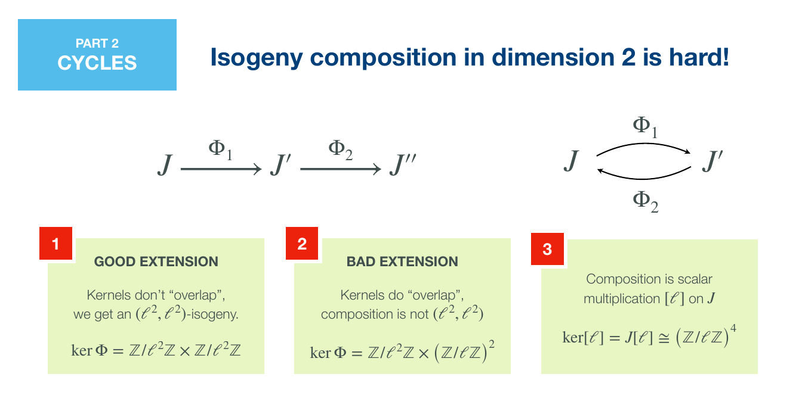
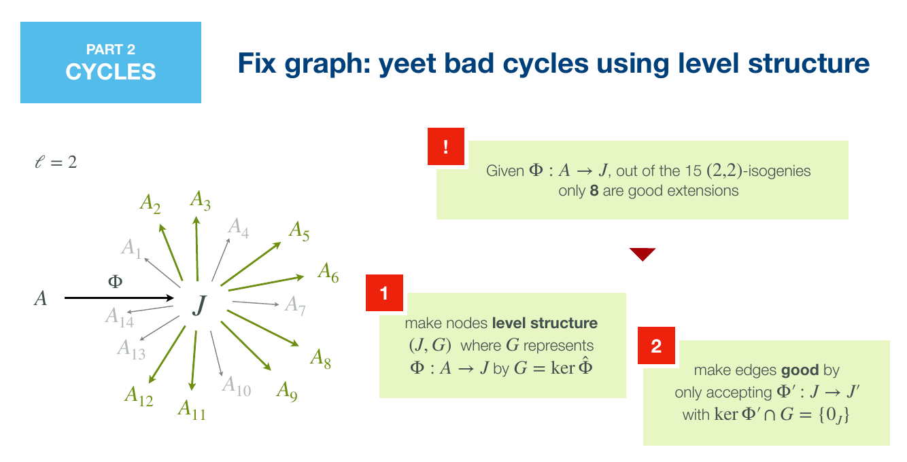

# 带 level structure 的 superspecial isogeny digraph 的 expander 性质

> **Expander properties of superspecial isogeny digraphs with level structure**
> Thomas Decru, Krijn Reijnders (COSIC, KU Leuven)
> CRYPTO 2026 · Lattice Cryptanalysis II + Isogenies (2026-08-17) · **L1 入门导读**
> [ePrint 2026/500](https://eprint.iacr.org/2026/500) · [Slides](https://iacr.org/submit/files/slides/2026/crypto/crypto2026/207/207_slides.pdf) · [代码与数据](https://github.com/Krijn-math/good-graphs)

## §1 研究什么

一维的 supersingular $\ell$-isogeny graph 是 Ramanujan graph（最优 expander），这是 CGL hash 与许多 isogeny 协议安全性的根基。本文问：**维数 $g\ge2$ 时"正确的" isogeny graph 是什么，它的 expander 性质如何**。

### 1.1 对象

固定素数 $p>5$ 与素数 $\ell\ne p$。$A$ 为 $\mathbb{F}_{p^2}$ 上 $g$ 维 principally polarized **superspecial** abelian variety（作为无极化簇同构于 supersingular 椭圆曲线的乘积；$g=1$ 时就是 supersingular 曲线，$g=2$ 时是 genus-2 曲线的 Jacobian 或两条椭圆曲线的乘积）。Weil pairing $e_\ell:A[\ell]\times A[\ell]\to\mu_\ell$ 是交错双线性的，$A[\ell]\cong(\mathbb{Z}/\ell)^{2g}$。

- **maximal isotropic $(\ell)^g$-subgroup**：$H\subset A[\ell]$，$H\cong(\mathbb{Z}/\ell)^g$，且 $e_\ell(P,Q)=1$ 对一切 $P,Q\in H$。个数为
$$\ell^{g(g+1)/2}\prod_{i=1}^{g}\Big(1+\frac{1}{\ell^{i}}\Big),\qquad g=2:\ \ell^3+\ell^2+\ell+1 .$$
- **$(\ell,\dots,\ell)$-isogeny**：可分 isogeny $\Psi:A\to A'$，kernel 恰为一个 maximal isotropic $(\ell)^g$-subgroup；kernel 决定 $\Psi$（到同构）。
- **good extension**：$\Psi_2:A'\to A''$ 是 $\Psi_1:A\to A'$ 的 good extension 若 $\ker\Psi_2\cap\ker\hat\Psi_1=0$。此时 $\Psi_2\circ\Psi_1$ 是 $(\ell^2,\dots,\ell^2)$-isogeny。对每个 $\Psi_1$ 恰有 $\ell^{g(g+1)/2}$ 个 good extension。
- **level structure**：pair $(A,H)$，$H$ 为 maximal isotropic $(\ell)^g$-subgroup，考虑到同构（含 automorphism）。
- **reduced automorphism group** $\mathrm{RA}(A)=\mathrm{Aut}(A)/[-1]$：$[-1]$ 把每个 $H$ 映到自身，对计数无影响，故商掉。

*图 1（slides）：二维时两个 $(\ell,\ell)$-isogeny 的复合有三种结果。kernel 不重叠时得到 $(\ell^2,\ell^2)$-isogeny（good）；部分重叠时 kernel 为 $\mathbb{Z}/\ell^2\times(\mathbb{Z}/\ell)^2$，复合退化（bad）；完全重叠时复合是 $[\ell]$，即走了回头路。一维只有第三种情况（dual），二维多出的第二种正是小 cycle 与 hash collision 的来源。*

### 1.2 Superspecial $(\ell)^g$-isogeny digraph

> **定义 3**：$\mathcal{G}_g(p,\ell)=(\mathcal{V},\mathcal{E})$。顶点集 $\mathcal{V}$ 为全部同构类 $(A,H)$。对每个满足 $H'\cap H_1=0$ 的 maximal isotropic $H'\subset A_1[\ell]$，取 $\Psi_1:A_1\to A_2$，$\ker\Psi_1=H'$，加一条有向边 $(A_1,H_1)\to(A_2,\Psi_1(H_1))$。

顶点记住"上一步是从哪条边来的"（$H_1=\ker\hat\Psi_0$），出边只允许 good extension。于是长度 $n$ 的 walk 对应一个 $(\ell^n)^g$-isogeny，没有 backtracking，也没有 bad cycle。代价是图天然**有向**：出边取决于入边，不能靠 dual isogeny 变成无向图。

*图 2（slides，$\ell=2$）：从 $A$ 经 $\Phi$ 到达 $J$ 后，$J$ 的 15 个 $(2,2)$-isogeny 中只有 8 个是 good extension（绿色）。做法：把顶点改成 $(J,H)$，$H=\ker\hat\Phi$；只接受 $\ker\Phi'\cap H=\{0\}$ 的出边 $\Phi'$。*

### 1.3 Expander 的度量

有向图 $d$-regular 指每个顶点出度为 $d$。邻接矩阵 $M$ 的特征值按模排序，$\lambda_1=d$（每行和为 $d$），$\lambda_2$ 可能是复数。**spectral expansion**：$\lambda(\mathcal{G})=|\lambda_2/d|$，越小越好。

> **定义 2**（$d$-regular、入度 $d'$-regular 的连通 digraph）：
> Ramanujan：$|\lambda_2|\le\sqrt{d-1}$；weakly Ramanujan：$|\lambda_2|\le\sqrt{d-1}+\sqrt{d'-1}$；adjacent-Ramanujan：$|\lambda_2^2-d-d'+2|\le2\sqrt{(d-1)(d'-1)}$。前者蕴含后者。

$\lambda(\mathcal{G})$ 直接给出 random walk 的 mixing time：长度 $t$ 的 walk 的终点分布与均匀分布的统计距离 $\le\epsilon$，只要
$$t\ \ge\ \frac{\log(\sqrt{|\mathcal{V}|}/\epsilon)}{\log(1/\lambda(\mathcal{G}))}.$$

## §2 为什么研究它

Charles–Goren–Lauter (2009) 用一维 isogeny graph 构造 hash function；同年他们把构造推广到高维，但需要 real multiplication，开销大。Takashima (2018) 提出更自然的 abelian surface 版本，次年被 Flynn–Ti 攻破：两个 $(\ell,\ell)$-isogeny 的复合可能是 $(\ell^2,\ell,\ell)$-isogeny，产生大量小 cycle，碰撞唾手可得。Castryck–Decru–Smith (2020) 给出修复：给顶点打上 level structure 标签、只走 good extension，这就是本文的 digraph。

问题是修复后的图的 expander 性质从未被认真算过。Jordan–Zaytman 证明 $(2,2)$-isogeny graph 不是 Ramanujan，Florit–Smith 证明它仍有不错的 expansion，但两者都没有排除 bad cycle，也没有把图当作有向图处理。另一方面，自 Kani 引理以来，SQIsign2D、PRISM、PEGASIS 等协议大量使用高维 isogeny 作为工具，若某些子图（例如 elliptic product 构成的子图）expansion 很差，可能催生新的 generic attack。

高维还有一个一维几乎没有的麻烦：**automorphism 破坏正则性**。一维图中约 $p$ 个顶点里只有 2 个有非平凡 automorphism，可以忽略；二维约 $p^3$ 个顶点里至少 $p^2$ 个有，必须逐类分析。入门例子：$E_0:y^2=x^3+1$ 有 automorphism $\zeta^{(3)}:(x,y)\mapsto(\zeta_3x,y)$，它在 $E_0[\ell]\cong\mathbb{F}_\ell^2$ 上的极小多项式是 $x^2+x+1$。$\ell\equiv2\pmod3$ 时该多项式在 $\mathbb{F}_\ell$ 上不可约，$\zeta^{(3)}$ 没有不变的直线，$\ell+1$ 条直线全部落在长度 3 的 orbit 里，$E_0$ 只有 $(\ell+1)/3$ 条出边；$\ell\equiv1\pmod3$ 时有两条不变直线（两个特征子空间），其余 $\ell-1$ 条分成长度 3 的 orbit，出边数为 $(\ell-1)/3+2=(\ell+5)/3$。

## §3 核心定理与做法

### 3.1 图的基本性质

> **命题 3**：$\mathcal{G}_g(p,\ell)$ 是出度 $\ell^{g(g+1)/2}$-regular 的 digraph，顶点数 $O\big((\ell p)^{g(g+1)/2}\big)$。

**证明**（简单计数）。$\mathbb{F}_p$ 上 $g$ 维 superspecial p.p. abelian variety 的个数为 $c_g\,p^{g(g+1)/2}$（$c_g$ 只依赖 $g$）；每个至多配 $\ell^{g(g+1)/2}\prod_i(1+\ell^{-i})=O(\ell^{g(g+1)/2})$ 个 $H$；每个 $(A,H)$ 恰有 $\ell^{g(g+1)/2}$ 个 good extension。$\square$

入度做不到 regular：带非平凡 automorphism 的顶点入度不同，但这类顶点在 $p\to\infty$ 时密度为零（Remark 1）。

### 3.2 Main Conjecture

记 $\lambda_{2,g}(p,\ell)$ 为 $\mathcal{G}_g(p,\ell)$ 邻接矩阵按模第二大的特征值，$\lambda_{2,g}(\ell):=\lim_{p\to\infty}\lambda_{2,g}(p,\ell)$。

> **Main Conjecture**：$\lambda_{2,g}(\ell)=\ell^{g^2/2}\in\mathbb{R}$。

推论（简单代数）：$\lambda_1=\ell^{g(g+1)/2}$，故 spectral expansion $|\lambda_{2,g}|/\lambda_1=\ell^{-g/2}$；$\lambda_2$ 的辐角趋于 0。weakly Ramanujan 的门槛是 $2\sqrt{\ell^{g(g+1)/2}-1}\approx2\ell^{g(g+1)/4}$，比较 $\ell^{g^2/2}\le2\ell^{g(g+1)/4}$ 即 $\ell^{g(g-1)/4}\le2$：

| $g$ | 条件 | 结论 |
|---|---|---|
| 1 | $\ell^0=1\le2$ | 一切 $\ell$ 都 weakly Ramanujan |
| 2 | $\ell^{1/2}\le2\Leftrightarrow\ell\le4$ | 仅 $\ell\in\{2,3\}$ |
| $\ge3$ | $\ell^{3/2}\ge2\sqrt2>2$ | 连 adjacent-Ramanujan 都不是 |

这与一维已知结果一致，并断言：**只走 good extension 显著改善高维 isogeny walk 的 expansion**，但维数一高 expansion 本质上变差。

### 3.3 证据：一维与二维的计算

**一维（$N=\ell^k$，$k\ge1$）。** 用 Vélu 公式沿 torsion basis 走图，好处是能精确识别 good extension：

> **引理 8**：$(E,H)$，$H=\langle Q\rangle$，$Q\in E[N]$，$P\in E[N]\setminus\langle Q\rangle$。则对每个 $a\in\mathbb{Z}/N$，$\ker\varphi=\langle P+[a]Q\rangle$ 的 isogeny $\varphi:E\to E'$ 是到 $(E',\langle\varphi(Q)\rangle)$ 的 good extension，且全部 $N$ 个 good extension 都是这种形式。

理由：$E$ 有 $\ell^k(\ell+1)$ 个 $N$-isogeny，与 $\langle Q\rangle$ 交平凡的 kernel 生成元必形如 $P+[a]Q$，共 $N$ 个；$E'$ 上的新 level structure 是 $\hat\varphi$ 的 kernel $\langle\varphi(Q)\rangle$，因为 $\hat\varphi\circ\varphi=[N]$。$N$ 为素数时，除 dual 外的每条边都是 good extension。

计算了所有 $N\le32$、$p$ 至约 $2^{14}$。模长 $|\lambda_2|/\sqrt N$：素数 $N$ 几乎立刻收敛到 1；$k$ 越大收敛越慢。辐角收敛慢得多，作者归因于小 cycle：例如 class group 在 $\mathbb{F}_p$-有理 supersingular 曲线上的作用给出长约 $h(-p)\approx\sqrt p$ 的 cycle。辐角小的含义：把 $M/d$ 看成 Markov 转移矩阵，$\lambda_2/d=a+bi$，$|b|\ll|a|$ 说明该特征模式没有显著的有向环流，收敛由 $a$ 主导，行为像无向图。

**二维，$\ell=2$。** 每个顶点 8 条出边。elliptic product 的 15 个 $(2,2)$-isogeny 分为 9 个 diagonal 与 6 个 gluing：若入边是 diagonal，good 出边为 4 diagonal + 4 gluing；若入边是 gluing，则为 6 diagonal + 2 gluing。对 $p<200$、$p\equiv3\pmod4$ 的全部素数，**$\lambda_2=4$ 精确成立**、辐角为 0，与猜想 $\ell^{g^2/2}=2^2$ 吻合。意外发现：$\lambda_2$ 的特征空间维数随 $p$ 增长，尚无解释。

### 3.4 Automorphism 对 level structure 的作用：计数定理

要构造与验证图，必须知道每个 $A$ 恰有多少个 $(A,H)$。工具是 Burnside 引理：$\mathrm{RA}(A)$ 作用在 maximal isotropic subgroup 集合 $X$ 上，
$$|X/\mathrm{RA}(A)|=\frac{1}{|\mathrm{RA}(A)|}\sum_{\alpha\in\mathrm{RA}(A)}|X^{\alpha}| ,$$
$X^\alpha$ 为 $\alpha$ 固定的 subgroup。于是问题化为：对每个 automorphism $\alpha_*$，数 $J[\ell]$ 中 $\alpha_*$-不变的 maximal isotropic 子空间。$\alpha_*$ 在 $A[\ell]$ 上是 $\mathrm{Sp}_4(\mathbb{F}_\ell)$ 中的矩阵；阶与 $\ell$ 互素时可对角化，且可取 symplectic 基（引理 4、5）。

> **引理 6**：$M$ 可对角化、特征子空间分解 $V=\bigoplus_i V_{\lambda_i}$，则子空间 $W$ 是 $M$-不变的当且仅当 $W=\bigoplus_i(W\cap V_{\lambda_i})$。

**证明**：取 $w=\sum_iv_i\in W$，$v_i\in V_{\lambda_i}$；令 $p_i(x)=\prod_{j\ne i}(x-\lambda_j)$，则 $p_i(M)w=p_i(\lambda_i)v_i\in W$，故每个 $v_i\in W$。反向显然。$\square$

**例（$\mathrm{RA}(J)=\mathbb{Z}/2$，$\ell>2$）。** $C:y^2=(x^2-1)(x^2-s^2)(x^2-t^2)$，$\sigma:x\mapsto-x$。$\sigma_*^2=\mathrm{id}$，极小多项式 $x^2-1$，在某 symplectic 基下 $\sigma_*=\mathrm{diag}(1,-1,1,-1)$。由引理 6，不变的 maximal isotropic 子空间是 $W_+\oplus W_-$，$W_\pm$ 为 $\pm1$ 特征子空间（各二维）中的一条直线，共 $(\ell+1)^2$ 个。Burnside：
$$\#\{(J,H)\}=\tfrac12\Big[(\ell^3+\ell^2+\ell+1)+(\ell+1)^2\Big]=\tfrac12(\ell^3+2\ell^2+3\ell+2).$$
这就是论文定理 1（$\ell=2$ 时为 11）。

**例（$\mathrm{RA}(J)=\mathbb{Z}/5$）。** $C:y^2=x^5-1$，$\zeta^{(5)}:x\mapsto\zeta_5x$，极小多项式 $\Phi_5=x^4+x^3+x^2+x+1$。$\ell\equiv1\pmod5$：$\Phi_5$ 在 $\mathbb{F}_\ell$ 上分裂，$\zeta^{(5)}_*=\mathrm{diag}(\mu_5,\mu_5^2,\mu_5^4,\mu_5^3)$，四个特征子空间都是一维，不变的二维子空间是任两个之和，其中 isotropic 的恰 4 个：$\langle D_1,D_2\rangle,\langle D_1,D_2'\rangle,\langle D_1',D_2\rangle,\langle D_1',D_2'\rangle$。$\ell\equiv2,3\pmod5$：$\Phi_5$ 不可约，没有不变二维子空间。$\ell\equiv4\pmod5$：$\Phi_5$ 分成两个二次因子，作用矩阵分成两个不相似的块，唯一可能的不变二维子空间是两个块本身，但它们不 isotropic。Burnside（四个非平凡元素表现相同）：
$$\#\{(J,H)\}=\begin{cases}\tfrac15(\ell^3+\ell^2+\ell+17)&\ell\equiv1\pmod5\\[2pt]\tfrac15(\ell^3+\ell^2+\ell+1)&\ell\not\equiv1\pmod5\end{cases}$$

论文 Table 1、Table 2 对 Jacobian 的全部 7 种 $\mathrm{RA}(J)$（$1,\mathbb{Z}/2,(\mathbb{Z}/2)^2,S_3,D_{2\times6},S_4,\mathbb{Z}/5$）与 elliptic product 的全部 7 种给出闭式，并对 $2\le\ell\le79$ 用 Magma 逐一验证；这把 Florit–Smith 的 $\ell=2$ 结果推广到任意素数 $\ell$。

**计数为何是 $\ell^3+\ell^2+\ell+1$（echelon form）。** 取 symplectic 基 $\langle D_1,D_2,D_1',D_2'\rangle$，$H=\langle K_1,K_2\rangle$ 的系数矩阵 $\begin{pmatrix}a_1&a_2&a_3&a_4\\b_1&b_2&b_3&b_4\end{pmatrix}$ 行约化后，isotropic 条件 $a_1b_3+a_2b_4-a_3b_1-a_4b_2\equiv0$ 逐型给出 $\ell^3$（型 $\begin{pmatrix}1&0&*&*\\0&1&*&*\end{pmatrix}$，一个约束）$+\ \ell(\ell-1)+\ell+\ell+1$ 个，相加恰为 $\ell^3+\ell^2+\ell+1$。这个唯一表示也让 automorphism 的作用与 subgroup 相等性检查变成矩阵乘法加行约化。

## §4 一句话带走

> 高维 isogeny walk 的"正确"图是带 level structure、只走 good extension 的**有向**图 $\mathcal{G}_g(p,\ell)$；它是 $\ell^{g(g+1)/2}$-regular 的，作者据一维与 $(g,\ell)=(2,2)$ 的计算猜想 $\lambda_2\to\ell^{g^2/2}$，于是 $g=1$（任意 $\ell$）与 $g=2$（$\ell\in\{2,3\}$）是 weakly Ramanujan，再往上就不是。支撑这一切的是对二维 abelian variety 全部 reduced automorphism group 在 $(\ell,\ell)$-level structure 上作用的完整分类，工具只是 symplectic 线性代数加 Burnside 引理。

**局限**：结论是启发式的（有限 $p$ 的谱计算），$(g,\ell)=(2,3)$ 因 $(3,3)$-isogeny 公式的例外情形与可行素数太少（$p\in\{41,47,53,59\}$ 且小 $p$ 下带 automorphism 的顶点占比过高）尚未算出；$g\ge3$ 顶点数 $O((\ell p)^{6})$ 起步，作者认为理论途径（如 CGL 2009 的 quaternion 方法）可能更可行。
