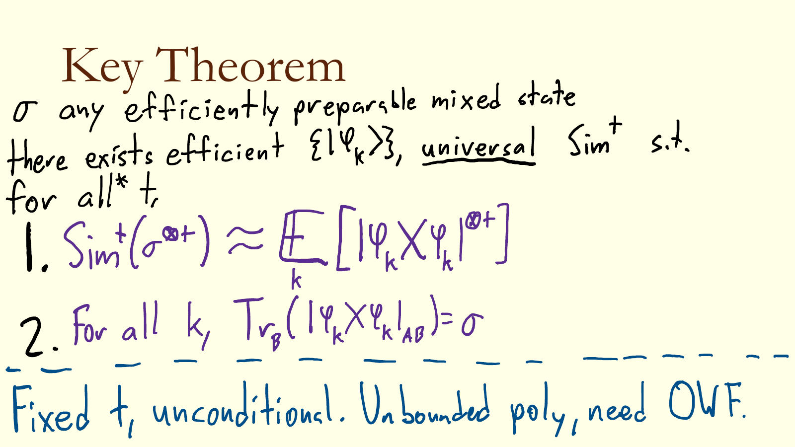
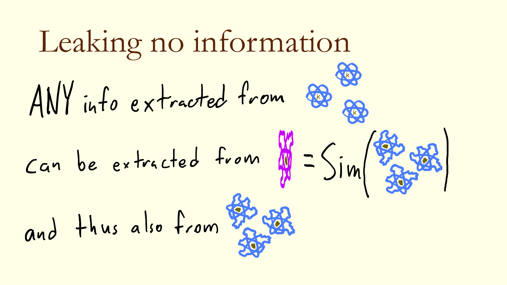
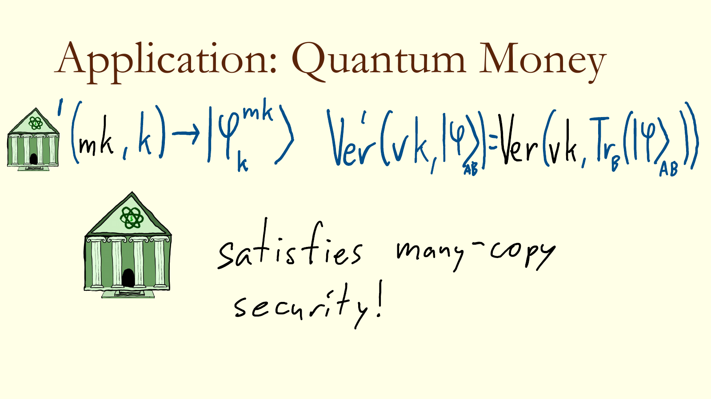

# 少即是多：量子密码中的 copy complexity——把 single-copy 安全通用地提升为 multi-copy 安全

> **Less is More: On Copy Complexity in Quantum Cryptography**
> Prabhanjan Ananth (UC Santa Barbara), Eli Goldin (New York University)
> CRYPTO 2026 · Quantum Cryptography I (2026-08-19) · **L1 入门导读**
> [ePrint 2025/1855](https://eprint.iacr.org/2025/1855) · [Slides](https://iacr.org/submit/files/slides/2026/crypto/crypto2026/369/369_slides.pdf)

## §1 研究什么

量子密码的定义对"敌手拿到几份态"极其敏感。本文问的是：**在哪些场景下，single-copy 安全蕴含 multi-copy 安全？** 答案落在一条"提纯定理"上：任何 mixed state 的族都有一个 pure state 族作为 purification，使得"同一个 pure state 的 $t$ 份拷贝"能被"$t$ 个 i.i.d. 的 mixed state 样本"高效模拟。

几个反复出现的对象：

- **Pseudorandom state generator（PRSG）**。三种版本：(a) **stretch PRSG**：输出 $n$ qubit 远长于 key 长 $\lambda$，敌手只拿**一份**；(b) **bounded-copy PRSG**：拷贝数事先固定为多项式 $t$；(c) **multi-copy PRSG**：拷贝数任意多项式。PRU（pseudorandom unitary）对应地分 one-query / bounded-query / multi-query。
- **Quantum money mini-scheme**（定义 4.13）：$\mathsf{Mint}(1^\lambda)\to(\rho,s)$，$\mathsf{Ver}(s,\sigma)\in\{0,1\}$；安全性：拿 $(\rho,s)$ 造不出两个都通过 $\mathsf{Ver}(s,\cdot)$ 的态。Public-key money（定义 4.14）$(\mathsf{Gen},\mathsf{Mint},\mathsf{Ver})$ 的安全性是 **i.i.d.** 的 $t\to t+1$：给 $t$ 次独立 $\mathsf{Mint}(\mathsf{sk})$ 的输出，造不出 $t+1$ 张通过验证的钞票。
- **Multi-copy secure mini-scheme**（定义 4.15）：$\mathsf{Mint}$ 先采样 $s$ 与秘密随机性 $\mathsf{sk}$，再对 $|\mathsf{sk}\rangle$ 施加一个 isometry 得到 **pure state** $|\psi_s\rangle$（purity）；安全性：给 $|\psi_s\rangle^{\otimes t}$ 与 $s$，造不出 $t+1$ 个通过 $\mathsf{Ver}(s,\cdot)$ 的态。这正是 Mosca–Stebila 2009 的 **quantum coins**；此前没有任何构造。
- **Copy-protection**：$\mathsf{CopyProtect}(1^\lambda,f)\to\rho_f$，$\mathsf{Eval}(\rho_f,x)=f(x)$。**i.i.d.-copy security**（定义 4.17）：敌手拿 $\rho_f^{\otimes t}$（$t$ 次独立生成），分给 $t+1$ 方后各自在随机 $x_{B_i}$ 上算对 $f$ 的概率 negligible；**identical-copy security**（定义 4.18）：输出必须是 pure state $|\psi_f\rangle$，敌手拿 $|\psi_f\rangle^{\otimes t}$。

## §2 为什么研究它

拷贝数的差别是实质性的：Chen–Coladangelo–Sattath 2024 分离了 single-copy 与 multi-copy PRSG；multi-copy PRSG 可被 PP oracle 打破（Kretschmer 2021，GMMY24），而 stretch PRSG 被认为无法被任何 classical oracle 打破（LMW24）；quantum pseudo one-time pad 只会从 multi-copy PRSG 构造（AQY22）。One-way state generator 在 $o(n/\log n)$ 份拷贝下信息论存在（CGG+23），$\omega(n/\log n)$ 份就蕴含 quantum bit commitment（KT24，BJ24）。Unclonable 那边，Aaronson 2018 指出多份拷贝下 shadow tomography 能打破许多原语；LLQZ22、ÇG24、KNP25 做到了 i.i.d. 版本的 collusion resistance；AMP24、PRV24 尝试了 identical-copy，但只在弱化定义下有受限结果。

所以：stretch PRSG 是否蕴含 bounded-copy PRSG？i.i.d.-copy 安全是否蕴含 identical-copy 安全？本文对两者都给出肯定回答（后者需要 PRF）。

## §3 核心定理与做法

### 3.1 主定理：用随机相位 + 随机 one-time pad 造 purification

*图 1（slides）：对任意可高效制备的 mixed state $\sigma$，存在高效的 pure state 族 $\{|\psi_k\rangle\}$ 与**通用**模拟器 $\mathsf{Sim}$，使 $\mathsf{Sim}(\sigma^{\otimes t})\approx\mathbb{E}_k|\psi_k\rangle\langle\psi_k|^{\otimes t}$，且每个 $|\psi_k\rangle$ trace 掉辅助寄存器后恰为 $\sigma$。固定 $t$ 时无条件；任意多项式 $t$ 需要 OWF。*

设有 mixed state 族 $\{\sigma_i\}_{i\in[N]}$，purification $|\phi_i\rangle_{\mathsf{AB}}$，寄存器 $\mathsf{A},\mathsf{B}$ 各 $n_A,n_B$ qubit。再取一个 $n_C$-qubit 的索引寄存器 $\mathsf{C}$，令 $q=2t$，$\omega_q=e^{2\pi\mathrm{i}/q}$，四个函数

$$f_1:\{0,1\}^{n_C}\to[q],\quad f_2,f_3:\{0,1\}^{n_C}\to\{0,1\}^{n_B},\quad f_4:\{0,1\}^{n_C}\to[N].$$

> **定义 5.2（purification ensemble）**
> $$|\psi_{f_1,f_2,f_3,f_4}\rangle_{\mathsf{ABC}}=\sum_{i\in\{0,1\}^{n_C}}\bigl(I_{\mathsf{A}}\otimes X_{\mathsf{B}}^{f_2(i)}Z_{\mathsf{B}}^{f_3(i)}\otimes I_{\mathsf{C}}\bigr)\,\frac{\omega_q^{f_1(i)}}{\sqrt{2^{n_C}}}\,|\phi_{f_4(i)}\rangle_{\mathsf{AB}}\otimes|i\rangle_{\mathsf{C}} .$$
>
> **定义 5.3（模拟器）** $\mathsf{Sim}$ 收到 $t$ 个态 $|\chi_1\rangle,\dots,|\chi_t\rangle$（各 $n_A$ qubit），采样**两两不同**的 $r_1,\dots,r_t\in\{0,1\}^{n_B+n_C}$，输出
> $$\sum_{\pi\in\mathrm{Sym}(t)}\ \bigotimes_{j=1}^{t}|\chi_{\pi(j)}\rangle_{\mathsf{A}_j}\,|r_{\pi(j)}\rangle_{\mathsf{B}_j\mathsf{C}_j}.$$

> **定理 5.1（主定理）**：对任意 $t\le q/2$，
> 1. $\mathsf{Sim}$ 是与族无关的 CPTP 映射，运行时间 $\mathrm{poly}(n_A,n_B,n_C)$，且在输入 $\mathbb{E}_{i_1,\dots,i_t}[\sigma_{i_1}\otimes\cdots\otimes\sigma_{i_t}]$ 上输出的 $\rho$ 满足
> $$\mathrm{TD}\Bigl(\rho,\ \mathbb{E}_{f_1,f_2,f_3,f_4}\bigl[|\psi_{f_1,f_2,f_3,f_4}\rangle\langle\psi_{f_1,f_2,f_3,f_4}|^{\otimes t}\bigr]\Bigr)\le\frac{t^2}{2^{n_C}} ;$$
> 2. $\{|\psi_{\vec f}\rangle\}$ 是 $\{\sigma_i\}$ 的 purification：$\mathbb{E}_{\vec f}\,\mathrm{Tr}_{\mathsf{BC}}|\psi_{\vec f}\rangle\langle\psi_{\vec f}|=\mathbb{E}_i\sigma_i$；当 $N=1$（单个 $\sigma$）时对**每个** $\vec f$ 都有 $\mathrm{Tr}_{\mathsf{BC}}|\psi_{\vec f}\rangle\langle\psi_{\vec f}|=\sigma$（论文定理陈述里写作 $\mathrm{Tr}_{\mathsf{B}}$，按构造应 trace 掉 $\mathsf{B},\mathsf{C}$ 两个寄存器）；
> 3. 给 $f_1,\dots,f_4$ 的查询访问与制备 $|\phi_i\rangle$ 的电路，$|\psi_{\vec f}\rangle$ 可在 $\mathrm{poly}(\log N,n_A,n_B,n_C)$ 时间制备。

**第 2 条的两行验证**（我算的）：对 $\mathsf{C}$ 取 partial trace 杀掉不同 $i$ 之间的交叉项，得 $2^{-n_C}\sum_i(I\otimes X^{f_2(i)}Z^{f_3(i)})|\phi_{f_4(i)}\rangle\langle\phi_{f_4(i)}|(\cdot)^\dagger$；再对 $\mathsf{B}$ 取 trace，Pauli 是 unitary，$\mathrm{Tr}_{\mathsf{B}}$ 不受影响，剩下 $2^{-n_C}\sum_i\sigma_{f_4(i)}$。$N=1$ 时它就是 $\sigma$。

**第 1 条为什么成立**——三步简单代数，每步对应构造里的一个随机函数。

*(i) 随机相位 $=$ 在 $\mathsf{C}$ 上做了测量（但忘掉顺序）。* 展开 $|\psi\rangle\langle\psi|^{\otimes t}$，一个矩阵元由 $t$ 元组 $\vec\imath=(i_1,\dots,i_t)$ 与 $\vec\imath'$ 标记，相位为 $\omega_q^{\sum_j(f_1(i_j)-f_1(i'_j))}$。记 $c_x$、$c'_x$ 为 $x$ 在 $\vec\imath$、$\vec\imath'$ 中出现的次数，则指数为 $\sum_x f_1(x)(c_x-c'_x)$，而各 $f_1(x)$ 在 $\mathbb{Z}_q$ 上独立均匀，故

$$\mathbb{E}_{f_1}\Bigl[\omega_q^{\sum_j(f_1(i_j)-f_1(i'_j))}\Bigr]=\prod_x\mathbb{E}\bigl[\omega_q^{f_1(x)(c_x-c'_x)}\bigr]=\begin{cases}1,&\forall x:\ q\mid c_x-c'_x,\\0,&\text{否则.}\end{cases}$$

因为 $|c_x-c'_x|\le t<q=2t$，条件等价于 $c_x=c'_x$ 对所有 $x$，即 $\vec\imath$ 与 $\vec\imath'$ 作为**多重集**相同（论文写作 $\mathrm{type}(\vec\imath)=\mathrm{type}(\vec\imath')$）。这就是取 $q=2t$ 的原因。于是 $\mathbb{E}_{f_1}$ 后的态在"多重集"上是 block-diagonal 的：等价于 challenger 采了 $i_1,\dots,i_t$，把 $t$ 个态按随机顺序排好，再对所有排列取叠加。论文用 compressed oracle 语言说同一件事：把 $S^f|x\rangle=\omega_t^{f(x)}|x\rangle$ 换成把 $x$ 加进一个多重集寄存器的 $\mathsf{CO}_t$，trace 掉多重集寄存器就是"测了、但忘了顺序"。

*(ii) 碰撞很少。* 限制到 $i_1,\dots,i_t$ 两两不同的分支，丢掉的权重最多 $\binom t2/2^{n_C}\le t^2/2^{n_C}$——这就是定理里的误差项。在两两不同的分支上，$f_4(i_j)$ 是**独立**均匀的索引，所以第 $j$ 块的 $\mathsf{A}_j\mathsf{B}_j$ 上是一个独立的随机 $|\phi_{f_4(i_j)}\rangle$。

*(iii) Quantum one-time pad 把 $\mathsf{B}$ 变成随机 classical 串。* 两两不同的 $i_j$ 让 $(f_2(i_j),f_3(i_j))$ 成为独立均匀的 Pauli 指数，而对任意 $n_B$-qubit 态 $\tau$，
$$\mathbb{E}_{x,z}\bigl[X^xZ^z\,\tau\,(X^xZ^z)^\dagger\bigr]=\mathrm{Tr}(\tau)\,\frac{I}{2^{n_B}}$$
（Pauli twirl；论文 (4) 式写作 $\rho_{\mathsf{A}}\otimes I_{\mathsf{B}}$，这里是我写的归一化形式）。所以每块的 $\mathsf{B}_j$ 变成最大混合态 $=$ 一个均匀随机的 classical 串 $|u_j\rangle$，而 $\mathsf{A}_j$ 上留下 $\mathrm{Tr}_{\mathsf{B}}|\phi_{f_4(i_j)}\rangle\langle\phi_{f_4(i_j)}|=\sigma_{f_4(i_j)}$。把 $r_j:=(u_j,i_j)$ 合起来看，就是 $\mathsf{Sim}$ 输出的 $\sum_\pi\bigotimes_j\sigma_{\pi(j)}\otimes|r_{\pi(j)}\rangle$（论文 §5 Part II 把这条链写成显式等式）。$\square$

*图 2（slides）：从 $|\psi_k\rangle^{\otimes t}$ 能提取的任何信息，都能从 $\mathsf{Sim}(\sigma^{\otimes t})$、从而从 $\sigma^{\otimes t}$ 提取——这就是所有应用的归约模板。*

$\mathsf{Sim}$ 的高效实现（§5）：采样两两不同的 $r_j$，用量子 Fisher–Yates 造 $\tfrac1{\sqrt{t!}}\sum_\pi|\pi\rangle|r_{\pi(1)}\rangle\cdots|r_{\pi(t)}\rangle$，controlled 在 $|\pi\rangle$ 上把输入态换到对应位置，最后由两两不同的 $r_j$ 反算出 $\pi$ 并擦掉 $|\pi\rangle$。

### 3.2 应用 I：quantum coins（multi-copy public-key money）

*图 3（slides）：新的 $\mathsf{Mint}'$ 输出 $\mathsf{Mint}(\mathsf{sk})$ 的 purification $|\phi^{\mathsf{sk}}_k\rangle$（key 里多了 PRF key $k$），$\mathsf{Ver}'$ 直接 trace 掉辅助寄存器跑原来的 $\mathsf{Ver}$。*

从 public-key money $(\mathsf{Gen},\mathsf{Mint},\mathsf{Ver})$（由任意 one-copy mini-scheme + OWF 可得）造 multi-copy mini-scheme（§6.1）：

- $\mathsf{Mint}'(1^\lambda)$：$(\mathsf{pk},\mathsf{sk})\leftarrow\mathsf{Gen}$；取 $\mathsf{Mint}(\mathsf{sk})$ 的 purification $|\phi^{\mathsf{sk}}\rangle_{\mathsf{M},\mathsf{S},\mathsf{B}}$（钞票在 $\mathsf{M}$，serial number 在 $\mathsf{S}$，purification 寄存器 $\mathsf{B}$）；采三个 PRF key $k_1,k_2,k_3$，PRF $f^1:\{0,1\}^\lambda\to[2^\lambda]$，$f^2,f^3:\{0,1\}^\lambda\to\{0,1\}^{n_B}$；$f_4$ 取常数（族只有一个态）。输出 $|\mathsf{coin}\rangle=|\psi^{\mathsf{sk}}_{f^1_{k_1},f^2_{k_2},f^3_{k_3}}\rangle$，serial number $s=\mathsf{pk}$。
- $\mathsf{Ver}'(\mathsf{pk},|\mathsf{coin}\rangle)$：$\rho_{\mathsf{M},\mathsf{S}}=\mathrm{Tr}_{\mathsf{B},\mathsf{C}}|\mathsf{coin}\rangle\langle\mathsf{coin}|$，coherently 跑 $\mathsf{Ver}(\mathsf{pk},\rho_{\mathsf{M},\mathsf{S}})$。

> **定理 6.1–6.3**：OWF 存在且存在 one-copy mini-scheme $\Rightarrow$ 存在 multi-copy secure mini-scheme（再用签名升级成 multi-copy public-key money）。正确性：由定理 5.1 第 2 条，对每组 key 都有 $\mathrm{Tr}_{\mathsf{B},\mathsf{C}}|\mathsf{coin}\rangle\langle\mathsf{coin}|=\mathsf{Mint}(\mathsf{sk})$。安全性：若 $\mathcal{A}$ 从 $|\mathsf{coin}\rangle^{\otimes t}$ 造出 $t+1$ 张，则归约 $\mathcal{R}(\mathsf{pk},\mathsf{Mint}(\mathsf{sk})^{\otimes t})$ 跑 $\mathcal{A}(\mathsf{Sim}(\mathsf{Mint}(\mathsf{sk})^{\otimes t}),\mathsf{pk})$，测 serial number 寄存器，trace 掉 $\mathsf{B},\mathsf{C}$ 输出；PRF 安全把 $f^1,f^2,f^3$ 换成真随机函数，定理 5.1（$n_C=\lambda$，误差 $t^2/2^\lambda$）说 $\mathcal{A}$ 的输入与真实几乎相同，于是打破 i.i.d. 安全。
>
> **推论 1.5**：post-quantum iO + injective OWF $\Rightarrow$ multi-copy public-key quantum money。

### 3.3 应用 II：one-copy stretch PRSG $\Rightarrow$ $t$-copy PRSG

设 one-copy PRSG $G$ 为：对 $|k\rangle|0\rangle$ 施加 $U_G$ 得 $|\phi_k\rangle_{\mathsf{AB}}$，输出 $\mathrm{Tr}_{\mathsf{B}}$；key 长 $\ell_k$，输出 $\ell_n$ qubit，"junk" 寄存器 $\mathsf{B}$ 长 $\ell_j$。

> **定理 7.2 / 推论 7.3**：取 $\ell'=\omega(\log\lambda)$，$f_1,\dots,f_4$ 为 $2t$-wise independent hash（$f_1:\{0,1\}^{\ell'}\to[t+1]$，$f_2,f_3\to\{0,1\}^{\ell_j}$，$f_4\to\{0,1\}^{\ell_k}$），新生成器
> $$\widetilde G(k_{f_1},\dots,k_{f_4})=\frac1{\sqrt{2^{\ell'}}}\sum_{i\in\{0,1\}^{\ell'}}\omega_{t+1}^{f_1(i)}\bigl(I\otimes X^{f_2(i)}Z^{f_3(i)}\otimes I\bigr)|\phi_{f_4(i)}\rangle_{\mathsf{AB}}\otimes|i\rangle_{\mathsf{C}}$$
> 是 $t$-copy PRSG，key 长 $\ell_{k_{f_1}}+\cdots+\ell_{k_{f_4}}=O(t(\ell_k+\ell_j))$（取 $\ell'=\ell_k$），输出 $\ell_k+\ell_n+\ell_j$ qubit。特别地，若 one-copy PRSG 把 $\lambda$ bit 拉到 $c\,t\lambda$ qubit（某常数 $c$），$t$-copy 版本仍是 expanding 的。

**证明是七个 hybrid 的链，每步一句话**：(1) 真实 $\widetilde G^{\otimes t}$；(2) 把 $f_i$ 换成真随机函数——$2t$-wise independence 对 $t$ 份拷贝完美；(3) 换成 $\mathsf{Sim}(\mathrm{Tr}_{\mathsf{B}}|\phi_{k_1}\rangle\langle\phi_{k_1}|\otimes\cdots\otimes\mathrm{Tr}_{\mathsf{B}}|\phi_{k_t}\rangle\langle\phi_{k_t}|)$——定理 5.1，误差 $t^2/2^{\ell'}$ negligible；(4) 每个 $\mathrm{Tr}_{\mathsf{B}}|\phi_{k_i}\rangle\langle\phi_{k_i}|$ 换成 Haar 态——整个实验只用到**一份** $G(k_i)$，one-copy 安全逐个替换；(5) 一份 Haar 态就是最大混合态 $=$ 随机串 $|r_i\rangle$；(6) $\mathsf{Sim}(|r_1\rangle\otimes\cdots\otimes|r_t\rangle)$ 恰是"随机串的对称化" $|\mathrm{perm}_{\vec r}\rangle\propto\sum_\pi\bigotimes_j|r'_{\pi(j)}\rangle$（$r'_j$ 为拼接后的串）；(7) 引理 7.1（JLS18）：$\mathrm{TD}\bigl(\mathbb{E}_{\text{Haar}}|\phi\rangle\langle\phi|^{\otimes t},\ \mathbb{E}_{\vec r}|\mathrm{perm}_{\vec r}\rangle\langle\mathrm{perm}_{\vec r}|\bigr)\le O(t^2/2^{n})$。合起来 $|p_7-p_1|\le\mathsf{negl}$。$\square$

注意 key 里含输出长度为 $\ell_j$ 的 hash，所以 key 随 junk 大小增长——这就是"需要 bounded ancilla"的来源（定理 1.2 的 caveat）。

### 3.4 应用 III、IV

- **PRU**（定理 1.3 / §9）：one-query、短 key、**pure**（算完清空 ancilla）的 PRU $\Rightarrow$ $t$-query **non-adaptive** PRU，key 长 $O(t\lambda)$。构造 $\widetilde{\mathsf{PRU}}_{k_f,k_g,k_U}=\mathsf{Apply}^{f_{k_f},\mathsf{PRU}}\cdot S^{g_{k_g}}\cdot U_{k_U}$：先过一个 $t$-design $U_{k_U}$，再在 key 寄存器上打随机相位 $S^{g}:|x\rangle\mapsto\omega_{2t}^{g(x)}|x\rangle$，最后 controlled 在 key 寄存器上施加 $\mathsf{PRU}_{f(k)}$（论文 Fig. 2）。它需要主定理的 unitary 版本（定理 3.1 / §8）：对 $\{U_{\tilde k}\}$ 的一次并行查询可由对 $\{U_i\}$ 的一次并行查询模拟。
- **Copy-protection**（定理 1.6 / 推论 6.6）：i.i.d.-copy 安全 + post-quantum PRF $\Rightarrow$ 同一函数族的 identical-copy 安全；用 ÇG24 的方案实例化，得到 subexponential iO + LWE 下签名与 PRF 的 identical-copy copy-protection。归约与 quantum money 完全同型：$\mathcal{A}'$ 先对 $\rho_f^{\otimes t}$ 跑 $\mathsf{Sim}$ 再喂给 identical-copy 敌手。

**与同期工作的比较**（§2）：Çakan 等（同一 session 的 paper 145）的 purification compiler 概念上更简单，但只适用于形如 $\sum_k|\phi_k\rangle|k\rangle$ 的 purification（生成算法的输出由 classical 随机性完全决定），因此不能从**任意** i.i.d. 安全方案通用出发；Tang–Wu–Zhandry 2025 的 purification channel 把 $\sigma^{\otimes t}$ 变成**真随机** purification 的 $t$ 份拷贝，误差更小但用表示论，本文的 ensemble 在能模拟随机函数时可高效采样、维数可任意缩放。

## §4 一句话带走

> 对 mixed state 族的 purification 打上**随机相位**（$\omega_{2t}^{f_1(i)}$，效果等于测量了索引但忘掉顺序）、在 purification 寄存器上加**随机 one-time pad**（$X^{f_2(i)}Z^{f_3(i)}$，效果等于 trace 掉并附上随机串）、再把索引藏进**随机函数** $f_4$，得到的 pure state 族 $\{|\psi_{\vec f}\rangle\}$ 的 $t$ 份拷贝能被 $t$ 个 i.i.d. 样本以误差 $t^2/2^{n_C}$ 模拟。于是 i.i.d.-copy 安全 $+$ PRF $\Rightarrow$ identical-copy 安全（首个 quantum coins、identical-copy copy-protection），one-copy stretch PRSG $\Rightarrow$ $t$-copy PRSG（key 长 $O(t(\ell_k+\ell_j))$），one-query PRU $\Rightarrow$ $t$-query non-adaptive PRU。

**局限**：固定 $t$ 时 key 随 $t$ 线性增长，unbounded 拷贝需要 OWF（或 PRF）；PRSG 的 copy expansion 要求 one-copy 方案的 ancilla 有界；PRU 只得到 non-adaptive 安全；主定理的误差 $t^2/2^{n_C}$ 比 TWZ25 的 purification channel 差。
