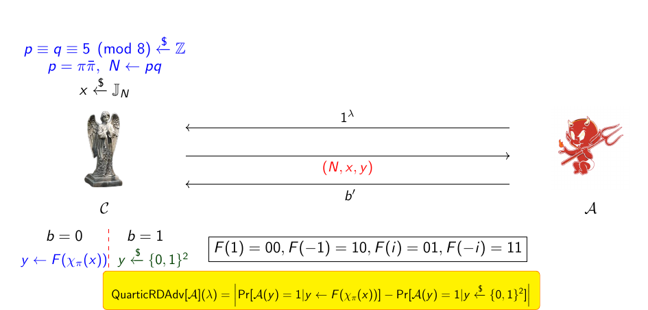
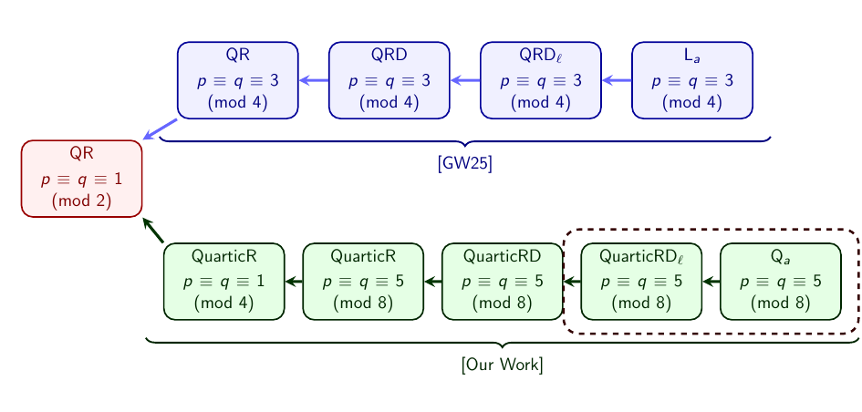

# 超越二次：用 quartic character 解锁伪随机性

> **Beyond Quadratic: Unlocking Pseudorandomness with Quartic Character**
> Mriganka Dey, Sampa Dey, Sampurna Pal, Subhabrata Samajder, Rana Barua
> CRYPTO 2026 · Foundations II (2026-08-20) · **L1 入门导读**
> [ePrint 2026/964](https://eprint.iacr.org/2026/964) · [Slides](https://iacr.org/submit/files/slides/2026/crypto/crypto2026/444/444_slides.pdf)

## §1 研究什么

**Dirichlet character**（modulus $N$）：乘法群同态 $\chi:\mathbb{Z}_N^\star\to\mathbb{C}^\times$（即 $\chi(mn)=\chi(m)\chi(n)$），对 $\gcd(n,N)\ne1$ 补定义 $\chi(n)=0$。最熟悉的例子是 **Legendre symbol**（order 2 的 character）：对奇素数 $p$，

$$
\Big(\tfrac{n}{p}\Big)\equiv n^{\frac{p-1}{2}}\pmod p\ \in\{1,-1\},
$$

值为 $1$ 当且仅当 $n$ 是 mod $p$ 的平方（quadratic residue）。

本文的主角是它的四次版本，定义要走进 **Gaussian integers** $\mathbb{Z}[i]$（实部、虚部均为整数的复数）：每个 $p\equiv1\pmod4$ 的素数在 $\mathbb{Z}[i]$ 中分解为 $p=\pi\bar\pi$（如 $5=(2+i)(2-i)$），$\pi$ 称为 **Gaussian prime**。**Quartic residue symbol**：

$$
\chi_\pi(n)\equiv n^{\frac{p-1}{4}}\pmod\pi\ \in\{1,\,i,\,-1,\,-i\},
$$

限制在 $\mathbb{Z}$ 上是一个 order 4 的 Dirichlet character。四个可能取值恰好携带 **2 bits**（Legendre 只有 1 bit）——这是全文所有效率优势的源头。

**简单代数：平方退回 Legendre，即 $\chi_\pi(n)^2=\big(\tfrac np\big)$。** 两边同余：$\chi_\pi(n)^2\equiv n^{(p-1)/2}\pmod\pi$，而 $\big(\tfrac np\big)\equiv n^{(p-1)/2}\pmod p$、故也 $\pmod\pi$；两边都取值于 $\{\pm1\}$，且 $1\not\equiv-1\pmod\pi$（因 $\pi\nmid2$），所以相等。$\square$

**手算例（$p=5$，$\pi=2+i$）**：mod $\pi$ 时 $i\equiv-2\equiv3$，residue field 为 $\{0,1,2,3,4\}$。由 $\tfrac{p-1}{4}=1$，$\chi_\pi(n)$ 就是与 $n$ 同余的那个单位根：

$$
\chi_\pi(1)=1,\quad \chi_\pi(2)=-i,\quad \chi_\pi(3)=i,\quad \chi_\pi(4)=-1.
$$

验证乘法性：$\chi_\pi(2)\chi_\pi(3)=(-i)(i)=1=\chi_\pi(6\bmod5)$；验证平方退回：$\chi_\pi(2)^2=-1=\big(\tfrac25\big)$ ✓（2 确实不是 mod 5 的平方）。

论文对这一个对象问了两个层面的问题，也分别给出构造：

**(a) 密码层面。** 取任一 bijection $F:\{1,i,-1,-i\}\to\{0,1\}^2$（如 $F(1)=00,F(i)=01,F(-1)=10,F(-i)=11$；24 种选法均可）。**Generalized quartic function**（秘密 $p=\pi\bar\pi$ 与 $x\leftarrow[2^\lambda]$，公开输入 $a\leftarrow[2^{3\lambda}]$）：

$$
Q_a(p,x):=F\big(\chi_\pi(x+a)\big)\in\{0,1\}^2 .
$$

目标：证明 $Q$ 是 **weak PRF**（输入 $a$ 随机选取时，输出与真随机函数不可区分），从而对随机公开 offsets $a_1,\dots,a_\ell$ 输出 $\big(Q_{a_k}(p,x)\big)_{k=1}^{\ell}$ 就是输出 $2\ell$ bits 的 **PRG**。

**(b) 解析层面。** 压缩成 $\pm1$：$\psi_\pi(n):=\mathrm{Re}(\chi_\pi(n))+\mathrm{Im}(\chi_\pi(n))$。在四个单位根上取值 $1,1,-1,-1$，故 $\psi_\pi:\mathbb{Z}_p^\star\to\{-1,1\}$。注意 $\psi_\pi$ **不是** character：上面 $p=5$ 的表即给出反例——$\psi_\pi(2)\psi_\pi(3)=(-1)(1)=-1$，但 $\psi_\pi(2\cdot3\bmod 5)=\psi_\pi(1)=1$。目标：证明序列 $E_{p-1}=(\psi_\pi(1),\dots,\psi_\pi(p-1))$ 在 Mauduit–Sárközy 统计框架下伪随机。

## §2 为什么研究它

**Damgård（CRYPTO 1988）**猜想连续 Legendre symbols（modulus 与起点保密）是伪随机的，并追问：quadratic 之外的 character 能否用来造 PRG？前一问三十多年后由 Corrigan-Gibbs 与 Wu 解决：**generalized Legendre function** $L_a(p,x):=\big(\tfrac{x+a}{p}\big)$ 在 **Quadratic Residuosity Assumption (QRA)** 下是 weak PRF。后一问在本文之前始终 open——本文以 quartic character 给出肯定回答，且用的还是同一个 QRA，不需要新假设。

**QRA**（自包含定义）：$N=pq$（两个奇素数，因子分解保密），记 Jacobi symbol $\big(\tfrac wN\big)=\big(\tfrac wp\big)\big(\tfrac wq\big)$，$\mathbb{J}_N=\{w\in\mathbb{Z}_N^\star:\big(\tfrac wN\big)=1\}$，$QR_N=\{w^2:w\in\mathbb{Z}_N^\star\}\subset\mathbb{J}_N$。QRA 断言：给定 $(N,w)$、$w\leftarrow\mathbb{J}_N$，任何多项式时间算法判断 $w\in QR_N$ 的 advantage 可忽略。这是 RSA 时代起就被密集研究的标准假设。

实际的利害关系：quartic 每次求值出 2 bits，同等 entropy 少一半 PRF 调用。后量子签名 **PorcRoast₄**（Beullens 等）与 **Quartapus**（Brier 等）已经建在 quartic character 的 one-wayness **假设**上，比基于 Legendre 的 LegRoast 签名更小更快；这类 residue symbol 还因电路小、可并行而对 MPC 与 zero-knowledge 友好（Euler 式判据 $\chi_\pi(n)\equiv n^{(p-1)/4}\bmod\pi$，一次模幂即可）。本文把这些方案脚下的假设落实为定理。解析一侧同样有缺口：Mauduit–Sárközy 证了 Legendre 序列的伪随机性、Oon 推广到所有 Dirichlet characters，而**非** character 的函数此前没有任何例子。

## §3 核心定理与做法

### 密码侧：wPRF 定理与归约链

> **定理（wPRF）**：设 $p,q$ 为随机 $\lambda$-bit 素数且 $p\equiv q\equiv5\pmod8$，$N=pq$。在 QRA 下，$Q_a(p,x)=F(\chi_\pi(x+a))$ 是 weak PRF；相应地，随机 offsets 下的 $2\ell$-bit 序列是安全 PRG。

安全性游戏（图 1）：challenger 采样 $N=pq$、$x\leftarrow\mathbb{J}_N$，掷币 $b$；$b=0$ 时返回 $F(\chi_\pi(x))$，$b=1$ 时返回均匀 2 bits；adversary 拿 $(N,x,\cdot)$ 猜 $b$。

*图 1（slides p.22）：decisional quartic residuosity game。左侧 challenger 按 $b$ 返回真值 $F(\chi_\pi(x))$ 或随机 2 bits，右侧 adversary 输出猜测 $b'$；advantage 为两种世界输出 1 的概率之差。wPRF 安全性归约的终点就是这个 game。*

证明是一条多项式时间归约链（对照图 2 下排）：

$$
QR \;\le_p\; \mathrm{QuarticR} \;\le_p\; \mathrm{QuarticRD} \;\le_p\; \mathrm{QuarticRD}_\ell \;\le_p\; Q_a,
$$

即：能区分 $Q_a$ 与随机 ⟹ 能解 decisional quartic residuosity ⟹ 能解 quadratic residuosity。技术路线仿照 Corrigan-Gibbs–Wu，但他们的世界建在 Blum primes（$p\equiv q\equiv3\pmod4$）上，而 quartic character 只在 $p\equiv1\pmod4$ 存在——整条链必须搬家，多步 hybrid（slides 给了 7 步）逐一重建。

*图 2（slides p.26）：residuosity 问题层级。上排（蓝）是 Corrigan-Gibbs–Wu 的 quadratic 路线，下排（绿）是本文的 quartic 路线，虚线框是本文新证的两步；两条链都终结于同一个 QR 假设——quartic 构造不需要比 quadratic 更强的假设。*

**为什么限定 $p\equiv q\equiv5\pmod8$（简单代数，讲完）：** 归约中的 resampling 一步需要一个**公开已知**的 $\mathbb{J}_N\setminus QR_N$ 元素。由二次互反律的补充律 $\big(\tfrac2p\big)=(-1)^{(p^2-1)/8}$：$p\equiv5\pmod8$ 时 $\big(\tfrac2p\big)=-1$。于是

$$
\Big(\tfrac2N\Big)=\Big(\tfrac2p\Big)\Big(\tfrac2q\Big)=(-1)(-1)=1,\qquad 2\notin QR_N\ (\text{因 }2\text{ 非 mod }p\text{ 平方}),
$$

即 $2\in\mathbb{J}_N\setminus QR_N$ **免费可得**。$p\equiv q\equiv1\pmod8$ 时没有已知的这类 canonical 元素，故归约（也仅这一步）需要该限制。$\square$

### 解析侧：Mauduit–Sárközy 伪随机性

两个测度（对 $\pm1$ 序列 $E_{p-1}$；$u,r,K$ 为等差数列的起点、公差、长度，$d_1<\cdots<d_\mu$ 为 shifts）：

$$
W(E_{p-1})=\max_{u,r,K}\Big|\sum_{j=0}^{K-1}\psi_\pi(u+jr)\Big|,\qquad
C_\mu(E_{p-1})=\max_{K,\,d_1<\cdots<d_\mu}\Big|\sum_{j=1}^{K}\psi_\pi(j+d_1)\cdots\psi_\pi(j+d_\mu)\Big|.
$$

$W$ 检测沿任意等差数列的偏置，$C_\mu$ 检测 $\mu$ 元组相关性；平凡上界都是 $p$ 量级，真随机序列的典型量级是 $\sqrt p$ 乘 log 因子。

> **定理 1 / 定理 2**：$\ W(E_{p-1})\le 6\sqrt2\,\sqrt p\,\log p,\qquad C_\mu(E_{p-1})\le 2^{\frac\mu2+1}\mu\,\sqrt p\,\log p.$

**核心 idea 是一个简单的线性分解（讲完）：** 对任意 $\zeta\in\{1,i,-1,-i\}$，

$$
\tfrac{1-i}{2}\,\zeta+\tfrac{1+i}{2}\,\bar\zeta
=\tfrac{\zeta+\bar\zeta}{2}+i\,\tfrac{\bar\zeta-\zeta}{2}
=\mathrm{Re}\,\zeta+\mathrm{Im}\,\zeta
$$

（末步用 $\bar\zeta-\zeta=-2i\,\mathrm{Im}\,\zeta$）。故 $\psi_\pi=\tfrac{1-i}{2}\chi_\pi+\tfrac{1+i}{2}\bar\chi_\pi$，且 $\bar\chi_\pi=\chi_\pi^{3}$（单位根的共轭是逆）。$\square$ 于是非 character 的 $\psi_\pi$ 的每个和式都拆成 character $\chi_\pi,\chi_\pi^3$ 的和式，交给经典武器：Pólya–Vinogradov 不等式（非主 character 在任意区间上的和 $=O(\sqrt p\log p)$）给出定理 1；相关性和式经 $\bar\chi_\pi=\chi_\pi^3$ 化成有界次数多项式的 character 和，用 Mauduit–Sárközy/Oon 的加强估计逐项控制、对展开的 $2^{\mu/2}$ 量级子集做记账即得定理 2（这部分展开属于 L2 份量，此处从略）。

两侧合起来：同一个 quartic 对象，拿到了**信息论无界对手**下的统计伪随机（$W,C_\mu$ 小）与**多项式时间对手**下的密码伪随机（QRA 归约）双重认证——并回答了 Damgård 的最后一问。作者留下的 open problems：三次（cubic）及更高阶 character 能否同样处理（当前障碍恰是缺少 §3 中"免费的 2"那样的可采样元素）。

## 一句话带走

> 把 Legendre symbol 的指数 $\tfrac{p-1}2$ 换成 $\tfrac{p-1}4$、模数搬进 $\mathbb{Z}[i]$，每次求值从 1 bit 变 2 bits；一条 $QR\le_p\mathrm{QuarticR}\le_p\mathrm{QuarticRD}\le_p Q_a$ 的归约链证明它在同一个 QRA 下是 weak PRF（$p\equiv q\equiv5\pmod8$ 只为白拿 $2\in\mathbb{J}_N\setminus QR_N$），而线性分解 $\psi_\pi=\tfrac{1-i}2\chi_\pi+\tfrac{1+i}2\chi_\pi^3$ 又把非 character 序列的统计伪随机归到经典 character 和估计——Damgård 1988 年的最后一问就此关闭，PorcRoast₄/Quartapus 的假设落地为定理。
