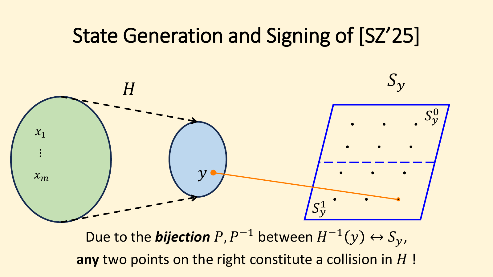
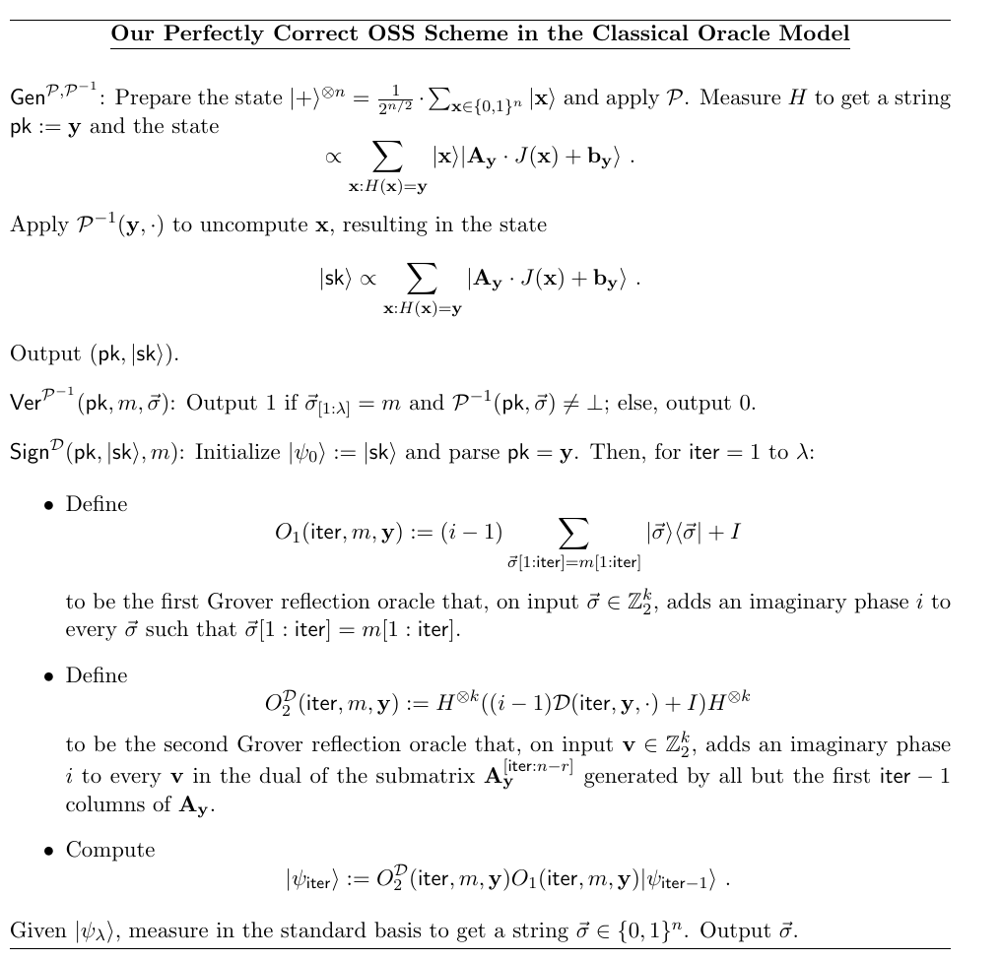

# 线性量子内存中的 uncloneable cryptography：把 one-shot signature 的量子签名 key 压到 $O(\lambda)$ qubit

> **Uncloneable Cryptography in Linear Quantum Memory**
> Andrew Huang (MIT), Omri Shmueli (NTT Research), Vinod Vaikuntanathan (MIT), Mark Zhandry (Stanford)
> CRYPTO 2026 · Quantum Cryptography I (2026-08-19) · **L1 入门导读**
> [ePrint 2026/1210](https://eprint.iacr.org/2026/1210) · [Slides](https://iacr.org/submit/files/slides/2026/crypto/crypto2026/490/490_slides.pdf)

## §1 研究什么

**One-shot signature（OSS，Amos–Georgiou–Kiayias–Zhandry 2020）**：一个公开的量子算法 $\mathsf{Gen}$ 输出 classical 验证 key $\mathsf{pk}$ 与量子签名 key $|\mathsf{sk}\rangle$；$\mathsf{Sign}(|\mathsf{sk}\rangle,m)$ 输出 classical 签名 $\sigma$；$\mathsf{Ver}(\mathsf{pk},m,\sigma)\in\{0,1\}$。安全性（strong unforgeability）：**即使 key 由敌手自己生成**，也找不到两个不同的 $(m_0,\sigma_0)\ne(m_1,\sigma_1)$ 在同一个 $\mathsf{pk}$ 下都通过验证。签名这个动作是对 $|\mathsf{sk}\rangle$ 的不可逆测量，签一次就把 key 毁掉。弱一点的 **signature token**（Ben-David–Sattath）由可信方生成 key。

本文的度量是**长期量子内存**：$|\mathsf{sk}\rangle$ 有多少 qubit。所有安全性按 bit-security 计：$\lambda$-bit 安全指不存在运行时间 $T$、成功概率 $p$ 且 $T/p<2^\lambda$ 的攻击。一个平凡下界是 $\Omega(\lambda)$：$(\mathsf{pk},|\psi_{\mathsf{pk}}\rangle)$ 是 QMA 型的 witness，$n$-qubit witness 可用 $2^{O(n)}$ 时间暴力找到，所以 $n\in\Omega(\lambda)$（slides 的论证）。

问题：**能否达到 $\Theta(\lambda)$？**

## §2 为什么研究它

量子态会 decohere；用于长期存放 key 的量子内存要求"永远在线"的 quantum error correction，远比 classical 内存或计算中的短期量子内存昂贵。而现有 uncloneable 原语的量子部分几乎都 $\ge\lambda^2$ qubit：它们按输入的 bit 逐位工作，每个 bit 配一个 $\ge\lambda$ qubit 的 uncloneable 态，输入本身又 $\ge\lambda$ bit。

具体到 OSS，Shmueli–Zhandry 2025（SZ25）给出首个有证明的方案：classical oracle model 下无条件安全，标准模型下基于 post-quantum LWE + iO。但签 $\lambda$-bit 消息的 key 在 oracle model 里是 $\Omega(\lambda^3)$ qubit，标准模型下至少 $\omega(\lambda^5)$。两个来源（§1.2）：

1. **逐 bit 签名**：每个 bit 一把独立的 key，$\lambda$ 把 key。
2. **coset partition function（CPF）的输入长度**：SZ25 的安全证明把一个 CPF $Q$（每个像的原像集都是 affine subspace）嵌进 oracle 里，要求原像 coset 大小 $2^\lambda$ 且 collision-resistant。他们只会用 $\lambda$ 个并行的 random 2-to-1 函数拼出来，输入长 $\lambda^2$；而 $Q$ 的输入长度下界了 $|\mathsf{sk}\rangle$ 的长度。

所以每把 key $\Omega(\lambda^2)$，共 $\Omega(\lambda^3)$。

## §3 核心定理与做法

> **定理 1**：相对 classical oracle 存在 OSS，量子 key 为 $O(\lambda)$ qubit，可签 $\lambda$-bit 消息；任意做 $T$ 次查询的（时间无界）量子算法找到同一 $\mathsf{pk}$ 下两个不同 message–signature 对的概率为 $\mathrm{poly}(T)/2^\lambda$。有两个变体：一个签名**可并行**（correctness $1-2^{-\Omega(\lambda)}$），一个 **perfectly correct**（逐位顺序签）。
>
> **定理 2–4（标准模型）**：(2) subexponential iO + exponentially secure OWF + "optimally secure" LWE $\Rightarrow$ $\tilde O(\lambda^3)$ qubit；(3) 再加 permutation-indistinguishable 的 perfect 2-to-1 trapdoor function（exponentially collision-resistant）且 LWE 只需多项式 noise/modulus ratio $\Rightarrow$ $\tilde O(\lambda)$；(4) 用 exponentially secure lossy function 完全去掉 LWE $\Rightarrow$ $O(\lambda)$。三者的伪造概率均为 $T/2^{\Omega(\lambda)}$。
>
> **定理 5（informal）**：存在 perfectly correct、strongly incompressible 的 OSS（$\lambda$-bit 消息），从而由 ÇGS25（同 session 的 paper 709）得到 **perfectly correct** 的 public-key quantum fire / key-fire。

### 3.1 SZ25 方案的骨架

*图 1（slides）：$H$ 是 many-to-1 的 hash；$P,P^{-1}$ 在原像集 $H^{-1}(y)$ 与 affine subspace $S_y$ 之间给出双射。$S_y$ 里任意两个不同的点都是 $H$ 的一对 collision，所以"同一 $\mathsf{pk}=y$ 下两个不同签名"就是 collision。*

参数（论文 §2）：$s:=16\lambda$，$r:=s\lambda$，$n:=r+\tfrac32 s$，$k:=\tfrac32 s+\lambda$。随机置换 $\Pi:\{0,1\}^n\to\{0,1\}^n$，$H(x)$ 为 $\Pi(x)$ 的前 $r$ bit，$J(x)\in\mathbb{Z}_2^{n-r}$ 为后 $n-r$ bit；随机函数 $F$ 为每个 $y\in\{0,1\}^r$ 派生一个列满秩矩阵 $A_y\in\mathbb{Z}_2^{k\times(n-r)}$ 与向量 $b_y\in\mathbb{Z}_2^k$。三个 oracle：

$$P(x)=\bigl(y,\ A_y J(x)+b_y\bigr),\ y=H(x);\qquad P^{-1}(y,u)=\begin{cases}\Pi^{-1}(y\|z)&\exists z:\ A_yz+b_y=u\\ \bot&\text{否则}\end{cases};\qquad D:\ \text{检查 } v\in S_y^{\perp}\text{（本文改造它）}.$$

$\mathsf{Gen}$：对 $|+\rangle^{\otimes n}$ 施加 $P$，测量 $y$，用 $P^{-1}$ 擦掉 $x$，得到 coset $W_y:=\{A_yw+b_y\}$ 上的均匀叠加
$$|\mathsf{sk}\rangle\propto\sum_{x:H(x)=y}|A_yJ(x)+b_y\rangle,\qquad\mathsf{pk}:=y .$$
$k$ qubit 的 $|\mathsf{sk}\rangle$ 就是要放进长期内存的东西。

### 3.2 一把 key 签 $\lambda$ bit（I）：perfectly correct 的顺序方案

*图 2（论文 Fig. 1）：签名 $=$ coset 中前 $\lambda$ bit 恰为 $m$ 的向量；签名算法是 $\lambda$ 轮相位为 $\mathrm{i}$ 的 Grover 旋转，每轮把叠加从"前 $\mathsf{iter}-1$ bit 已对"收缩到"前 $\mathsf{iter}$ bit 已对"。*

**两处改动**。(a) 强制每个 coset 都包含所有 $\lambda$-bit 前缀：取
$$A_y:=\begin{pmatrix}I_\lambda&0\\ B_y&C_y\end{pmatrix}\in\mathbb{Z}_2^{k\times(n-r)},$$
$B_y$ 随机，$C_y\in\mathbb{Z}_2^{(k-\lambda)\times(n-r-\lambda)}$ 随机列满秩。于是 $A_yw+b_y$ 的前 $\lambda$ bit 是 $w[1{:}\lambda]\oplus b_y[1{:}\lambda]$，每个前缀出现的向量数相等。记 $W_{y,m,j}:=\{w\in\mathbb{Z}_2^k: w[1{:}j]=m[1{:}j]\wedge P^{-1}(y,w)\ne\bot\}$，则 $|W_{y,m,j}|$ 随 $j$ 每增 1 恰好减半（论文写 $|W_{y,m,j}|=2^{k-j}$；按 $|W_y|=2^{n-r}$ 应为 $2^{n-r-j}$，减半这一点不受影响）。(b) 把 dual oracle 扩成带索引的
$$D(j,y,v)=1\iff v^{\mathsf T}A_y^{[j:n-r]}=0\quad(j\in[\lambda+1]),$$
其中 $A_y^{[j:n-r]}$ 是去掉前 $j-1$ 列的子矩阵。它给出的是 $W_{y,m,j-1}$ 所在线性空间的 dual——正是每轮 Grover 需要"反射"的那个子空间。给出 $\lambda$ 个逐渐变大的 dual 的成员测试就够了，不必给出指数多个。

**验证**：$\mathsf{Ver}(\mathsf{pk},m,\vec\sigma)=1\iff\vec\sigma[1{:}\lambda]=m\ \wedge\ P^{-1}(\mathsf{pk},\vec\sigma)\ne\bot$。

**签名**：$|\psi_0\rangle:=|\mathsf{sk}\rangle$，对 $\mathsf{iter}=1,\dots,\lambda$：
$$O_1:=(\mathrm{i}-1)\!\!\sum_{\vec\sigma[1:\mathsf{iter}]=m[1:\mathsf{iter}]}\!\!|\vec\sigma\rangle\langle\vec\sigma|+I,\qquad O_2^{D}:=\mathsf{Had}^{\otimes k}\bigl((\mathrm{i}-1)D(\mathsf{iter},y,\cdot)+I\bigr)\mathsf{Had}^{\otimes k},\qquad|\psi_{\mathsf{iter}}\rangle:=O_2^{D}O_1|\psi_{\mathsf{iter}-1}\rangle$$
（$\mathsf{Had}$ 为 Hadamard，论文记 $H^{\otimes k}$，这里避免与 hash $H$ 撞名）。最后测 $|\psi_\lambda\rangle$ 输出 $\vec\sigma$。

> **引理 14（perfect correctness）**：对所有 $\lambda$ 与 $m\in\{0,1\}^\lambda$，$\Pr[\mathsf{Ver}(\mathsf{pk},m,\sigma_m)=1]=1$。

**一轮的代数**（论文 §2.2，我逐步核对过）。记 $|\mathsf{sk}_b\rangle$ 为 coset 中第 $\mathsf{iter}$ 位等于 $b$ 的向量的均匀叠加，当前态为 $|\mathsf{sk}\rangle=\tfrac1{\sqrt2}(|\mathsf{sk}_0\rangle+|\mathsf{sk}_1\rangle)$，目标 bit 为 1。令 $|{+}\rangle:=\tfrac1{\sqrt2}(|\mathsf{sk}_0\rangle+|\mathsf{sk}_1\rangle)$，$|{-}\rangle:=\tfrac1{\sqrt2}(|\mathsf{sk}_0\rangle-|\mathsf{sk}_1\rangle)$。关键观察：$O_2^D$ 把 $|{+}\rangle$ 映到 $\mathrm{i}|{+}\rangle$、保持 $|{-}\rangle$ 不动——因为 $\mathsf{Had}^{\otimes k}|{+}\rangle$ 支撑在 $(A_y^{[\mathsf{iter}:n-r]})^\perp$ 上（$D=1$），而 $\mathsf{Had}^{\otimes k}|{-}\rangle$ 支撑在 $(A_y^{[\mathsf{iter}+1:n-r]})^\perp\setminus(A_y^{[\mathsf{iter}:n-r]})^\perp$ 上（$D=0$）。于是
$$O_1|\mathsf{sk}\rangle=\tfrac1{\sqrt2}(|\mathsf{sk}_0\rangle+\mathrm{i}|\mathsf{sk}_1\rangle)=\tfrac{1+\mathrm{i}}2|{+}\rangle+\tfrac{1-\mathrm{i}}2|{-}\rangle\ \xrightarrow{O_2^D}\ \tfrac{\mathrm{i}(1+\mathrm{i})}2|{+}\rangle+\tfrac{1-\mathrm{i}}2|{-}\rangle=\tfrac{\mathrm{i}-1}2\bigl(|{+}\rangle-|{-}\rangle\bigr)=\tfrac{\mathrm{i}-1}{\sqrt2}\,|\mathsf{sk}_1\rangle .$$
因为"好向量"恰占一半，相位取 $\mathrm{i}$ 的 phase-matched Grover **一轮就精确旋转到位**，只多一个 global phase $(\mathrm{i}-1)/\sqrt2$（Remark 12：不影响测量；若要 controlled 版本可签长度为 8 的倍数的消息使 $((\mathrm{i}-1)/\sqrt2)^8=1$）。$\lambda$ 轮后得 $\sum_{w\in W_{y,m,\lambda}}|w\rangle$，测量即得合法签名。$\square$

> **定理 15（strong signature security）**：对任意做 $q$ 次查询的 oracle 算法 $\mathcal{A}$，
> $$\Pr\bigl[(m_0,\sigma_0)\ne(m_1,\sigma_1)\ \wedge\ \mathsf{Ver}(\mathsf{pk},m_0,\sigma_0)=\mathsf{Ver}(\mathsf{pk},m_1,\sigma_1)=1\bigr]=O\!\left(\frac{\lambda^3q^3}{2^\lambda}\right).$$

安全性的逻辑仍是"两个不同的合法签名 $=$ $S_y$ 里两个不同的点 $=$ $H$ 的 collision"，但因为多给了 $\lambda$ 个 dual oracle，SZ25 的证明不能黑盒套用；论文为此定义并证明了 *subspace-hiding functions*（§3.3，subspace-hiding obfuscation 的推广）。

### 3.3 一把 key 签 $\lambda$ bit（II）：并行的"测量–纠正"方案

顺序方案每轮依赖上一轮。并行方案（Construction 8/9）改为：先把 $m$ 编码成一个随机线性码的码字 $m^*\in\{0,1\}^\lambda$（$\varepsilon=\tfrac13$，码率 $c_{\mathrm{ECC}}\varepsilon^2$，Pinsker 1965：最小距离以压倒性概率 $\ge(\tfrac12-\varepsilon)\lambda=\lambda/6$；论文把该常数记作 $C$，这里改名以免与 $C_y$ 撞），消息长度 $\lambda'=c_{\mathrm{ECC}}\varepsilon^2\lambda$。签名 $\vec\sigma\in\mathbb{Z}_2^k$ 合法当且仅当 $P^{-1}(y,\vec\sigma)\ne\bot$ 且 $\vec\sigma$ 的**后** $\lambda$ bit 与 $m^*$ 的 Hamming 距离 $\le\lambda/12$。

签名算法跑 4 轮，每轮：(a) 测量 $|\mathsf{sk}\rangle$ 后 $\lambda$ 个 qubit 得 $m^t$；(b) $\mathsf{Had}^{\otimes k}$；(c) 把 $D(y,\cdot)$ 的输出写进 $\lambda$-qubit 寄存器，**只测量** $m^*_i\oplus m^t_i=1$ 的那些位置，丢掉结果并用 $D$ 再算一次擦掉寄存器；(d) $\mathsf{Had}^{\otimes k}$。这里的 $D(y,v)$ 改为：若 $v^{\mathsf T}A_y$ 落在 $A_y$ **底部 $\lambda$ 行**张成的行空间里，则输出其坐标向量 $c_{y,v}\in\mathbb{Z}_2^\lambda$，否则 $\bot$（$A_y$ 采样时要求底部 $\lambda$ 行满秩）。

> **Claim 10（正确性）**：以 $1-2^{-\Omega(\lambda)}$ 的概率得到合法签名。

机制：记 $S_{y,0}:=\mathrm{ColSpan}(A_y)$，$S_y\subset S_{y,0}$ 为后 $\lambda$ bit 全 0 的子空间，$S_{y,j}$ 为后 $\lambda$ bit 中只允许第 $j$ 位非零的子空间。每轮 (a) 之后态形如 $\sum_{u\in S_y}(-1)^{\langle z^t,u\rangle}|x^t+b_y+u\rangle$（论文 (1) 式）；(b)–(d) 之后变成
$$\sum_{u\in S(m^*,m^t)}(-1)^{\langle z^{t+1},u\rangle}|x^t+b_y+u\rangle,\qquad S(m^*,m^t):=\mathrm{Span}\{S_{y,j}: m^*_j\oplus m^t_j=1\}$$
（论文 (2) 式）：**只有测错的 bit 被"重新熵化"回均匀叠加，测对的 bit 保持 classical**。相位 $z^{t+1}$ 随机但无关紧要，下一轮反正要测量。每个处于叠加的 bit 独立以 $\tfrac12$ 塌缩到正确值（底部 $\lambda$ 行满秩保证独立），4 轮后错位比例 $\le\tfrac1{16}+\tfrac1{100}<\tfrac1{12}$（Chernoff），验证通过。

> **定理 11**：并行方案的伪造概率同样是 $O(\lambda^3q^3/2^\lambda)$。理由：最小距离 $\lambda/6>2\cdot\lambda/12$，任意 $u$ 到至多一个码字的距离 $\le\lambda/12$，故不同消息的合法签名是 $S_y$ 里两个不同的向量，即 $H$ 的 collision。码只需高效**编码**，随机线性码即可。

### 3.4 从 $\Theta(\lambda^2)$ 到 $\Theta(\lambda)$：folding coset partition functions

上两节把 $\Omega(\lambda^3)$ 降到 $O(\lambda^2)$；剩下的因子来自 §2 的第 2 个来源。SZ25 的最后一步归约：给定只有 $P,P^{-1}$（无 $D$）时 $H$ 是 collision-resistant，方法是把一个 CPF $Q$ 嵌进 $P,P^{-1}$，使 $H$ 的 collision 就是 $Q$ 的 collision。嵌入用了 $Q$ 的两个结构：(i) CPF 可延拓成置换（前 $r$ bit 是 $Q$ 的输出，后 $n-r$ bit 是输入在其 coset 里的坐标），与随机 $\Pi$ 复合后统计上仍是随机置换；(ii) 把 $Q$ 的原像 coset 乘上随机满秩矩阵，就得到随机 affine subspace $S_y$，且 $x\leftrightarrow u_x$ 的映射可高效求逆。$Q$ 的输入长度 $n'$ 同时下界 $n$ 和 $k$。

本文的 folding CPF（§1.2，§4）：
$$Q:\mathbb{Z}_2^{\lambda^2}\to\mathbb{Z}_2^{\lambda^2-\lambda}\times\mathbb{Z}_2^{2\lambda-1},\qquad Q^{-1}:\mathbb{Z}_2^{\lambda^2-\lambda}\times\mathbb{Z}_2^{2\lambda-1}\to\mathbb{Z}_2^{\lambda^2}.$$
用 **claw-free permutation** $L(b,x):=\Pi_b(x)$（$\Pi_0,\Pi_1$ 为 $\{0,1\}^{\lambda-1}$ 上的随机置换）代替任意 2-to-1 函数：collision 必然在第一个 bit 上不同，而这个 bit 就是元素在 coset 里的"坐标"，可公开算出。把输入拆成 $\lambda$ 组 $(b_1,w_1,\dots,b_\lambda,w_\lambda)$，输出
$$\bigl(y_1,\dots,y_\lambda\bigr)\in\{0,1\}^{\lambda^2-\lambda},\qquad\bigl(b_1,\dots,b_\lambda,\ w:=\textstyle\sum_j w_j\bigr)\in\{0,1\}^{2\lambda-1}.$$
$Q^{-1}$ 用各 $\Pi_{j,b_j}^{-1}$ 逐组求逆（不需要 $w$）。关键：即使第 $i^*$ 组**没有** inverse，也能完美模拟 $Q,Q^{-1}$——正向照算，反向先求出其他 $\lambda-1$ 个 $w_j$，再由
$$w_{i^*}\leftarrow w-\sum_{j\ne i^*}w_j$$
补齐。这样归约可以把要找 collision 的 claw-free 实例藏在 $i^*$ 处。而"folded"的第二部分只有 $2\lambda-1$ bit，本身也是 coset 结构（§4），归约里用它（而不是 $\lambda^2$-bit 的原输入）当作 $S_y$ 的向量，于是 $k=O(\lambda)$：签名 key 就是这些向量的叠加，长度降为 $O(\lambda)$。

### 3.5 标准模型与 quantum fire

标准模型（§5，基于并行方案）要求各组件对 $2^\lambda$ 时间攻击安全：iO 只影响 CRS 大小，可取 subexponential；LWE 用在两处——lossy function 的 "bloating" 需要值域 $2^{O(\lambda)}$ 且抵御 $2^{O(\lambda)}$ 时间攻击，因 LWE 有 $2^{O(\lambda/\log\lambda)}$ 时间攻击（$\lambda$ 为 secret 的 bit 长）而只能到 $\tilde O(\lambda)$；approximately 2-to-1 函数的错误率 $\approx$ noise/modulus ratio，sparse trigger 要求它 $\approx2^{-\lambda}$，导致输入输出 $\ge\omega(\lambda^3)$——这是定理 2 的 $\tilde O(\lambda^3)$ 与定理 3/4 需要额外假设的原因。

Quantum fire（§7）：ÇGS25 需要 $\lambda$-bit 消息的 OSS 具有 **strong incompressibility**（$\mathcal{A}_1$ 的任何多项式长 classical 串 $L$ 都只能让 $\mathcal{A}_2$ 对一个 $\mathrm{poly}(|L|,\lambda)$ 大小的 key 列表签名）。逐 bit 并行重复的方案天然**可压缩**：$\mathcal{A}_1$ 对每个 bit 存两组 $(\mathsf{pk}_{i,b},b,\sigma_{i,b})$，$\mathcal{A}_2$ 混搭即可对指数多个 key 签名，$\mathcal{A}_1$ 只需 $O(\lambda)$ 次查询、$\mathcal{A}_2$ 零查询。本文对 perfectly correct 方案稍作修改后证明其 strong incompressibility（Lemma 66），从而（推论 68/69）得到 perfectly correct 的 public-key quantum fire、任意 classically-unlearnable 功能的 key-fire、以及 key 可完美克隆且 unbounded-leakage-resilient 的 PKE；oracle 可用 post-quantum OWF 高效实现。

## §4 一句话带走

> 让 coset $W_y$ 强制包含所有 $\lambda$-bit 前缀（$A_y$ 的前 $\lambda$ 行取 $I_\lambda$），并把 dual oracle 扩成 $\lambda$ 个逐级嵌套子空间的成员测试，一把 $k=O(\lambda)$ qubit 的 coset state 就能用 $\lambda$ 轮"相位 $\mathrm{i}$ 的 Grover"**完美地**签出整条 $\lambda$-bit 消息（或用 ECC + 4 轮"测量–纠正"并行签出）；再用 claw-free permutation 的 folding CPF（$w_{i^*}=w-\sum_{j\ne i^*}w_j$ 补出缺失的逆）把安全归约里 CPF 的向量长度从 $\lambda^2$ 压到 $2\lambda-1$。结果是相对 classical oracle 无条件、$\mathrm{poly}(T)/2^\lambda$ 安全、$\Theta(\lambda)$ qubit 的 one-shot signature，达到平凡下界。

**局限与开放问题**（slides）：标准模型的 $\Theta(\lambda)$ 归结为一个 classical 问题——构造输入长 $\Theta(\lambda)$、perfectly 2-to-1、post-quantum 的 claw-free（trapdoor）function；perfectly correct 方案的标准模型安全证明与其 quantum fire 的并行版本留作后续；这些技术能否把其他基于 coset state 的原语（copy-protection、one-time program）同样压到最优量子内存，是作者提出的方向。
