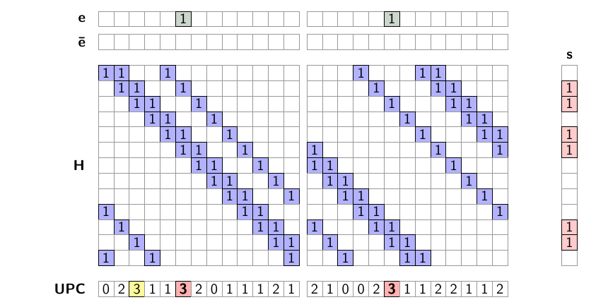
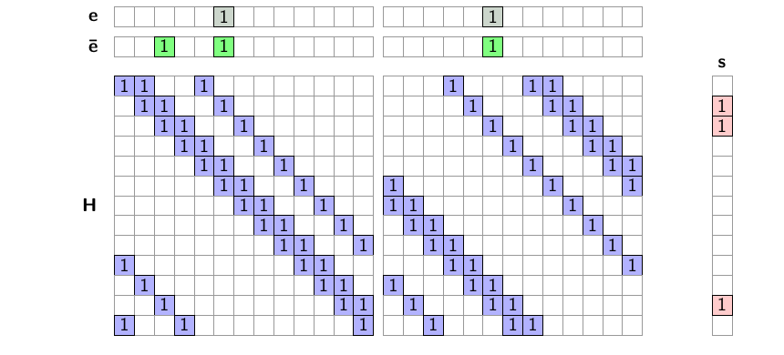
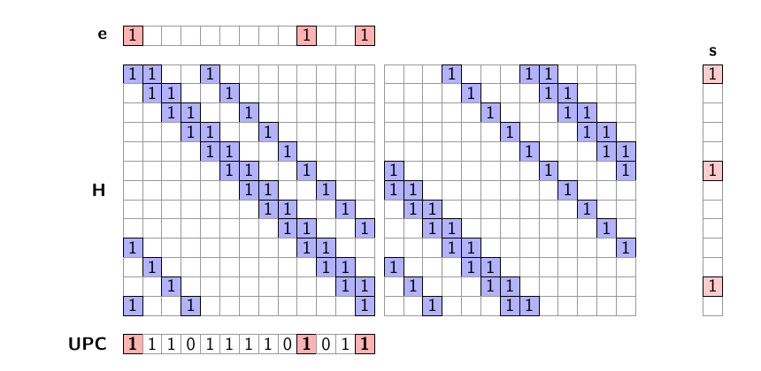

# 译码失败率有界的高效 QC-MDPC 密码系统

> **Efficient QC-MDPC Cryptosystems with Bounded Decoding Failure Rate**
> Alessandro Annechini, Alessandro Barenghi, Gerardo Pelosi, Simone Perriello (Politecnico di Milano)
> CRYPTO 2026 · Post-Quantum Cryptography (2026-08-18) · **L1 入门导读**
> [ePrint 2025/1043](https://eprint.iacr.org/2025/1043) · [Slides](https://iacr.org/submit/files/slides/2026/crypto/crypto2026/502/502_slides.pdf)

## §1 研究什么

**Linear code** $C\subset\mathbb{F}_2^n$ 由 **parity-check matrix** $\mathbf{H}$ 刻画：$C=\{\mathbf{y}\in\mathbb{F}_2^n:\mathbf{H}\mathbf{y}=\mathbf{0}\}$，任意 $\mathbf{y}\in\mathbb{F}_2^n$ 的 **syndrome** 为 $\mathbf{H}\mathbf{y}$。**Syndrome decoding problem**（1978 年证明 NP-hard）：

$$
\text{给定 }(\mathbf{H},\mathbf{s},t):\quad \text{求 } \mathbf{e}\in\mathbb{F}_2^{n},\ \ \mathbf{H}\mathbf{e}=\mathbf{s},\ \ \mathrm{wt}(\mathbf{e})=t,
$$

其中 $\mathrm{wt}(\cdot)$ 为 Hamming weight，$t$ 为规定的 error weight。

**QC-MDPC code**：设 $p$ 为素数（满足 $\mathrm{ord}_p(2)=p-1$），$R:=\mathbb{F}_2[x]/\langle x^p-1\rangle$。取 $n_0$ 个 weight 为 $v$ 的多项式 $h_0,\dots,h_{n_0-1}\in R$（$v$ 为奇数，$v\in O(\sqrt n)$，$n=p\,n_0$），

$$
\mathbf{H}=[\,\mathrm{circ}(h_0)\mid\cdots\mid\mathrm{circ}(h_{n_0-1})\,]\in\mathbb{F}_2^{p\times n},
$$

$\mathrm{circ}(h_\ell)$ 是 $h_\ell$ 生成的 $p\times p$ circulant matrix。把 $\mathbf{e}$ 按块拆成 $(\mathbf{e}_0,\dots,\mathbf{e}_{n_0-1})$、每块视为多项式 $e_\ell\in R$，则 syndrome 就是多项式运算：

$$
s(x)=\sum_{\ell=0}^{n_0-1} h_\ell(x)\,e_\ell(x)\ \in R. \tag{1}
$$

两个参数条件是配套的："$v$ 奇 + $\mathrm{ord}_p(2)=p-1$"合起来保证 KeyGen 的求逆无条件成立：后者使 $x^p-1=(x+1)\Phi(x)$ 中 $\Phi(x)=x^{p-1}+\cdots+1$ irreducible（irreducible 因子个数 $=(p-1)/\mathrm{ord}_p(2)$），故 $R\cong\mathbb{F}_2\times\mathbb{F}_{2^{p-1}}$，其中不可逆元只有 $(x+1)$ 的倍数与 $\{0,\Phi\}$；而 $h_\ell(1)=v\bmod 2=1$ 排除前者、$0<v<p$ 排除后者——**odd weight 即可逆**。附带地，$R$ 只有两个分量也把 folding/squaring 类结构攻击可利用的代数分解压到最小。

稀疏的 $\mathbf{H}$ 就是 trapdoor：**Niederreiter PKE**（即 BIKE / LEDAcrypt-KEM 的构造，论文 Fig. 1）——

- **KeyGen**：私钥 $\mathbf{H}$；公钥 $\mathbf{M}=\mathrm{circ}(h_{n_0-1})^{-1}\mathbf{H}$（稠密，最后一块为单位阵）。
- **Enc**：明文即 weight-$t$ 的 $\mathbf{e}$；密文 $\mathbf{c}=\mathbf{M}\mathbf{e}$。
- **Dec**：算 $\mathbf{s}=\mathrm{circ}(h_{n_0-1})\,\mathbf{c}$（$=\mathbf{H}\mathbf{e}$），用稀疏 $\mathbf{H}$ 对 $\mathbf{s}$ 译码恢复 $\mathbf{e}$；失败输出 $\bot$。

译码用 **parallel bit-flipping decoder**。记 error 估计为 $\bar{\mathbf{e}}$（初始 $\mathbf{0}$），每轮：

1. 对每个坐标 $j\in\{0,\dots,n-1\}$ 数 unsatisfied parity checks：$\mathrm{upc}_j=\langle\mathbf{s},\mathbf{H}_{:,j}\rangle$（$\mathbf{H}_{:,j}$ 为第 $j$ 列）；
2. 所有 $\mathrm{upc}_j\ge\mathrm{th}$ 的坐标**同时**翻转（$\mathrm{th}$ 为本轮 threshold）：$\bar{\mathbf{e}}$ 的第 $j$ 位取反，并更新 $\mathbf{s}\leftarrow\mathbf{s}\oplus\mathbf{H}_{:,j}$；
3. $\mathbf{s}=\mathbf{0}$ 则成功；超过轮数上限（本文：**3 轮**）则失败。

$\mathrm{upc}_j$ 的内积方向值得点破。parity check 本身是**行**对 error 的内积：记当前 discrepancy 为 $\mathbf{d}=\mathbf{e}\oplus\bar{\mathbf{e}}$，decoder 维持不变量 $\mathbf{H}\mathbf{d}=\mathbf{s}$，即 $s_i=\langle\mathbf{H}_{i,:},\mathbf{d}\rangle\bmod 2$ 记录第 $i$ 条 check 当前是否被违反。而 $\langle\mathbf{s},\mathbf{H}_{:,j}\rangle$ **不是在算新的 check**：列 $\mathbf{H}_{:,j}$ 是"第 $j$ 位出现在哪些 check 里"的名单，这个**整数**内积只是拿名单去 $\mathbf{s}$ 里点名——

$$
\mathrm{upc}=\mathbf{H}^{\top}\mathbf{s}\ (\text{over }\mathbb{Z}),\qquad
\mathrm{upc}_j=\#\{\,i:\ H_{i,j}=1\ \wedge\ s_i=1\,\}\in\{0,\dots,v\}.
$$

信息先经 $\mathbf{H}$ 从位流向 check（每条 check 聚合它管的位），再经 $\mathbf{H}^{\top}$ 流回位（每个位聚合管它的 check）。这个信号有用是因为 $\mathbf{d}$ 与 $\mathbf{H}$ 都稀疏：一条 check 的 support 通常至多撞上 $\mathbf{d}$ 的一位，于是 error 位自己就点亮名单上几乎全部 $v$ 条 check（$\mathrm{upc}\approx v$），无辜位只被偶尔路过（$\mathrm{upc}\approx 0$）——threshold 就切在这两团分布之间。

*图 1（slides p.7）：一个 $n_0=2$、$v=3$ 的玩具例。$\mathbf{e}$ 有 2 个 error bit，syndrome $\mathbf{s}$ 有 6 个 1。UPC 行中达到 $\mathrm{th}=3$ 的位置将被翻转——注意其中一个（黄色）并不是真正的 error 位置：并行决策只看 upc，会犯错。*

*图 2（slides p.8）：同时翻转后 $\mathrm{wt}(\mathbf{s})$ 从 6 降到 3。两个真 error 已消掉，但图 1 中错翻的那一位成为新的 discrepancy（其 syndrome 贡献恰为该列的 $v=3$ 个 1），留给下一轮清理。这就是 bit-flipping 的日常：整体收敛,局部犯错。*

失败概率记为 **DFR**（decoding failure rate）。本文的问题：**对实际部署的三轮 parallel decoder，给出 DFR 的 closed-form 估计**。

## §2 为什么研究它

**为什么译码失败会泄露私钥**（基础但关键）：某个 error $\mathbf{e}$ 是否译码失败**不是**均匀随机事件——它取决于 $\mathrm{Supp}(\mathbf{e})$ 与私钥多项式 support 的几何关系（§3 会给出直觉：与 near/half codeword 结构 overlap 越大越容易失败）。于是主动攻击者每观察一次"解密成功/失败"，就得到一个关于私钥结构的统计样本：GJS 攻击（Guo–Johansson–Stankovski, ASIACRYPT 2016）从失败样本中重建私钥 support 里各 1 之间距离的多重集（distance spectrum），继而恢复私钥；本文进一步引述，观察到**单次**失败已足以恢复 Niederreiter 私钥。因此 IND-CCA2 要求把"见到一次失败"变得与组合攻击一样难：

$$
\mathrm{DFR}\le 2^{-\lambda},\qquad \lambda=128,
$$

而 $2^{-128}$ 远超 Monte Carlo 可验证范围，只能靠数学模型。已有三条路线全部有裂缝：

| 路线 | 做法 | 裂缝 |
|---|---|---|
| LEDAcrypt-KEM | 两轮 decoder 的 closed-form 上界 | 界松：公钥/密文比 BIKE 大约 2 倍；不考虑 QC 结构 |
| BIKE | 在 DFR $\approx 2^{-30}$ 区仿真后外推 | DFR 曲线有 **waterfall**（指数下降）→ **error floor**（多项式下降）转折，外推错过 floor；实际 DFR 被证至少超标 $2^{11.39}$ 倍 |
| CRYPTO 2025 | 用无限轮 **sequential** decoder 作 proxy 上界 | "proxy 更差"只是仿真区的猜想（§3 将给出反例结构） |

结局：NIST 2025 年 3 月报告称"BIKE 本可与 ML-KEM 互补"，但"HQC 的 DFR 分析更稳定成熟是决定性因素"——BIKE 落选、HQC 标准化，且报告明言"两轮以上的 closed-form DFR 分析尚不存在"。本文补的正是这一块。

## §3 核心定理与做法

> **核心结果（非正式）**：对 QC-MDPC code 上的三轮 parallel bit-flipping decoder，DFR 可分解为三个可 closed-form 计算的项之和：
> $$
> \mathrm{DFR}_{\mathrm{QC}}=\mathrm{DFR}_{\mathrm{htd}}+\mathrm{DFR}_{\mathrm{ncw}}+\mathrm{DFR}_{\mathrm{hcw}},
> $$
> 分别刻画 hard-to-decode errors（waterfall 区）、near codewords 与 half codewords（error floor 区）；这是第一个同时对准真实 code 族与真实 decoder 的 closed-form 模型。

### (1) Hard-to-decode errors — waterfall 区

与 QC 结构无关的失败：翻转决策的随机性使三轮后 discrepancy $\bar{\mathbf{e}}\oplus\mathbf{e}\ne\mathbf{0}$。建模基于两条独立性假设（同一轮内各 parity check 的结果独立、各翻转决策独立），逐轮推导"一条 parity check 不满足"的概率，进而给出各坐标 upc 的分布（用 binomial 与 Fisher noncentral hypergeometric 分布表出）。此前的分析只做到两轮；**延拓到第三轮**正是参数得以缩小的来源。

### (2) Near codewords — error floor 区（Vasseur 已知，本文重新量化）

若 error 恰为"第 $\ell$ 块等于 $h_\ell$、其余块为零"，由 (1) 式：

$$
s(x)=h_\ell(x)\cdot h_\ell(x)=h_\ell(x)^2 .
$$

**简单代数：squaring 保 weight。** 设 $\mathrm{Supp}(h_\ell)=S$，则在 $\mathbb{F}_2[x]$ 中

$$
\Big(\sum_{a\in S}x^{a}\Big)^{2}=\sum_{a\in S}x^{2a}
$$

（交叉项系数为 $2=0$）；而 $a\mapsto 2a \bmod p$ 是 $\mathbb{Z}_p$ 上的双射（$p$ 为奇素数，2 可逆），故 $\mathrm{wt}(h_\ell^2)=\mathrm{wt}(h_\ell)=v$。

于是这个 weight-$v$ 的 error 的 syndrome 只有 $v$ 个 1——正常情况下每个 error bit 独自就点亮约 $v$ 条 checks，现在 $v$ 个 error bit 合谋只点亮 $v$ 条：平均每位 upc 只有 $\approx 1$，低于任何合理 threshold，decoder 对它**视而不见**。与它 overlap 大的 error 还会在迭代中收敛向它。

*图 3（slides p.17）：error 取满第 0 块的 $h_0$（3 个红位）。syndrome 仅 3 个 1，UPC 行处处 $\le 1$——error 位置与无辜位置在 upc 上不可区分，bit-flipping 完全失灵。*

### (3) Half codewords — 本文新发现，并行 decoder 特有

若 error 为"第 $\ell'$ 块等于 $h_\ell$"（$\ell\ne\ell'$，下标**错位**），由 (1) 式与乘法交换律：

$$
s = h_{\ell'}\cdot h_{\ell} = h_{\ell}\cdot h_{\ell'},
$$

右端同时也是"第 $\ell$ 块等于 $h_{\ell'}$"这一 error 的 syndrome。**同一个 syndrome，两个同样合理的解**。逻辑后果：

- **sequential decoder**：一次翻一位、立即更新 upc——先翻哪边就打破对称、顺势收敛到那一边，**能解**；
- **parallel decoder**：两组候选位置的 upc 完全对称，threshold 判定**同时**命中两边→本轮把两块的支撑都翻上→新的 discrepancy 恰好是"两个解的对称差"，下一轮又对称地翻回——**周期 2 的循环，永不收敛**。

这一下同时给出：一个新的 floor 区失败源（常用参数下影响可超过 near codewords），和"CRYPTO 2025 的 sequential proxy 不可靠"的结构性反例——**proxy 能解的 error 恰是卡死真实 decoder 的 error**。

对 (2)(3)，模型在第一轮之后把该结构隔离（"in a vacuum"）处理，量化结构本身对 DFR 的贡献；三项估计各自与可仿真区（DFR $\gtrsim 2^{-20}$）的模拟结果吻合，且在 waterfall 区偏保守（上界方向）。

### 参数与结果（一句话）

用该模型对 $n_0\in\{2,\dots,5\}$ 穷举选参（攻击代价 $\ge 2^{\lambda}$ 次 AES-$\lambda$ 且模型 DFR $\le 2^{-\lambda}$），代表参数 $n_0=2$：$p=13613,\ v=69,\ t=130$，三轮 thresholds $(41,35,35)$，$-\log_2\mathrm{DFR}=131.6$；相比 BIKE 解密约 3 倍加速、比已标准化的 HQC 密文小 2.2–4.4 倍，公钥/密文比同样有 closed-form 保证的 LEDAcrypt-KEM 缩小约一半。

## 一句话带走

> QC-MDPC 加密的命门是无法仿真验证的 $2^{-128}$ 级 DFR。本文给真实部署的三轮 parallel decoder 建出首个 closed-form 模型 $\mathrm{DFR}=\mathrm{DFR}_{\mathrm{htd}}+\mathrm{DFR}_{\mathrm{ncw}}+\mathrm{DFR}_{\mathrm{hcw}}$；其中新发现的 half codeword 源于 $h_{\ell'}h_{\ell}=h_{\ell}h_{\ell'}$ 造成的双解对称——sequential decoder 能破对称而 parallel decoder 陷入周期 2 循环——恰好证明了用 sequential proxy 估计 parallel decoder 的老路不可靠。
