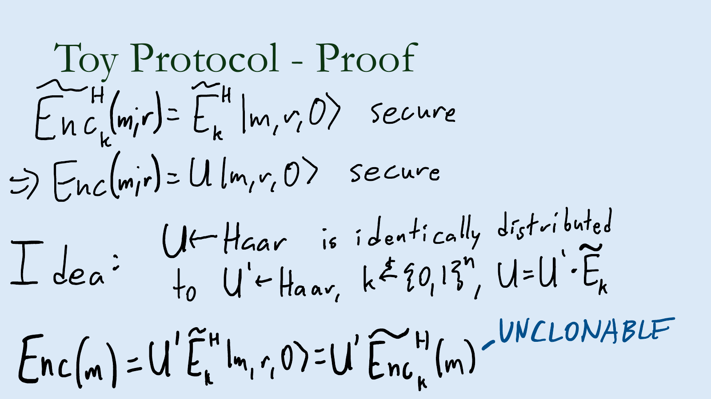
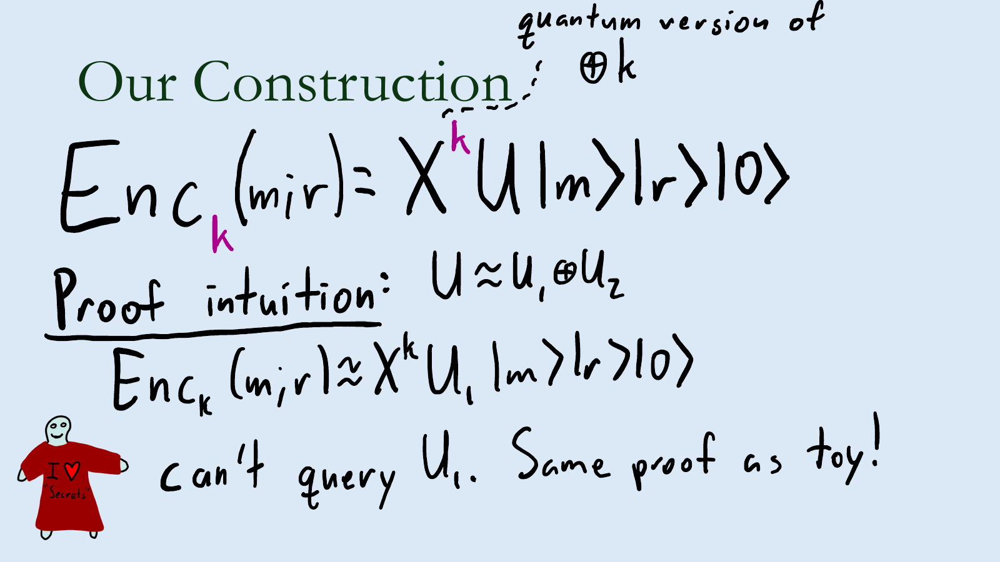

# Haar random oracle model 中的 unclonable encryption：UE 属于 microcrypt 的首个证据

> **Unclonable Encryption in the Haar Random Oracle Model**
> James Bartusek (Columbia University), Eli Goldin (New York University)
> CRYPTO 2026 · Quantum Cryptography I (2026-08-19) · **L1 入门导读**
> [ePrint 2026/506](https://eprint.iacr.org/2026/506) · [Slides](https://iacr.org/submit/files/slides/2026/crypto/crypto2026/595/595_slides.pdf)

## §1 研究什么

**Unclonable encryption（UE，Broadbent–Lord 2020）**：private-key 加密，密文是量子态 $\rho_{k,m}$，要求把它"分成两半"后两边都解不出来。本文全程用**标准的 unclonable indistinguishability**，并且是 **reusable（many-time）**版本。安全参数记 $n$（论文记法）。

> **定义 4.1（many-time UE）**：$\mathsf{Enc}(1^n,k,m)\to\rho_{k,m}$，$\mathsf{Dec}(1^n,k,\rho)\to m$，key $k\in\{0,1\}^{\ell_k}$，消息 $m\in\{0,1\}^{\ell_m}$，perfect correctness。安全游戏 $\mathsf{GAME}^{\mathcal{A},\mathcal{B},\mathcal{C}}_n$：
> 1. $k\leftarrow\{0,1\}^{\ell_k}$；cloner $\mathcal{C}$ 带 encryption oracle $\mathsf{Enc}(1^n,k,\cdot)$ 运行，输出 $(m_0,m_1,\mathsf{st})$；
> 2. $b\leftarrow\{0,1\}$，$\rho_b=\mathsf{Enc}(1^n,k,m_b)$；$\mathcal{C}$ 继续带 oracle 运行，输出两寄存器 $\mathsf{A},\mathsf{B}$ 上的态 $\sigma_{\mathsf{AB}}$；
> 3. $b_{\mathcal{A}}\leftarrow\mathcal{A}(1^n,k,\mathsf{A})$，$b_{\mathcal{B}}\leftarrow\mathcal{B}(1^n,k,\mathsf{B})$；输出 1 当且仅当 $b=b_{\mathcal{A}}=b_{\mathcal{B}}$。
>
> 要求对所有 QPT $\mathcal{A},\mathcal{B},\mathcal{C}$：$\Pr[\mathsf{GAME}\to1]\le\tfrac12+\mathsf{negl}(n)$。

弱一点的 search security（猜出高熵消息）不是本文的目标。

**Quantum Haar random oracle model（QHROM，定义 2.3）**：开始时采样一个 $\ell_u$-qubit 的 Haar random unitary $U$，所有参与者都可查询 $U,U^\dagger,U^*,U^{\mathsf T}$（记 $\vec U$）。这是 random oracle model 的量子类比：ROM 里的构造可启发式地用具体 hash 实例化，QHROM 里的构造可用随机量子电路实例化。

**Pure 方案**（定义 4.3）：$\mathsf{Enc}(k,m;r)=E_k|m,r,0\rangle$，$E_k$ 是高效（oracle-aided）unitary，$r\leftarrow\{0,1\}^{\ell_r}$；不 trace 掉任何输出寄存器。此时 $\mathsf{Dec}$ 不妨就是 $E_k^{-1}$ 后测第一个寄存器。

**Minicrypt vs microcrypt**：ROM 里有构造的原语至少需要 OWF（minicrypt）；QHROM 里有构造的原语可能在 OWF 不存在时仍存在（microcrypt）——PRU、PRS、plain private-key encryption、quantum money 都已知在 QHROM 里可造（HY26，ABGL25a/b），而 PRS/PRU 相对 oracle 可与 OWF 分离（Kre21，KQST23，KQT25）。

## §2 为什么研究它

One-time UE 的 candidate（BL20）及其变体在 ROM 下被证明安全（AKL+22，AKL23），证明**重度依赖** random oracle；reusable UE 蕴含 reusable private-key encryption，所以必然需要计算假设，但需要多少？此前唯一相关的是 PRV26：只做 search security，模型非标准（每个安全参数有指数多个 Haar oracle $\{U_i\}$，cloner 阶段**不能**查询 oracle，distinguisher 只拿一个 $U_i,U_i^\dagger$），且只允许一份密文。UE 同时要求 plain encryption 的 hiding 和 quantum money 的 unclonability，两者都在 microcrypt，UE 是否也在？

> **定理 1.1（informal）**：对任意多项式消息长度，QHROM 里存在满足 unclonable indistinguishability 的 reusable UE。
> **推论 1.2**：存在 oracle $\mathcal{O}$，相对它 reusable UE 存在而 $\mathsf{BQP}^{\mathcal{O}}=\mathsf{QMA}^{\mathcal{O}}$（从而 OWF 不存在）。
> **定理 1.3（informal，编译器）**：若 reusable（pure）UE 相对**任意**一个 unitary oracle 分布存在，则它在 QHROM 里存在。ROM 是 unitary oracle 的特例，所以定理 1.1 由 AKL+22/AKL23 的 QROM 方案套编译器得到。

## §3 核心定理与做法

### 3.1 构造与主定理

> **定理 4.4（编译器）**：设 $(\widetilde{\mathsf{Enc}}^{\vec V},\widetilde{\mathsf{Dec}}^{\vec V})$ 是相对 unitary oracle $V$ 的 pure UE，消息 $\{0,1\}^{\ell_m}$、key $\{0,1\}^{\ell_{\tilde k}}$、随机性 $\{0,1\}^{\ell_{\tilde r}}$、$\ell_a$ 个 ancilla；$U$ 为 $\ell_m+\ell_{\tilde r}+\ell_a+\ell_r$ qubit 上的 QHROM。则下面是相对 $U$ 的 pure UE，key $k\in\{0,1\}^{\ell_k}$：
> $$\mathsf{Enc}^{\vec U}(1^n,k,m):\ r_1\leftarrow\{0,1\}^{\ell_{\tilde r}},\ r_2\leftarrow\{0,1\}^{\ell_r};\quad\text{输出 } X^k\,U\,|m,r_1,0^{\ell_a},r_2\rangle ;$$
> $$\mathsf{Dec}^{\vec U}(1^n,k,\rho):\ \text{算 } U^\dagger X^k\rho X^kU \text{ 后测第一个寄存器.}$$
> 这里 $X^k$ 在第 $i$ 个 qubit 上作用 $X^{k_i}$（前 $\ell_k$ 个 qubit）。

密文只需**一次** $U$ 查询；加密者甚至不需要 $r_1$ 与 $r_2$ 的区分——它们只在证明里各司其职（$r_1$ 对应内层方案的随机性，$r_2$ 用来定义"加密子空间"）。直观：公开的 $U$ 把 Hilbert 空间划成子空间族 $\{U|m,\cdot\rangle\}_m$（每个消息一个），$X^k$ 是这些子空间的秘密"平移"；密文是 $m$ 对应子空间里的一个随机样本再平移。

> **定理 5.1**：QROM 里存在 pure many-time UE（任意多项式 $\ell_m$）。One-time 版本是 BL20/AKL 的方案：$F$ 为 random oracle，$k\leftarrow\{0,1\}^n$，$x\leftarrow\{0,1\}^n$，$\mathsf{Enc}^F(k,m)=|m\oplus F(x)\rangle\,\mathsf{Had}^{k}|x\rangle$（$\mathsf{Had}^k$ 在 $k_i=1$ 的位置做 Hadamard，即 BB84 态）；many-time 版本用 fresh 的 $s\leftarrow\{0,1\}^n$ 派生一次性 key $F(k,s)$ 并把 $s$ 附在密文里，安全性用标准的 re-sampling 归约到 one-time。
>
> **推论 5.2**：QHROM 里存在 **$n$-bit key**、任意多项式消息长度的 reusable UE。

### 3.2 为什么安全：先看 toy protocol

*图 1（slides）：toy 方案 $\mathsf{Enc}(m;r)=U|m,r,0\rangle$（无 key！）对**不做 oracle 查询**的敌手安全。理由：$U\leftarrow\mathrm{Haar}$ 与 $U'\cdot\widetilde E_k$（$U'\leftarrow\mathrm{Haar}$，$k$ 随机）同分布，于是 $U|m,r,0\rangle=U'\widetilde{\mathsf{Enc}}_k(m;r)$ 是内层方案的一份不可克隆密文再过一个固定 unitary。*

Toy 的归约把内层方案的密文"吸收"进 $U$：Haar 分布是右平移不变的，所以把 $\widetilde E_k$ 乘进去不改变敌手看到的分布，而内层密文的 unclonability 保证 toy 密文不可克隆。这个想法 PRV26 已在其变体模型里用过；但一旦 cloner 能查询 $U$（诚实用户加密就得查 $U$），归约就要在**拿到 $\tilde k$ 之前**回答 cloner 对 $U=U'\widetilde E_{\tilde k}$ 的查询——做不到。

### 3.3 真正的证明：把 $U$ 拆成两块

*图 2（slides）：真实方案 $\mathsf{Enc}_k(m;r)=X^kU|m\rangle|r\rangle|0\rangle$。证明直觉：$U\approx U_1\oplus U_2$，密文落在 $U_1$ 作用的子空间里，cloner 因为不知道 $k$ 而查不到那个子空间，于是回到 toy 的局面。*

取随机子集 $R\subset\{0,1\}^{\ell_r}$（overview 里 $|R|$ 取 $2^{\ell_r/2}$ 量级），定义
$$S_2:=\mathrm{Span}\{|m,r_1,0,r_2\rangle: r_2\in R\},\qquad S_2^\perp:=\mathrm{Span}\{|m,r_1,0,r_2\rangle: r_2\notin R\}.$$
归约把敌手的 oracle 定义成 $U_1U_2$：$U_1$ 在 $S_2$ 上作用 $U\widetilde E_{\tilde k}$（在 $S_2^\perp$ 上为恒等），$U_2$ 在 $S_2^\perp$ 上作用 $U$；所有 encryption 查询都用 $r_2\leftarrow R$ 回答。两点观察：

- 敌手的密文都被 $X^k$ 遮住，它学不到关于 $R$ 的任何信息，因而在 cloning 阶段无法在 $S_2$ 内查询（附录 A 用一串 hybrid 正式化，用到 one-way-to-hiding 类技巧）。
- 所以归约在 cloning 阶段只用 $U_2$ 就能模拟敌手的 oracle；到了 distinguishing 阶段它已拿到 $\tilde k$，可以用 $U_1U_2$。而 challenge 密文 $X^kU_1|m_b,r_1,0,r_2\rangle=X^kU\,\widetilde E_{\tilde k}|m_b,r_1,0\rangle|r_2\rangle$ 正是内层方案的密文再过固定 unitary——toy 的论证接上。

剩下的问题：敌手看到的 oracle 分布从"一个 Haar $U$"变成了"两个不相交子空间上的 Haar $U_1,U_2$ 的乘积"，必须证明它分不出来。这就是本文的技术核心。

### 3.4 Unitary reprogramming lemma

> **引理 3.1**：设 $N,M_1,M_2,t$ 满足 $M_1/M_2=\mathsf{negl}(n)$，$M_2/N=\mathsf{negl}(n)$，$t=\mathrm{poly}(n)$。$S_1\subseteq[N]$ 任意固定，$|S_1|=M_1$。oracle $\mathcal{O}$ 如下采样：均匀取 $S_2\supseteq S_1$，$|S_2|=M_2$；$U_1\leftarrow\mathrm{Haar}(S_2)$，$U_2\leftarrow\mathrm{Haar}([N]\setminus S_2)$；$\mathcal{O}=U_1U_2$。则对任意做 $t$ 次查询（允许 inverse、transpose、conjugate）且**知道 $S_1$** 的算法 $\mathcal{A}$，
> $$\Bigl|\Pr\bigl[\mathcal{A}^{\vec{\mathcal{O}}}(S_1)\to1\bigr]-\Pr_{U\leftarrow\mathrm{Haar}([N])}\bigl[\mathcal{A}^{\vec U}(S_1)\to1\bigr]\Bigr|\le\mathsf{negl}(n).$$
> 结论对"$S_1$ 为固定子空间、$S_2$ 为包含它的随机子空间"同样成立（证明不依赖基的选取）。

$S_1$ 对应归约回答 encryption 查询时用掉的那些 $r_2$（归约必须知道它们，敌手也可能从密文里学到），$S_2$ 对应整个加密子空间。引理说：**即使公开了 $S_2$ 里一小部分点，Haar unitary 与"在随机子空间上拆成两个 Haar unitary"仍不可区分**。这与 HY26 的同名引理（"难以找到某子空间的态 $\Rightarrow$ 可在该子空间上任意重编程"）不同：这里的子空间**部分已知**，不能直接套 one-way-to-hiding；两者可以叠加使用（本文先用引理 3.1 隔离信息，再在附录 A 用 O2H 式技巧）。它更像 classical 里对 random permutation 的 reprogramming。

**证明工具是 path recording**（Ma–Huang 2025；带 inverse/transpose/conjugate 查询的扩展 SML+25）。对 Haar random $U$ 的查询可用作用在内部"关系寄存器"上的 partial isometry 模拟：
$$V\,|x\rangle|D\rangle\ \propto\sum_{y\in[N]\setminus\mathrm{Im}(D)}|y\rangle\,|D\cup\{(x,y)\}\rangle,$$
$D$ 是一个 injective relation（已记录的 $(x_i,y_i)$ 对，$y_i$ 互不相同）；定理 2.14：$t$ 次前向查询的 trace distance $\le 2t(t-1)/(|S|+1)$（$S$ 为 $U$ 作用的集合）；带四种查询时（定理 2.18）$\le 9t(t+1)/|S|^{1/8}$。

对 $U_1U_2$ 相应地用两个关系寄存器 $D_1$（$S_2$ 内）、$D_2$（$S_2$ 外）的 $V^{S_2}$，并把 $S_2$ 的选择也 purify 成 ancilla $\sum_{S_1\subseteq S_2,|S_2|=M_2}|S_2\rangle$。关键观察：只要查询次数多项式，ancilla 的状态总是近似由 $D_1$ 决定——它始终接近形如
$$|D_1\rangle|D_2\rangle\sum_{S_1\cup\mathrm{Im}(D_1)\subseteq S_2,\ |S_2|=M_2}|S_2\rangle$$
的态的叠加：敌手关于 $S_2$ 知道的只有 $S_1$ 与它从"已知在 $S_2$ 内的点"查询得到的像 $\mathrm{Im}(D_1)$。对 $x\notin\mathrm{Im}(D_1)\cup S_1$ 的查询，"$x$ 恰好落在 $S_2$ 里"的概率 $\approx M_2/N$，是 negligible 误差；inverse/transpose/conjugate 的情形由直接的组合计数得到。既然 $S_2$ 寄存器信息论上由 $D_1$ 决定，可以把它删掉，得到只依赖 $(D_1,D_2)$ 的 oracle $\widetilde V$；最后存在只作用于内部状态的 isometry $T$ 把单个 $U$ 的 path recording 状态 $|D\rangle$ 变成 $\widetilde V$ 的状态——$T$ 把 $D$ 中的每条关系按"是否存在一条从 $S_1$ 出发、$x_i=y_{i-1}$ 的路径通到它"分进 $D_1$ 或 $D_2$。内部 isometry 不改变敌手的视角，引理得证。$\square$

## §4 一句话带走

> 密文 $X^kU|m,r_1,0,r_2\rangle$：公开的 Haar unitary $U$ 把空间按消息切成子空间，秘密的 Pauli $X^k$ 把它们平移到敌手够不着的地方。证明用新的 **unitary reprogramming lemma**（Haar $U$ 与"在含已知点集 $S_1$ 的随机子空间 $S_2$ 上拆成 $U_1\oplus U_2$"不可区分，path recording 证明）把内层 oracle 方案的加密 unitary 吸收进 $U_1$，于是 QROM 里 AKL 的 BB84 型方案被通用地搬进 QHROM：reusable、标准 unclonable indistinguishability、$n$-bit key、任意长消息——UE 落入 microcrypt。

**局限**：安全只是 QHROM 下的启发式证据（与 ROM 之于 OWF 同级）；编译器要求内层方案 pure；one-time UE 是否信息论存在仍开放（同期 BBC26 给出低效的一比特构造）；未涉及 UE 的其他变体（certified deletion、public-key）。
