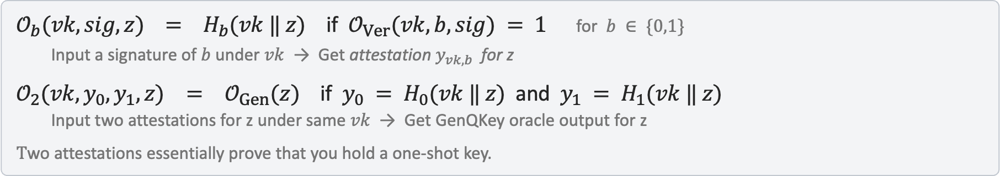
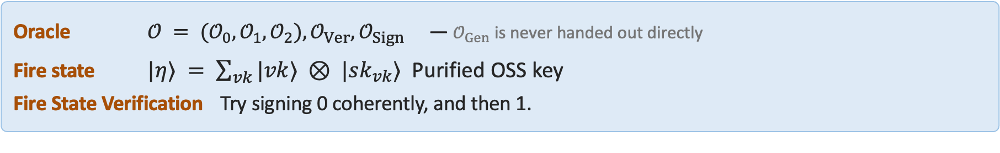
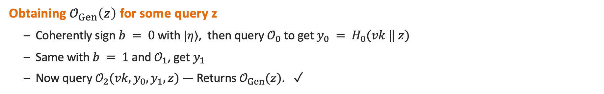

# 经典 oracle 下的 public-key quantum fire 与 key-fire：可克隆、但不可"电报"的量子态

> **Public-Key Quantum Fire and Key-Fire From Classical Oracles**
> Alper Çakan (CMU), Vipul Goyal (NTT Research & CMU), Omri Shmueli (NTT Research)
> CRYPTO 2026 · Quantum Cryptography I (2026-08-19) · **L1 入门导读**
> [ePrint 2025/726](https://eprint.iacr.org/2025/726) · [Slides](https://iacr.org/submit/files/slides/2026/crypto/crypto2026/709/709_slides.pptx)

## §1 研究什么

量子力学的两条 no-go 原理：**no-cloning**（一份未知态造不出两份）与 **no-telegraphing**（一份未知态变不成能重建它的 classical 串）。信息论上两者等价：能 telegraph 就能 clone（重建两次）；能 clone 就能 telegraph（克隆指数多份做 tomography）。但后一方向的归约是指数时间的。**在只允许多项式时间过程的计算宇宙里，它们还等价吗？** Nehoran–Zhandry 2024 提出这个问题；Bostanci–Nehoran–Zhandry 2025 把它的密码学版本定义为 **quantum fire**：一族可高效克隆、却不可高效 telegraph 的量子态（flame state）。

> **定义 14（quantum fire mini-scheme）**：$\mathsf{Spark}(1^\lambda)\to(\mathsf{sn},\mathsf{R}_{\mathrm{flame}})$；$\mathsf{Clone}(\mathsf{sn},\mathsf{R}_{\mathrm{flame}})\to(\mathsf{R}_{\mathrm{flame}},\mathsf{R}_{\mathrm{clone}})$；$\mathsf{Ver}(\mathsf{sn},\mathsf{R})\in\{0,1\}$。要求 verification correctness，以及 **strong cloning correctness**：$\mathsf{Spark}$ 以概率 1 输出某个 pure state $|\psi_k\rangle$，且 $\mathsf{Clone}$ 的两个输出寄存器都以 $1-\mathsf{negl}$ 通过到 $|\psi_k\rangle$ 的投影测量。
>
> **定义 15（untelegraphability）**：$\mathcal{A}_1$ 收到 $(\mathsf{sn},\mathsf{R}_{\mathrm{flame}})$；$\mathcal{A}_2$ 收到 $\mathsf{sn}$ 后可先发一条消息 $T$；$\mathcal{A}_1$ 输出 classical 串 $L$（长度不限）；$\mathcal{A}_2(L)$ 输出 $\mathsf{R}'$；敌手赢若 $\mathsf{Ver}(\mathsf{sn},\mathsf{R}')=1$。要求任何 query-bounded 敌手赢的概率 negligible。
> **定义 16（interactive untelegraphability）**：$\mathcal{A}_1,\mathcal{A}_2$ 在 classical 信道上交互任意多轮。

完整方案（定义 11/13）多一对 $(\mathsf{pk},\mathsf{sk})$，$\mathsf{Spark}(\mathsf{sk})$ 出票，敌手可要多张；mini-scheme 用签名把 $\mathsf{sn}$ 签掉即可通用升级（同 quantum money 的 AC12）。

本文进一步引入 **quantum key-fire**（定义 17/18）：flame state 是功能性的 key。以签名为例：$\mathsf{Setup}(1^\lambda)\to(\mathsf{vk},\mathsf{R}_{\mathrm{key}})$，$\mathsf{Clone}$，$\mathsf{Sign}(\mathsf{vk},\mathsf{R}_{\mathrm{key}},m)$，$\mathsf{Ver}(\mathsf{vk},m,\mathsf{sig})$。安全性是 **LOCC leakage-resilience**（定义 19）：敌手任意多轮地指定 classical 输出的 leakage 电路 $E_i$ 作用在 key 寄存器上并拿到输出 $L_i$（长度不限），最后要对随机 $m^*$ 签名，成功概率须 negligible。四个安全概念的关系（论文表 1）：LOCC leakage-resilience $\Rightarrow$ interactive untelegraphability；unbounded leakage-resilience $\Rightarrow$ untelegraphability。

## §2 为什么研究它

已知结果都不令人满意：NZ24 相对一个**低效的 quantum oracle**（把克隆烤进 oracle）给出分离，连启发式实例化都不可能；BNZ25 给出基于 group action 的候选，但即使在 classical oracle model 里也只能猜测安全性，且断言"任何有证明的 classical-oracle quantum fire 很可能导致 QMA vs QCMA 的 classical oracle 分离"。本文相对 classical oracle **无条件**证明安全（构造与前人完全不同，且不产生 QMA/QCMA 分离；该问题后来由 Bostanci–Haferkamp–Nirkhe–Zhandry 以别的方法解决）。

由此得到三个分离：计算宇宙里 no-telegraphing $\not\Rightarrow$ no-cloning；copy-protection 安全 vs unbounded/LOCC leakage-resilience（ÇGLZR24 与 NZ24 的开放问题：所有已知 leakage-resilient 方案都同时 unclonable，而 unclonable 蕴含 public-key quantum money，后者几乎需要 obfuscation——本文说明 leakage-resilience 不必如此）；FGSY25 的 computational no-cloning vs no-learning assumption。密码应用：**可克隆的 LOCC-leakage-resilient key**——可以复制到多台服务器、像 DRAM 一样反复"刷新"以对抗 decoherence，同时对无限长的侧信道泄漏免疫，这在 classical key 上不可能。所有 oracle 都可用 OWF 高效实现，因此用 iO 可得 plain model 的启发式方案。

## §3 核心定理与做法

> **定理 1（informal）**：相对 classical oracle 存在 untelegraphable 的 public-key quantum fire。
> **定理 2（informal）**：相对 classical oracle 存在对任意 classically-unlearnable 功能满足 LOCC leakage-resilience 的 quantum key-fire（可学习的功能显然不可能）。
> **定理 3/4（informal）**：random oracle 满足 classical-message incompressibility；相对 classical oracle 存在 incompressible 的 one-shot signature。
>
> 形式版：**定理 16**：下面的 $\mathsf{QKeyFireSign}$ 满足签名正确性与 strong cloning correctness；若 OSS 满足 $\mathcal{O}_{\mathsf{Ver}}$-incompressibility 与 one-shot 安全则它 unbounded（非交互）leakage-resilient；若 OSS 满足 strong incompressibility 则 LOCC leakage-resilient——均为无条件；oracle 可用 OWF 高效实现（安全变为计算性）。**定理 17/18**：由定理 9 的 OSS 实例化，得相对 classical oracle 的签名 key-fire，进而任意 unlearnable 功能的 key-fire。

### 3.1 起点：one-shot signature 的另一种读法

**One-shot signature（OSS，SZ25 相对 classical oracle 构造）**：公开算法 $\mathsf{GenQKey}^{\mathcal{O}}(1^\lambda)$ 采样 $(\mathsf{vk},|\phi_{\mathsf{vk}}\rangle)$，用 $|\phi_{\mathsf{vk}}\rangle$ 可对 $m\in\{0,1\}$ 签名，但不能对同一 $\mathsf{vk}$ 同时签出 0 和 1。表面上 OSS 与 quantum fire 背道而驰（key 不可克隆、主要应用是 classical 信道传输的 quantum money）。本文的新视角：**OSS 安全性同时保证了"采样者不知道 $|\phi_{\mathsf{vk}}\rangle$ 的 classical 描述"**——否则它能签两次。所以 OSS key 天然 untelegraphable；问题是怎么让它可克隆。

第一步：用 $\mathsf{GenQKey}$ 的 **purified** 输出 $|\eta\rangle\approx\sum_{\mathsf{vk}}|\mathsf{vk}\rangle|\phi_{\mathsf{vk}}\rangle$ 当 flame state，那么"再跑一次 $\mathsf{GenQKey}$"就是克隆。但 $|\eta\rangle$ 是**公开可制备**的：$\mathcal{A}_2$ 不需要任何消息就能自己造，untelegraphability 平凡地被打破。加个 secret key 也没用（key 本身就是 classical 描述，且克隆必须公开）。

### 3.2 Self-encrypted oracle：只有持有 flame state 的人能跑 $\mathsf{GenQKey}$

*图 1（slides）：把 OSS 的 keygen oracle "加密"——先出示对 $b$ 的签名换取 attestation $H_b(\mathsf{vk}\|z)$，两份 attestation（同一 $\mathsf{vk}$ 下 0 和 1）才能换到 $\mathcal{O}_{\mathsf{Gen}}(z)$。*

要求 OSS 的 oracle **拆分**为 $(\mathcal{O}_{\mathsf{GenQKey}},\mathcal{O}_{\mathsf{Sign}},\mathcal{O}_{\mathsf{Ver}})$，各算法只用自己那份（定义 20）；拆法必须非平凡（若三者都是完整 oracle，下面的性质不成立）。取随机函数 $H_0,H_1:\{0,1\}^{p_1+p_2}\to\{0,1\}^\lambda$（$p_1$ 为 $\mathsf{vk}$ 长，$p_2$ 为 $\mathcal{O}_{\mathsf{GenQKey}}$ 输入长），$H_{\mathrm{sig}}:\{0,1\}^{\nu}\to\{0,1\}^\lambda$（$\nu$ 为消息长）：

$$\mathcal{O}_b(\mathsf{vk},\mathsf{sig},z)=\begin{cases}H_b(\mathsf{vk}\|z)&\mathcal{O}_{\mathsf{Ver}}(\mathsf{vk},b,\mathsf{sig})=1\\\bot&\text{否则}\end{cases}\ (b\in\{0,1\}),\qquad \mathcal{O}_2(\mathsf{vk},y_0,y_1,z)=\begin{cases}\mathcal{O}_{\mathsf{GenQKey}}(z)&y_b=H_b(\mathsf{vk}\|z)\ \forall b\\\bot&\text{否则}\end{cases}$$
$$\mathcal{O}_3(\mathsf{vk},y_0,y_1,m)=\begin{cases}H_{\mathrm{sig}}(m)&y_b=H_b(\mathsf{vk}\|m)\ \forall b\\\bot&\text{否则}\end{cases},\qquad\mathcal{O}_4(m,y)=[H_{\mathrm{sig}}(m)=y].$$

*图 2（slides）：公开 oracle 为 $(\mathcal{O}_0,\mathcal{O}_1,\mathcal{O}_2),\mathcal{O}_{\mathsf{Ver}},\mathcal{O}_{\mathsf{Sign}}$；$\mathcal{O}_{\mathsf{GenQKey}}$ 永远不直接给出。flame state 是 purified 的 OSS key；验证 flame state 就是 coherently 地先试签 0、再试签 1。*

**$\mathsf{QKeyFireSign}$（§9.2）**：
- $\mathsf{Setup}$：采样上述随机函数与 OSS oracle，公开 $\mathsf{sn}=(\mathcal{O}_0,\mathcal{O}_1,\mathcal{O}_2,\mathcal{O}_{\mathsf{Sign}},\mathcal{O}_3,\mathcal{O}_4)$；跑 purified 的 $\mathsf{GenQKey}$，得寄存器 $(\mathsf{R}_{\mathsf{vk}},\mathsf{R}_{\mathrm{key}},\mathsf{R}_{\mathrm{out\text{-}aux}})$ 作为 flame state。
- $\mathsf{Sign}(\mathsf{R}_{\mathrm{flame}},m)$：测 $\mathsf{R}_{\mathsf{vk}}$ 得 $\mathsf{vk}$；coherently 地对 0 签名得 $\mathsf{sig}$、查 $\mathcal{O}_0(\mathsf{vk},\mathsf{sig},m)$ 得 $y_0$，rewind（gentle measurement）；同样对 1 签名得 $y_1$（论文 §9.2 第 5 步印的是 $\mathsf{Sign}(\cdot,0)$，按 $\mathcal{O}_1$ 的定义应为 1）；输出 $\mathcal{O}_3(\mathsf{vk},y_0,y_1,m)$。
- $\mathsf{Ver}(m,\mathsf{sig})=\mathcal{O}_4(m,\mathsf{sig})$。
- $\mathsf{Clone}$：模拟 $\mathsf{GenQKey}$，它的每次 $\mathcal{O}_{\mathsf{GenQKey}}$ 查询用下面的"解锁"序列代替。

*图 3（slides）：对 $\mathsf{GenQKey}$ 的一次查询 $z$：用 $|\eta\rangle$ coherently 签 0 查 $\mathcal{O}_0$ 得 $y_0$，签 1 查 $\mathcal{O}_1$ 得 $y_1$，再查 $\mathcal{O}_2(\mathsf{vk},y_0,y_1,z)$ 得 $\mathcal{O}_{\mathsf{GenQKey}}(z)$。*

**克隆为什么不会毁掉 flame state**（§2.2，§9.4）。$\mathsf{GenQKey}$ 的查询是叠加 $\sum_z\alpha_z|z\rangle$。先把 $|\eta\rangle$ coherently 签成 $|\eta_0\rangle=\sum_{\mathsf{vk}}|\mathsf{vk}\rangle\sum_{\mathsf{sig}\in\mathrm{SIG}(\mathsf{vk},0)}|\mathsf{sig}\rangle$，查 $\mathcal{O}_0$ 得
$$\sum_{z,\mathsf{vk}}\alpha_z|z\rangle|\mathsf{vk}\rangle\otimes\Bigl(\sum_{\mathsf{sig}\in\mathrm{SIG}(\mathsf{vk},0)}|\mathsf{sig}\rangle\Bigr)\otimes|H_0(\mathsf{vk}\|z)\rangle .$$
因为 attestation **只依赖 $(\mathsf{vk},z)$、不依赖具体的 $\mathsf{sig}$**，签名寄存器与输出寄存器之间没有纠缠，可以用签名 unitary 的逆把 $|\eta_0\rangle$ 变回 $|\eta\rangle$；对 1 同理得 $y_1$；查 $\mathcal{O}_2$ 得到真正的 oracle 输出；再逆序擦掉 $y_1,y_0$。两个设计选择由此被迫：(i) 签的是常数 0/1 而不是 $z$——否则 flame state 会与查询寄存器纠缠，下一次查询就没有干净的 key 可用；(ii) 必须**两个**分开的 oracle $\mathcal{O}_0,\mathcal{O}_1$——一个同时要求两份签名的 oracle 按 one-shot 安全性永远解不开；而接受**不同** $\mathsf{vk}$ 下的两份签名则有攻击：克隆后测出两个 $\mathsf{vk}$，各签 0 和 1，把两份 classical 签名发给 $\mathcal{A}_2$，它就能在任意 $z$ 上解锁 $\mathcal{O}_2$。

$\mathsf{Ver}$ 其实接受任何 OSS key $|\phi_{\mathsf{vk}}\rangle$，不只 $|\eta\rangle$，论文证明这不是安全问题。

### 3.3 安全性的支点：incompressibility

> **定义 21（incompressibility，压缩形式）**：OSS 对 $\mathcal{O}\in\{\mathcal{O}_{\mathsf{Sign}},\mathcal{O}_{\mathsf{Ver}}\}$ incompressible，若存在常数 $c>0$：对任意 query-bounded 的 $\mathcal{A}_1$（带全部 oracle，输出任意长的 classical 串 $L$），存在一个映射 $M$ 输出至多 $s(\lambda)=q_{\mathsf{Gen}}(\lambda)^c$ 个 $\mathsf{vk}$ 的列表 $\mathcal{L}$（$q_{\mathsf{Gen}}$ 为 $\mathcal{A}_1$ 对 $\mathcal{O}_{\mathsf{GenQKey}}$ 的查询数），使得对任意只带 $\mathcal{O}_{\mathsf{Sign}},\mathcal{O}_{\mathsf{Ver}}$ 的 query-bounded $\mathcal{A}_2(L)$，它落在"$\mathcal{O}(\mathsf{vk},x)\ne0$ 且 $\mathsf{vk}\notin\mathcal{L}$"的输入上的总查询权重的期望为 negligible。**Strong** incompressibility 把列表换成 $(\mathsf{vk},z)$ 对。

直观：**一个 classical 串里装不下太多签名**。量子消息下这显然不成立（发所有 $\mathsf{vk}$ 与签名的均匀叠加即可）。它也不是 one-shot 安全的推论：签名可重随机化、或 $\mathcal{O}_{\mathsf{Sign}}$ 顺便吐出一个随机 $\mathsf{vk}$ 的签名，都不破坏 one-shot 安全却破坏 incompressibility。

> **定理 9 / 构造（§6.2）**：SZ25 方案的一个小心修改版是 incompressible 的。参数 $q=16\lambda$，$r=q(\lambda-1)$，$n=r+\tfrac32q$，$k=n$；随机置换 $\pi$，$H(x)$、$J(x)$ 为 $\pi(x)$ 的前 $r$、后 $n-r$ bit；每个 $y$ 配列满秩 $A_y\in\mathbb{F}_2^{k\times(n-r)}$ 与 $b_y$。$P(x)=(y,A_yJ(x)+b_y)$；$P^{-1}(y,v)=\pi^{-1}(y\|z)$ 若 $v=A_yz+b_y$；$D(y,v)=[v^{\mathsf T}A_y=0\wedge v\ne0]$；$D_0(y,m,v)=[v\in\mathrm{ColSpan}(A_y)+b_y\wedge v_1=m]$。**拆分**：$\mathcal{O}_{\mathsf{Ver}}=D_0$，$\mathcal{O}_{\mathsf{Sign}}=D$，$\mathcal{O}_{\mathsf{GenQKey}}=(P,P^{-1},D,D_0)$。$\mathsf{GenQKey}$：$|+\rangle^{\otimes n}$ 过 $P$，用 $P^{-1}$ 擦掉输入，测 $y$，剩下 coset $\mathrm{ColSpan}(A_y)+b_y$ 上的均匀叠加；签 $m$：至多 $\lambda$ 次"测第一个 qubit，若不是 $m$ 就用 $\mathsf{Had}^{\otimes k}$、$D$、$\mathsf{Had}^{\otimes k}$ 把态恢复成 coset 叠加"（每次成功概率恰 $\tfrac12$）。One-shot 安全直接继承 SZ25（$D_0$ 可由 $P^{-1}$ 算出）；incompressibility 是新证明（§6.4）。
>
> **定理 15**：random oracle 也 incompressible——给定只在谓词 $P$ 为 1 处开放的 $H$ 与像验证 oracle $[y=H(x)]$，$\mathcal{A}_1$ 的 classical 消息只能让 $\mathcal{A}_2$ 验证一个小集合上的像。

### 3.4 证明思路（§2.3–2.4）

**Step 2（简单的一半）**：假设 $\mathcal{A}_2$ **没有** $\mathcal{O}_2$（从而没有 $\mathcal{O}_{\mathsf{GenQKey}}$），却由 $L$ 造出以不可忽略概率通过 $\mathsf{Ver}$ 的态 $\rho$。因为 $L$ 是 classical 的，**把 $\mathcal{A}_2(L)$ 跑两次**得两份 $\rho$，一份签 0 得 $(\mathsf{vk}_1,\mathsf{sig}_1)$，一份签 1 得 $(\mathsf{vk}_2,\mathsf{sig}_2)$，由 Jensen 两者同时合法的概率不可忽略；incompressibility 说 $\mathsf{vk}_1,\mathsf{vk}_2$ 都落在多项式大小的列表 $\mathcal{L}$ 里，于是 $\mathsf{vk}_1=\mathsf{vk}_2$ 的概率也不可忽略——同一 $\mathsf{vk}$ 下 0 和 1 的签名，违反 one-shot 安全。

**Step 1（证明 $\mathcal{O}_2$ 对 $\mathcal{A}_2$ 几乎无用）**有一个循环：想说 $\mathcal{A}_2$ 解不开 $\mathcal{O}_2$ 因为它没有 $|\eta\rangle$，又想说它没有 $|\eta\rangle$ 因为它解不开 $\mathcal{O}_2$。解法是**逐个查询**地分析：$\mathcal{A}_2$ 在第一次 $\mathcal{O}_2$ 查询之前是一个无 $\mathcal{O}_{\mathsf{GenQKey}}$ 的敌手，incompressibility 给出列表 $\mathcal{L}$，它只能在 $\mathsf{vk}\in\mathcal{L}$ 处通过 $\mathcal{O}_0,\mathcal{O}_1$ 的检查；而若 $\mathcal{A}_2$ 对 $\mathcal{O}_2$ 的合法查询用了 $\mathsf{vk}\in\mathcal{L}$，论文证明可以从它身上提取同一 $\mathsf{vk}$ 下 0 和 1 的签名（矛盾）；所以合法查询的 $\mathsf{vk}\notin\mathcal{L}$，其 $H_0(\mathsf{vk}\|\cdot),H_1(\mathsf{vk}\|\cdot)$ 从未被 $\mathcal{A}_2$ 查过，由 random oracle 的 incompressibility（定理 15），$z$ 只能来自一个小集合 $\mathcal{L}'$。于是让 $\mathcal{A}_1$ 预先算好 $\mathcal{O}_{\mathsf{GenQKey}}$ 在 $\mathcal{L}'$ 上的值作为额外 leakage 发出，就可以删掉这次 $\mathcal{O}_2$ 查询；重复直到 $\mathcal{A}_2$ 不再查 $\mathcal{O}_2$，回到 Step 2。技术难点：$\mathcal{L},\mathcal{L}'$ 只是存在性的、可能依赖整个 oracle（$\mathcal{A}_1$ 可以用 oracle 输出做 one-time pad、甚至用 Yamakawa–Zhandry 式的全局性质编码），直接交给敌手会破坏 one-shot 安全甚至 incompressibility；论文给出 $\mathcal{A}_1$ 用多项式次查询**估计**这些集合的过程并证明误差很小（§10）。

**交互（LOCC）情形**（§2.4）：构造不变，但 Step 2 的"跑两次"失效——$\mathcal{A}_2$ 有可能不可克隆的内部量子态，且 incompressibility 只对非交互敌手成立。论文先按上面的方法删掉 $\mathcal{A}_2$ 对 $\mathcal{O}_0,\mathcal{O}_1,\mathcal{O}_2$ 的查询，再进一步删掉它对**所有** oracle 的查询（改为读 $\mathcal{A}_1$ 造的数据库）；此时可以让 $\mathcal{A}_1$ 模拟第一轮并把结果告诉 $\mathcal{A}_2$，$\mathcal{A}_2$ 本地重新制备条件于 transcript 的内部态——通常这需要指数次试验，但没有 oracle 查询后可以负担——于是把多轮协议**round-collapse** 成一条消息，$\mathcal{A}_2$ 的内部态随之可克隆，回到 one-shot 安全的论证。

## §4 一句话带走

> 把 one-shot signature 的 keygen oracle **用它自己的签名加密**：出示同一 $\mathsf{vk}$ 下对 0 和对 1 的（coherent）签名才能换到 $\mathcal{O}_{\mathsf{GenQKey}}$ 的输出。持有 purified OSS key $|\eta\rangle$ 的人可以 coherently 签、拿 attestation、再逆签名把 key 复原，从而一次次解锁 oracle 跑完 keygen——这就是克隆；而只拿 classical 串的人受 **incompressibility**（一个 classical 串装不下多项式以上个签名）限制，能解锁的点只有多项式多个，把这些点交给发送方预算就能把接收方的 oracle 查询逐个删光，最后"跑两次接收方、各签 0 和 1"与 one-shot 安全矛盾。结果：相对 classical oracle 无条件安全的 public-key quantum fire 与 LOCC-leakage-resilient 的 quantum key-fire，以及 no-cloning 与 no-telegraphing 在计算宇宙里的首个 classical-oracle 分离。

**局限**：安全在 classical oracle model（plain model 只有 iO 的启发式实例化，QROM + 计算假设下的构造是开放问题）；同 session 的 paper 490 指出 [ÇGS25] 对 SZ25 逐 bit 并行方案的 strong incompressibility 假设不成立，并给出满足它的 perfectly correct 方案作为替代实例化；本文的 key-fire 证明初版最后一个 hybrid 有一处小缺口（附录 B 记录，已修复）。
