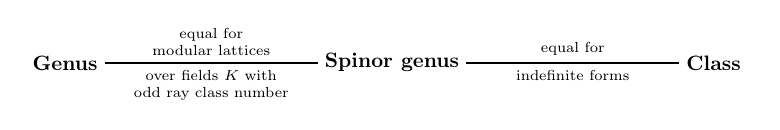
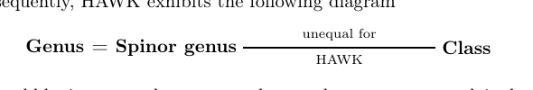

# 定与不定 Lattice Isomorphism Problem 的密码分析及其在 DEFI 上的应用

> **Cryptanalysis of Definite and Indefinite Lattice Isomorphism Problems With Applications to DEFI**
> Markus Kirschmer (Universität Bielefeld), Cong Ling, Ali Sadreddin (Imperial College London)
> CRYPTO 2026 · Lattice Cryptanalysis II + Isogenies (2026-08-17) · **L2 深入解析**
> [ePrint 2026/890](https://eprint.iacr.org/2026/890) · [Slides](https://iacr.org/submit/files/slides/2026/crypto/crypto2026/187/187_slides.pdf) · [Magma 代码](https://github.com/defiv2magmacodes/defiv2codes)

## §1 背景与问题设定

### 1.1 DEFIv2 签名方案

DEFI 是建立在 **indefinite quadratic form** 之上的签名方案。设 $f(X)=X^m+X+1$，$K=\mathbb{Q}[X]/(f)$，$R=\mathbb{Z}[X]/(f)$。DEFIv2 取 $m\in\{16,28\}$：$m=28$ 的参数集 DEFIv2-1 声称 128-bit 安全，$m=16$ 的 DEFIv2-c 是作者公开的 90-bit challenge。对这些 $m$，$f$ 的 discriminant 是奇数且 square-free，故 $R=\mathcal{O}_K$ 是 $K$ 的整数环（monogenic）。

固定 $J=\mathrm{diag}(1,1,-1,-1)$。

- **私钥**：$B=\begin{pmatrix}1&0\\ B_{21}&B_{22}\end{pmatrix}\in\mathrm{GL}_4(\mathcal{O}_K)$，其中 $B_{21}\in\mathcal{O}_K^{3\times1}$，$B_{22}\in\mathrm{GL}_3(\mathcal{O}_K)$。
- **公钥**：对称矩阵 $C=B^{T}JB$，定义 quadratic form $Q(\mathbf{u})=\mathbf{u}^{T}C\mathbf{u}=(B\mathbf{u})^{T}J(B\mathbf{u})$。
- **签名**：消息 hash 为 $h\in\mathcal{O}_K$。随机取 $Z''\in\mathcal{O}_K^{3}$ 使 $Z:=(h,Z'')$ 满足 $Z^{T}JZ=0$，输出
$$\mathbf{y}=B_{22}^{-1}(Z''-B_{21}h)\in\mathcal{O}_K^{3}.$$
- **验签**：接受当且仅当 $\mathbf{y}\in\mathcal{O}_K^3$、系数不超过规定上界（DEFIv2-c 为 $2^{42}$），且 $\mathbf{z}:=(h,\mathbf{y})$ 满足 $\mathbf{z}^{T}C\mathbf{z}=0$。

正确性是两行代数：$B\mathbf{z}=(h,\ B_{21}h+B_{22}\mathbf{y})=(h,Z'')=Z$，故 $\mathbf{z}^{T}C\mathbf{z}=(B\mathbf{z})^{T}J(B\mathbf{z})=Z^{T}JZ=0$。

于是伪造签名 $\Leftrightarrow$ 对给定 $h$ 找一个**系数小**的 $\mathbf{y}$ 使 $(h,\mathbf{y})$ 是 $Q$ 的 isotropic vector；恢复密钥 $\Leftrightarrow$ 找 $S\in\mathrm{GL}_4(\mathcal{O}_K)$ 使 $S^{T}CS=J$（$S$ 未必等于 $B$，见 §4.3，但功能等价）。

### 1.2 三种 LIP

$K$ 为 number field，$\mathcal{O}_K$ 其整数环，$n$ 为秩。

> **Decision-LIP**：给定 $\mathcal{O}_K$ 上两个 quadratic form $Q_1,Q_2$，判定是否存在 $U\in\mathrm{GL}_n(\mathcal{O}_K)$ 使 $Q_2=U^{T}Q_1U$。
> **Distinguishing-LIP**：给定 $Q_1,Q_2$ 及一个来自其中某一 class 的 $Q$，判定 $Q$ 属于哪个 class。
> **Search-LIP**：已知 $Q_1,Q_2$ 等价，求出 $U$。

三者的归约链为 Distinguishing $\le$ Decision $\le$ Search；Ducas–van Woerden (Eurocrypt 2022) 指出 LIP 类方案的安全性通常归约到 Distinguishing-LIP。

### 1.3 Quadratic space、lattice 与三层等价关系

本节只固定符号，不重讲 lattice 基础。全文的字母分配：

| 符号 | 含义 |
|---|---|
| $(V,Q)$ | $K$ 上 $n$ 维 quadratic space，$Q:V\to K$；bilinear form $\langle\mathbf{u},\mathbf{u}'\rangle_Q:=\tfrac12\big(Q(\mathbf{u}+\mathbf{u}')-Q(\mathbf{u})-Q(\mathbf{u}')\big)$ |
| $\det(V,Q)$ | 任一 basis 的 Gram matrix 的行列式，属于 $K^*/(K^*)^2$；**regular** 指其非零（全文假设） |
| $L$ | $V$ 中 full-rank $\mathcal{O}_K$-lattice；$L_\mathfrak{p}=L\otimes\mathcal{O}_{K_\mathfrak{p}}$ 为在 prime ideal $\mathfrak{p}$ 处的 completion |
| $L^{\#}$ | dual lattice $\{\mathbf{u}\in V:\langle\mathbf{u},L\rangle_Q\subseteq\mathcal{O}_K\}$；**integral** 指 $L\subseteq L^\#$，**unimodular** 指 $L=L^\#$，**$\mathfrak{a}$-modular** 指 $L=\mathfrak{a}L^\#$，**modular** 指对某 $\mathfrak{a}$ 为 $\mathfrak{a}$-modular |
| $\mathrm{O}(V,Q),\ \mathrm{SO}(V,Q)$ | isometry group 及其行列式为 1 的子群；$L\cong L'$ 指 $L'=\sigma(L)$ 对某 $\sigma\in\mathrm{O}(V,Q)$ |
| $\theta$ | spinor norm $\mathrm{O}(V,Q)\to K^*/(K^*)^2$，由 $\theta(\mathrm{refl}_{\mathbf{u}})=Q(\mathbf{u})$ 唯一确定 |
| $\mathrm{Cl}(K)$ | ideal class group；$\mathrm{Cl}_\Sigma(K)$ 为对实 place 集合 $\Sigma$ 的 ray class group（下文定义） |
| $J,\ C,\ B$ | DEFI 的目标形式、公钥、私钥 |

**isotropic**：$\mathbf{u}\neq0$ 且 $Q(\mathbf{u})=0$。$(V,Q)$ 称 isotropic 若含 isotropic vector。**Hyperbolic plane** 是 Gram matrix 为 $\begin{pmatrix}0&1\\1&0\end{pmatrix}$ 的二维 space。一个 regular isotropic space 必含 hyperbolic plane，证明是简单代数：取 isotropic 的 $\mathbf{x}$，regular 保证有 $\mathbf{u}$ 使 $\langle\mathbf{x},\mathbf{u}\rangle_Q\ne0$，缩放到 $=1$，再令 $\mathbf{y}:=\mathbf{u}-\tfrac12Q(\mathbf{u})\mathbf{x}$，则
$$Q(\mathbf{y})=Q(\mathbf{u})-2\cdot\tfrac12Q(\mathbf{u})\langle\mathbf{u},\mathbf{x}\rangle_Q+\tfrac14Q(\mathbf{u})^2Q(\mathbf{x})=0,\qquad\langle\mathbf{x},\mathbf{y}\rangle_Q=1.$$
注意这里除以了 $2$：在 $\mathcal{O}_K$ 上 $\tfrac12$ 不可用，这正是 §3 中 hyperbolic plane 会带一个参数 $a$ 的原因。DEFI 的 $J$ 是 isotropic 的（$\mathbf{e}_1+\mathbf{e}_3$），且 $(K^4,J)$ 同构于两个 hyperbolic plane 的正交和。

**Definite / indefinite（number field 上的定义）**：$Q$ 称 positive definite 若 $K$ totally real 且对一切 $\mathbf{u}\ne0$，$Q(\mathbf{u})$ 的所有 algebraic conjugate 为正；$(V,Q)$ 称 definite 若某个 $aQ$（$a\in K^*$）positive definite，否则称 indefinite。**因此只要 $K$ 有一个 complex embedding，$K$ 上一切 form 都是 indefinite**。DEFIv2 的 $K$ 在 $m$ 为偶数时 totally complex（$f$ 无实根），DEFIv1 的 $K=\mathbb{Q}(\zeta_{2m})$ 亦然。

三层等价关系（rank $\ge3$）：

$$\mathrm{gen}(L)=\{L'\subset V: L'_\mathfrak{p}\cong L_\mathfrak{p}\ \forall\mathfrak{p}\},\qquad
\mathrm{cls}(L)=\{L'\subset V: L'\cong L\},$$
$$\mathrm{sgen}(L)=\{L'\subset V:\ \exists\,\varphi\in\mathrm{O}(V,Q),\ \forall\mathfrak{p}\ \exists\,\psi_\mathfrak{p}\in\ker\theta_\mathfrak{p}\subseteq\mathrm{SO}(V_\mathfrak{p},Q):\ L'_\mathfrak{p}=\varphi(\psi_\mathfrak{p}(L_\mathfrak{p}))\}.$$

$\varphi$ 可取自 $\mathrm{SO}$ 时称 **proper spinor genus** $\mathrm{sgen}^+(L)$。显然 $\mathrm{cls}(L)\subseteq\mathrm{sgen}(L)\subseteq\mathrm{gen}(L)$。Decision-LIP 问的是 $L'\in\mathrm{cls}(L)$；而 $L'\in\mathrm{gen}(L)$ 是纯局部问题，可以逐个 $\mathfrak{p}$ 检查。本文的核心就是找出让这三层**塌缩**的条件。

## §2 此前的成果

**DEFI 的攻防史。** DEFIv1 (Feussner–Semaev) 取 $R=\mathbb{Z}[X]/(X^m+1)$、$m\in\{32,64\}$（这两个 cyclotomic field 的 class number 分别为 17 和 359057）。Bambury–Nguyen (PQCrypto 2025) 用 lattice 方法攻破了 $m=32,64$ 的 challenge；作者随后换成 $f=X^m+X+1$（Galois group 为 $S_m$，结构远不如 cyclotomic 对称），得到 DEFIv2。Bambury–Nguyen 在文末提出 open problem：能否用 quadratic form 的算术理论与 isotropic form 的分类，从 $C=B^{T}JB$ 恢复密钥。本文正面回答了它。

**$\mathbb{Z}$ 上的经典分类。** 对 $\mathbb{Z}$ 上 rank $\ge3$ 的 indefinite form，每个 spinor genus 只含一个 class（Eichler，强逼近定理的推论）；而 genus 往往只含一个 spinor genus（Kneser 1956 用局部不变量给出 spinor genus 个数；O'Meara 102:10 给出 $K=\mathbb{Q}$ 时的判据）。这暗示 indefinite form 在密码上天然脆弱：Decision-LIP 可能被局部理论解决。本文把这一结论推广到一般 $\mathcal{O}_K$。

**Spinor genus 在密码分析中的使用。** Ling–Liu–Mendelsohn (Asiacrypt 2024) 给出 quantum 多项式时间算法判定 class number 1 的域上两个 binary quadratic lattice 是否同 spinor genus，并指出 HAWK 是 Hermitian form、spinor genus 分类不能直接套用，留为 open problem。Mureau (TCC 2025) 给出 classical 多项式时间算法判定 HAWK 的 binary Hermitian lattice 是否同 special genus，但一个 genus 含大量 special genus、每个 special genus 又似乎含指数多个 class，对 Decision-LIP 帮助有限。

**Rank-2 module-LIP 攻击。** Mureau–Pellet-Mary–Pliatsok–Wallet (Eurocrypt 2024) 攻破 totally real field 上的 rank-2 module-LIP；Luo–Jiang–Pan–Wang (Asiacrypt 2024) 利用 symplectic automorphism；Allombert–Pellet-Mary–van Woerden (Eurocrypt 2025) 证明只要有一个 real embedding 就够。HAWK 用的是 totally complex 的 CM field，这些攻击都不适用；Chevignard 等 (Eurocrypt 2025) 把 HAWK 归约到 quaternion algebra 中 order 的 principal ideal problem，目前没有高效算法。

**工具。** Biasse–Song (SODA 2016) 给出任意次数 number field 上 class group 与 principal ideal problem 的 quantum 多项式时间算法，可用于解 Galois 扩张的 relative norm equation $N_{E/K}(x)=\vartheta$；quadratic 扩张总是 Galois，所以 §3 的 Search 算法有 quantum 多项式时间版本。

## §3 本文的算法

### 3.1 Decision-LIP：判定同 genus

由 §4.1 的塌缩定理，DEFI 情形下 Decision-LIP 等价于判定 $L'\in\mathrm{gen}(L)$。后者是纯局部问题：

**算法 2 DecidingGenus**
- **输入**：integral full-rank lattice $L\subset(V,Q)$，$L'\subset(V',Q')$。
- **输出**：true 当且仅当 $L_v\cong L'_v$ 对 $K$ 的所有 place $v$ 成立。
1. 若 $\mathrm{rank}(L)\neq\mathrm{rank}(L')$ 或 determinant ideal $\det(L)\neq\det(L')$，返回 false。
2. 若 $\det(V,Q)\cdot\det(V',Q')\notin(K^*)^2$，返回 false。
3. 若在某个实 place 上 $(V,Q)$ 与 $(V',Q')$ 的 signature $(n_+,n_-)$ 不同，返回 false。
4. 对每个 $\mathfrak{p}\mid 2\det(L)$：若 $L_\mathfrak{p}\not\cong L'_\mathfrak{p}$（用下面的局部判据），返回 false。
5. 返回 true。

**局部判据（算法 1 的思路）。** 在固定 $\mathfrak{p}$ 处，$L_\mathfrak{p}$ 有 Jordan decomposition
$$L_\mathfrak{p}=\Lambda_1\perp\Lambda_2\perp\cdots\perp\Lambda_\ell,\qquad\Lambda_i\ \text{为}\ \mathfrak{p}^{s_i}\text{-modular},\quad s_1<s_2<\cdots<s_\ell .$$
算法 1 对 Gram matrix 做带 pivot 的 Gram–Schmidt：每一步选 $\mathfrak{p}$-adic valuation 最小的元素作 pivot；非 dyadic 时总能把 pivot 挪到对角线，dyadic（$2\in\mathfrak{p}$）时可能只能得到 $2\times2$ 块 $\begin{pmatrix}\alpha&\beta\\ \beta&\gamma\end{pmatrix}$，$\mathrm{ord}_\mathfrak{p}(\beta)<\mathrm{ord}_\mathfrak{p}(\alpha)\le\mathrm{ord}_\mathfrak{p}(\gamma)$。判定局部同构不需要显式分解，只需要不变量：
- 非 dyadic $\mathfrak{p}$：$(s_i,\ \mathrm{rank}\,\Lambda_i,\ \det\Lambda_i\in K_\mathfrak{p}^*/(K_\mathfrak{p}^*)^2)_{i\le\ell}$ 完全决定 $L_\mathfrak{p}$ 的 isometry class（O'Meara 92:2）。
- dyadic $\mathfrak{p}$：另需 $(V_\mathfrak{p},Q)$ 的 Hasse invariant，以及各 $\Lambda_i$ 的 norm generator 与 weight；O'Meara 93:28 给出由这些数据判定同构的方法，归结为比较 determinant 的 square class 与若干 Hilbert symbol。

系数不会爆炸：最大 scale $s_\ell$ 可由 $-s_\ell=\min\mathrm{ord}_\mathfrak{p}$（$G^{-1}$ 的元素）在多项式时间算出；由 Hensel 引理，unit 的 square class 由其模 $\mathfrak{p}^{1+\mathrm{ord}_\mathfrak{p}(4)}$ 的值决定，故其余计算都可在有限环 $\mathcal{O}_K/\mathfrak{p}^{\,s_\ell+1+\mathrm{ord}_\mathfrak{p}(4)}$ 中进行。

> **定理 2（论文 Theorem 9）**：给定 $2\det(L)$ 的素理想分解，算法 2 在多项式时间内判定 $L,L'$ 是否处处局部同构。
> **推论（论文 Corollary 6）**：若 $K=\mathbb{Q}[X]/(f)$、$f$ 的 discriminant 为奇数且 $L$ unimodular，则算法 2 在期望多项式时间内运行。理由：$2\det(L)=2\mathcal{O}_K$，分解它只需在 $\mathbb{F}_2$ 上分解 $f$（Cantor–Zassenhaus）。$X^m+X+1$ 恰满足此条件。

### 3.2 Search-LIP：从 $C$ 恢复等价私钥

设 $K$ 的 class number 为 1（DEFIv2 的 $m\in\{16,28\}$ 满足），则 $\mathcal{O}_K$ 是 PID，一切 lattice 都是 free 的。

**算法 3 PrimitiveIsotropicVector**
- **输入**：class number 1 的 $K$ 上秩 2 或 3 的 isotropic space $V$，其中的 full lattice $L$。
- **输出**：primitive isotropic vector $\mathbf{x}\in L$（primitive 指 $\mathbf{x}$ 可扩充为 $L$ 的一组 basis）。
1. 取 $(V,Q)$ 的任一 orthogonal basis $(\mathbf{f}_1,\dots,\mathbf{f}_n)$，记 $q_i=Q(\mathbf{f}_i)$。
2. 若 $q_1=0$：$\mathbf{x}'=\mathbf{f}_1$。
3. 否则若 $-q_2/q_1=\rho^2$ 是平方：$\mathbf{x}'=\rho\mathbf{f}_1+\mathbf{f}_2$。
4. 否则（只在 $n=3$ 时发生）：在 $E=K\big(\sqrt{-q_2/q_1}\big)$ 中解 norm equation
$$N_{E/K}\big(x_1+x_2\sqrt{-q_2/q_1}\big)=x_1^2+\tfrac{q_2}{q_1}x_2^2=-\tfrac{q_3}{q_1},$$
令 $\mathbf{x}'=x_1\mathbf{f}_1+x_2\mathbf{f}_2+\mathbf{f}_3$。
5. 设 $\mathbf{x}'$ 在 $L$ 的一组 basis 下的坐标生成 ideal $\varrho\mathcal{O}_K$，返回 $\mathbf{x}=\mathbf{x}'/\varrho$。

三种情形都是直接代入验证 $Q(\mathbf{x}')=0$：情形 3 为 $\rho^2q_1+q_2=0$，情形 4 为 $q_1\big(x_1^2+\tfrac{q_2}{q_1}x_2^2+\tfrac{q_3}{q_1}\big)=0$。$n=2$ 时 $-\det(V,Q)=-q_1q_2$ 必是平方（isotropic 二维 space 即 hyperbolic plane），所以到不了第 4 步。第 5 步除以坐标的公因子使坐标 ideal 变为 $\mathcal{O}_K$，这就是 primitive。

**算法 4 SplitIsotropicUnimodular**
- **输入**：class number 1 的 $K$ 上秩 3 的 isotropic space，其中 unimodular lattice $L$。
- **输出**：$L$ 的 basis $(\mathbf{x},\mathbf{y},\mathbf{z})$，Gram matrix 为 $\begin{pmatrix}0&1&0\\1&a&0\\0&0&u\end{pmatrix}$，$a\in\mathcal{O}_K$，$u\in\mathcal{O}_K^*$。
1. 用算法 3 取 primitive isotropic $\mathbf{x}\in L$。
2. 用 $\mathbb{Z}$ 上线性代数找 $\mathbf{y}\in L$ 使 $\langle\mathbf{x},\mathbf{y}\rangle_Q=1$。
3. 用 $K$ 上线性代数找 $\mathbf{z}'\in V\setminus\{0\}$ 与 $\mathbf{x},\mathbf{y}$ 正交。
4. 取 $\kappa\in K$ 满足 $\kappa^2=-\det(L)/Q(\mathbf{z}')$，令 $\mathbf{z}=\kappa\mathbf{z}'$。

**算法 5 SearchProblem（DEFIv2 密钥恢复）**
- **输入**：公钥 $C=B^{T}JB$，$B$ 形如 §1.1。
- **输出**：$S\in\mathrm{GL}_4(\mathcal{O}_K)$，第一行为 $(1,0,0,0)$，$S^{T}CS=J$。
1. 令 $(\mathbf{e}_1,\dots,\mathbf{e}_4)$ 为 $\mathcal{O}_K^4$ 的标准 basis，$M:=\mathcal{O}_K\mathbf{e}_2\oplus\mathcal{O}_K\mathbf{e}_3\oplus\mathcal{O}_K\mathbf{e}_4$，$V=K^4$ 配以 $Q(\mathbf{u})=\mathbf{u}^{T}C\mathbf{u}$。
2. 用 $K$ 上线性代数解 $\mathbf{t}\in K^4$：$t_1=1$ 且 $\mathbf{e}_i^{T}C\mathbf{t}=0$（$i=2,3,4$）。
3. 对 $M$ 运行算法 4 得 $(\mathbf{x},\mathbf{y},\mathbf{z}')$。
4. 取 $\kappa\in K$ 满足 $\kappa^2=-Q(\mathbf{z}')$，令 $\mathbf{z}=\mathbf{z}'/\kappa$，于是 $Q(\mathbf{z})=-1$。
5. **（论文未写明、但 $A^{T}J'A=J$ 需要的一步）**把 hyperbolic plane 的参数 $a=Q(\mathbf{y})$ 归零，见 §4.3。
6. $T:=(\mathbf{t}\mid\mathbf{x}\mid\mathbf{y}\mid\mathbf{z})$，返回 $S:=TA$，其中
$$A=\begin{pmatrix}1&0&0&0\\0&1&1&0\\0&1&0&1\\0&1&1&1\end{pmatrix}\in\mathrm{GL}_4(\mathcal{O}_K).$$

第 4 步里 $\kappa$ 是 $K$ 中真正的平方根（为什么 $-Q(\mathbf{z}')$ 必是平方，见 §4.3）。算法 3 需要解 norm equation 与求 principal ideal 的生成元：两者都有 quantum 多项式时间算法（Biasse–Song），实践中用 Magma 的 classical 算法即可对 $m=16,28$ 完成。

论文还给出**算法 6**：不假设 $C$ 由形如 §1.1 的 $B$ 生成，只要 $C$ 在 $J$ 的 genus 中（且 $K$ class number 1、discriminant 为奇数），就能构造 $S$ 使 $S^{T}CS=J$（论文 Theorem 10）。它的骨架与算法 5 相同：先找两个正交的 hyperbolic plane，再用中国剩余定理在 $2\mathcal{O}_K$ 的各个素因子处调整，把两个 plane 的参数归零，最后凑出一个 $Q(\mathbf{t})=1$ 的向量。这说明对 DEFI 类方案，Search-LIP 在 $J$ 的整个 genus 上都可解，而不只是对特定形状的私钥。

### 3.3 签名伪造

伪造时直接用 $T$ 而非 $S$。设 $J':=T^{T}CT=\begin{pmatrix}1&&&\\&0&1&\\&1&a&\\&&&-1\end{pmatrix}$。对消息 hash $h$ 与任意 $\beta\in\mathcal{O}_K$，令 $\mathbf{v}=(h,\beta,0,h)^{T}$，
$$\mathbf{w}:=T\mathbf{v}=h\mathbf{t}+\beta\mathbf{x}+h\mathbf{z}=h(\mathbf{t}+\mathbf{z})+\beta\mathbf{x}.$$
则 $\mathbf{w}^{T}C\mathbf{w}=\mathbf{v}^{T}J'\mathbf{v}=h^2+(2\beta\cdot0+a\cdot0^2)-h^2=0$，且 $w_1=h$（因 $t_1=1$、$\mathbf{x},\mathbf{y},\mathbf{z}\in M$ 首坐标为 0）。所以 $\mathbf{w}$ 的后三个坐标就是 $h$ 的合法签名，**对任何 $a$ 都成立**。

**压小签名。** 固定 $\mathcal{O}_K$ 的一组 $\mathbb{Z}$-basis $(b_1,\dots,b_m)$，则 $(\mathbf{e}_ib_j)$ 是 $\mathcal{O}_K^4$ 的 $\mathbb{Z}$-basis，把 $\mathcal{O}_K^4$ 等同于 $\mathbb{Z}^{4m}$ 及其标准内积。DEFIv2 会拒绝系数过大的签名，因此要选 $\beta$ 使 $\mathbf{w}$ 小：

- **一次性优化** $\mathbf{w}_1$：取 $\beta=h\beta'$，则 $\mathbf{w}=h(\mathbf{t}+\mathbf{z}+\beta'\mathbf{x})$。在秩 $m$ 的整数 lattice $\mathcal{O}_K\mathbf{x}\subseteq\mathbb{Z}^{4m}$ 中解一次 CVP，找 $\mathbf{v}'$ 靠近 $\mathbf{t}+\mathbf{z}$，令 $\mathbf{w}_1=h(\mathbf{t}+\mathbf{z}-\mathbf{v}')$。对所有 $h$ 只需做一次。
- **逐签名优化** $\mathbf{w}_2$：对每个 $h$ 在 $\mathcal{O}_K\mathbf{x}$ 中找 $\mathbf{v}''$ 靠近 $h(\mathbf{t}+\mathbf{z})$，令 $\mathbf{w}_2=h(\mathbf{t}+\mathbf{z})-\mathbf{v}''$。

## §4 为什么能 work

### 4.1 三层等价关系的塌缩

*图 1（论文 §1.2 的层级图，rank $\ge3$）：左边一段"genus $=$ spinor genus"由 Theorem 7 给出，条件是 lattice modular 且 $K$ 的 ray class number 为奇数；右边一段"spinor genus $=$ class"由强逼近定理给出，条件是 form indefinite。DEFI 两个条件同时满足，Decision-LIP 退化为局部判定。*

先引用两个经典定理。

> **定理（O'Meara 102:7）**：$\dim V\ge3$ 时，$\mathrm{gen}(L)$ 中 proper spinor genus 的个数等于指数 $[\mathcal{J}:K_\Sigma^*\mathcal{J}^{L}]$。

其中的对象：idèle group $\mathcal{J}=\{(j_v)_v\in\prod_v K_v^*:\ \text{几乎所有}\ \mathfrak{p}\ \text{处}\ j_\mathfrak{p}\in\mathcal{O}_{K_\mathfrak{p}}^*\}$，$K^*$ 经对角嵌入视为其子群；$\mathcal{J}^{L}=\{j\in\mathcal{J}: j_\mathfrak{p}\in\theta(\mathrm{SO}(L_\mathfrak{p}))\ \forall\mathfrak{p}\}$；$\Sigma$ 为使 $(V_v,Q)$ anisotropic 的实 place 集合，$K_\Sigma^*=\{a\in K^*: a\ \text{在}\ \Sigma\ \text{中每个 place 处为正}\}$；ray class group $\mathrm{Cl}_\Sigma(K)=\mathcal{I}_K/\{a\mathcal{O}_K: a\in K_\Sigma^*\}$（$\mathcal{I}_K$ 为 fractional ideal 群）。

> **定理（强逼近，O'Meara 104:5；论文 Theorem 6）**：$(V,Q)$ indefinite、$\dim V\ge3$ 时 $\mathrm{cls}(L)=\mathrm{sgen}(L)$。

直观：indefinite 意味着某个 archimedean place 处 $V_v$ isotropic，此时 spin group 的强逼近定理说 $\ker\theta$ 在 $\prod_\mathfrak{p}\ker\theta_\mathfrak{p}$ 中稠密，于是 spinor genus 定义里的一族局部 $\psi_\mathfrak{p}$ 可以被一个整体的 isometry 同时逼近到保持 $L_\mathfrak{p}$ 的精度，$L'$ 就真的与 $L$ 同构。

现在是本文的新判据。

> **定理 7（论文 Theorem 1/7）**：$L$ modular，$\dim V\ge3$，$\#\mathrm{Cl}_\Sigma(K)$ 为奇数，则 $\mathrm{gen}(L)=\mathrm{sgen}(L)$。

**证明。** 令 $g:=[\mathcal{J}:K_\Sigma^*\mathcal{J}^{L}]$，只需证 $g=1$。

(i) $g$ 是 2 的幂：$\theta$ 取值在 $K_\mathfrak{p}^*/(K_\mathfrak{p}^*)^2$ 中，故 $\theta(\mathrm{SO}(L_\mathfrak{p}))$ 含全部平方，$\mathcal{J}^2\subseteq\mathcal{J}^{L}$，商群 $\mathcal{J}/K_\Sigma^*\mathcal{J}^{L}$ 的指数为 2。

(ii) $g$ 整除 $\#\mathrm{Cl}_\Sigma(K)$：令 $\mathcal{J}^{\mathrm{unit}}:=\{j\in\mathcal{J}:\mathrm{ord}_\mathfrak{p}(j_\mathfrak{p})=0\ \forall\mathfrak{p}\}$。映射
$$\mathcal{J}\to\mathrm{Cl}_\Sigma(K),\qquad j\mapsto\Big[\prod_\mathfrak{p}\mathfrak{p}^{\mathrm{ord}_\mathfrak{p}(j_\mathfrak{p})}\Big]$$
是满同态，其 kernel 恰为 $K_\Sigma^*\mathcal{J}^{\mathrm{unit}}$：$j$ 对应的 ideal 在 $\mathrm{Cl}_\Sigma$ 中平凡 $\Leftrightarrow$ 它等于某 $a\mathcal{O}_K$、$a\in K_\Sigma^*$ $\Leftrightarrow$ $j/a$ 的所有有限 valuation 为 0。故 $[\mathcal{J}:K_\Sigma^*\mathcal{J}^{\mathrm{unit}}]=\#\mathrm{Cl}_\Sigma(K)$。另一方面，**$L$ modular** 保证在每个 $\mathfrak{p}$ 处
$$\mathcal{O}_{K_\mathfrak{p}}^*(K_\mathfrak{p}^*)^2\subseteq\theta(\mathrm{SO}(L_\mathfrak{p}))$$
（O'Meara 92:5、93:20，非 dyadic 时取等号；机制：modular 的 $L_\mathfrak{p}$ 有大量 norm 为 unit 的向量，两个这样的 reflection 的乘积落在 $\mathrm{SO}(L_\mathfrak{p})$ 中、spinor norm 为两个 unit 之积，取遍 unit 的所有 square class）。于是 $\mathcal{J}^{\mathrm{unit}}\subseteq\mathcal{J}^{L}$，从而
$$g=[\mathcal{J}:K_\Sigma^*\mathcal{J}^{L}]\ \Big|\ [\mathcal{J}:K_\Sigma^*\mathcal{J}^{\mathrm{unit}}]=\#\mathrm{Cl}_\Sigma(K).$$

(iii) 既是 2 的幂又整除奇数，$g=1$。$\square$

奇数条件不能去掉：论文 Example 4 取 $K=\mathbb{Q}(\sqrt{10})$（class number 2）、$L$ 为 $J$ 对应的 free lattice，$J$ isotropic 故 $\Sigma=\emptyset$、$\mathrm{Cl}_\Sigma=\mathrm{Cl}$，此时 $\mathrm{gen}(L)$ 恰含两个 proper spinor genus。

> **推论 5（论文 Corollary 1/5）**：$K$ totally complex、class number 为奇数，$L$ 为 rank $\ge3$ 的 modular lattice，则 $\mathrm{cls}(L)=\mathrm{gen}(L)$。

**证明。** $K$ totally complex $\Rightarrow$ 没有实 place $\Rightarrow$ 一方面 $(V,Q)$ 不可能 definite，由强逼近定理 $\mathrm{cls}=\mathrm{sgen}$；另一方面 $\Sigma=\emptyset$，$\mathrm{Cl}_\Sigma(K)=\mathrm{Cl}(K)$ 为奇数阶，由定理 7 $\mathrm{sgen}=\mathrm{gen}$。$\square$

> **推论 8（DEFIv2）**：$m$ 偶数、$m\le67$、$m\not\equiv2\pmod 3$，$L$ 为 $R=\mathbb{Z}[X]/(X^m+X+1)$ 上 rank $\ge3$ 的 modular lattice，则 Decision-LIP 有高效算法。

**证明。** Selmer 证明 $m\not\equiv2\pmod3$ 时 $f$ 不可约；$m$ 偶数时 $f$ 无实根，$K$ totally complex；论文计算得 $m\le67$ 时 $\mathrm{Cl}(K)$ 平凡。由推论 5，$\mathrm{cls}(L)=\mathrm{gen}(L)$；再由 $f$ 的 discriminant 为奇数，算法 2 在期望多项式时间内判定同 genus。$\square$

对 $J$ 本身还可以去掉 "$m$ 偶数"：$J$ isotropic 使 $\Sigma=\emptyset$，只用定理 7 就够（论文 Corollary 10 覆盖 $m\le67$、$m\not\equiv2\pmod3$）。DEFIv1 同理：Weber 证明 2-power cyclotomic field 的 class number 总是奇数，且 $2\mathcal{O}_K=(1-\zeta_{2m})^m$ 的分解是现成的（论文 Corollary 3/7）。

### 4.2 为什么算法 2 判定的是 genus

**若返回 false**，某个 place 处局部不同构，显然不在同一 genus。**若返回 true**：第 1–3 行由 Hasse–Minkowski（$(V,Q)$ 的 isometry class 由维数、$\det$ 的 square class、各实 place 的 signature、各有限 place 的 Hasse invariant 决定）处理 archimedean place；第 4 行处理 $\mathfrak{p}\mid2\det(L)$；剩下的 $\mathfrak{p}\nmid2\det(L)$ 处两个 lattice 都是非 dyadic unimodular，其 isometry class 只依赖 rank 与 $\det(V,Q)$ 的 square class（O'Meara 92:1），已由第 1、2 行保证。$\square$

第 2 行是在 $K$ 上分解一个二次多项式，第 3 行看 Gram matrix 的 leading principal minor 的符号，都是多项式时间；唯一的非平凡代价是 $2\det(L)$ 的分解——对 unimodular 的 DEFI lattice 与奇 discriminant 的 $K$，它退化为 $\mathbb{F}_2$ 上分解 $f$。

### 4.3 为什么算法 4/5 能恢复密钥

**$M$ 的形状。** 对 $\mathbf{u}\in M$（首坐标为 0），$B\mathbf{u}=(0,\ B_{22}\mathbf{u}')$，$\mathbf{u}'$ 为后三个坐标，故
$$Q|_M(\mathbf{u})=(B_{22}\mathbf{u}')^{T}\mathrm{diag}(1,-1,-1)(B_{22}\mathbf{u}').$$
即 $M\cong\langle1,-1,-1\rangle$（经 $B_{22}\in\mathrm{GL}_3(\mathcal{O}_K)$），是 unimodular、isotropic（$\mathbf{e}_1+\mathbf{e}_2$ 在 $\langle1,-1,-1\rangle$ 中）、rank 3 的 lattice，$\det M=\det(B_{22})^2$ 是 unit 的平方。这正是算法 4 的输入条件。

**$\mathbf{t}$ 的存在。** $\mathbf{t}$ 要与 $M$ 正交且 $t_1=1$。取 $\mathbf{t}:=B^{-1}\mathbf{e}_1$。$B$ 是分块下三角且左上块为 1，故 $B^{-1}$ 的第一行也是 $(1,0,0,0)$，$t_1=1$；$B\mathbf{t}=\mathbf{e}_1$ 与 $B(M)=\{\text{首坐标为 0}\}$ 在 $J$ 下正交，且 $Q(\mathbf{t})=\mathbf{e}_1^{T}J\mathbf{e}_1=1$。算法 5 第 2 步解的线性方程组的解空间是一维的（$M^\perp$），加上 $t_1=1$ 唯一确定，所以解出来的就是这个 $\mathbf{t}$，无需知道 $B$。于是 $\mathcal{O}_K^4=\mathcal{O}_K\mathbf{t}\perp M$，问题归结为分解 $M$。

**算法 4 的正确性。** $\mathbf{x}$ primitive 且 $M$ unimodular（$M=M^\#$），故存在 $\mathbf{y}\in M$ 使 $\langle\mathbf{x},\mathbf{y}\rangle_Q=1$（$\mathbf{x}$ 可扩充为 basis，对应的 dual basis 向量属于 $M^\#=M$）。子模 $\mathcal{O}_K\mathbf{x}\oplus\mathcal{O}_K\mathbf{y}$ 的 Gram matrix 为 $\begin{pmatrix}0&1\\1&a\end{pmatrix}$（$a:=Q(\mathbf{y})$），行列式 $-1$ 是 unit，所以它是 $M$ 的正交直和项：$M=(\mathcal{O}_K\mathbf{x}\oplus\mathcal{O}_K\mathbf{y})\perp\mathcal{O}_K\mathbf{z}$，秩 1 的补是 free 的（class number 1）。补的生成元 $\mathbf{z}$ 与第 3 步的 $\mathbf{z}'$ 相差一个 $\kappa\in K^*$，比较行列式：
$$\det M=\det\begin{pmatrix}0&1\\1&a\end{pmatrix}\cdot Q(\mathbf{z})=-\kappa^2Q(\mathbf{z}')\ \Longrightarrow\ \kappa^2=-\det M/Q(\mathbf{z}').\qquad\square$$
把 $\det M=\det(B_{22})^2$ 代入，得 $Q(\mathbf{z})=-(\text{unit})^2$，所以 $-Q(\mathbf{z}')$ 在 $K$ 中是平方，算法 5 第 4 步的 $\kappa$ 存在，并把 $Q(\mathbf{z})$ 规范到 $-1$。

**把 $a$ 归零。** 直接把 $A^{T}J'A$ 乘开：
$$A^{T}J'A=\begin{pmatrix}1&0&0&0\\0&1+a&0&a\\0&0&-1&0\\0&a&0&a-1\end{pmatrix},$$
它等于 $J$ **当且仅当 $a=0$**。论文算法 5 的叙述里 $J'$ 带着一般的 $a$ 却直接断言 $A^{T}J'A=J$，归零的步骤出现在算法 6 的第 13–15 行；下面按同样的思路补全。设当前 basis $(\mathbf{x},\mathbf{y},\mathbf{z})$ 的 Gram matrix 为 $\begin{pmatrix}0&1&0\\1&a&0\\0&0&-1\end{pmatrix}$。对 $c,d\in\mathcal{O}_K$ 令
$$\mathbf{y}':=\mathbf{y}+c\mathbf{x}+d\mathbf{z},\qquad\mathbf{z}':=\mathbf{z}+d\mathbf{x}.$$
展开：$Q(\mathbf{y}')=a+2c-d^2$，$\langle\mathbf{x},\mathbf{y}'\rangle_Q=1$，$\langle\mathbf{x},\mathbf{z}'\rangle_Q=0$，$\langle\mathbf{y}',\mathbf{z}'\rangle_Q=-d+d=0$，$Q(\mathbf{z}')=-1$。所以只需 $d^2\equiv a\pmod{2\mathcal{O}_K}$，再取 $c=(d^2-a)/2$。这样的 $d$ 存在：$f$ 的 discriminant 为奇数，$2$ 在 $K$ 中不分歧，$2\mathcal{O}_K=\mathfrak{p}_1\cdots\mathfrak{p}_\ell$ 无平方因子；每个 $\mathcal{O}_K/\mathfrak{p}_i$ 是特征 2 的有限域，Frobenius 是双射，故 $a$ 模每个 $\mathfrak{p}_i$ 都是平方，用中国剩余定理拼出 $d$。基变换矩阵 $\begin{pmatrix}1&c&d\\0&1&0\\0&d&1\end{pmatrix}$ 行列式为 1，仍是 $M$ 的 basis。归零后 $J'=\mathrm{diag}(1)\perp\begin{pmatrix}0&1\\1&0\end{pmatrix}\perp\mathrm{diag}(-1)$，上面的乘积给出 $A^{T}J'A=J$，从而 $S=TA$ 满足 $S^{T}CS=A^{T}T^{T}CTA=A^{T}J'A=J$。$S$ 的第一行：$T$ 的第一行是 $(1,0,0,0)$（$t_1=1$，其余三列首坐标为 0），$A$ 的第一行也是 $(1,0,0,0)$，故 $S$ 的第一行为 $(1,0,0,0)$，形状与 $B$ 相同。

**为什么恢复的不是 $B$ 本身也无妨。** $C$ 的 automorphism group $\{U: U^{T}CU=C\}$ 是无限群（Vinberg），从 $C$ 不可能唯一确定 $B$；但任何满足 $S^{T}CS=J$ 且形状相同的 $S$ 都能运行签名算法，对伪造而言等价。而 §3.3 表明伪造甚至不需要 $S$，$T$ 已经足够。

### 4.4 为什么 HAWK 幸免

*图 2（论文 §6 的层级图）：对 HAWK lattice，本文证明了左半段的塌缩（genus $=$ spinor genus），但右半段因 form 是 definite 而不塌缩，spinor genus 里仍有指数多个 class，攻击无从下手。*

HAWK 的 lattice 是 $\mathcal{H}=\mathbb{Z}[\zeta]^2$（$\zeta=\zeta_{2m}$，$m$ 为 2 的幂），配 Hermitian form $\varphi(\mathbf{u},\mathbf{u}')=\mathbf{u}^{T}\overline{\mathbf{u}'}$。取最大 totally real 子域 $K^+=\mathbb{Q}(\zeta+\zeta^{-1})$，用 trace form $Q(\mathbf{u})=\varphi(\mathbf{u},\mathbf{u})+\overline{\varphi(\mathbf{u},\mathbf{u})}$ 把 $\mathcal{H}$ 看成 $\mathcal{O}_{K^+}$ 上秩 4 的 quadratic lattice，basis $(\mathbf{e}_1,\zeta\mathbf{e}_1,\mathbf{e}_2,\zeta\mathbf{e}_2)$ 的 Gram matrix 为
$$\begin{pmatrix}2&\zeta+\zeta^{-1}&&\\ \zeta+\zeta^{-1}&2&&\\&&2&\zeta+\zeta^{-1}\\&&\zeta+\zeta^{-1}&2\end{pmatrix},$$
它是 $\mathfrak{D}$-modular 的，$\mathfrak{D}=(2-(\zeta+\zeta^{-1}))\mathcal{O}_{K^+}$ 是 $K^+$ 中 2 上方的素理想。

要用定理 7 需要 $\#\mathrm{Cl}_\Sigma(K^+)$ 为奇数。$K^+$ totally real 且 form totally positive definite，$\Sigma$ 是全部实 place，$\mathrm{Cl}_\Sigma(K^+)$ 就是 narrow class group $\mathrm{Cl}_+(K^+)$。正合列
$$1\to\mathcal{O}_{K^+}^*/(\mathcal{O}_{K^+}^*\cap (K^{+})^*_{\Sigma})\to (K^+)^*/(K^{+})^*_{\Sigma}\to\mathrm{Cl}_+(K^+)\to\mathrm{Cl}(K^+)\to1$$
中（$(K^+)^*_\Sigma$ 为 totally positive 元素），弱逼近给出 $(K^+)^*/(K^+)^*_\Sigma\cong(\mathbb{Z}/2)^{m/2}$，Weber 证明 2-power cyclotomic field 的 unit 的 conjugate 已实现全部 $2^{m/2}$ 种符号组合，故第一个箭头也是到 $(\mathbb{Z}/2)^{m/2}$ 的同构，于是 $\mathrm{Cl}_+(K^+)\cong\mathrm{Cl}(K^+)$；再由 Weber，$\#\mathrm{Cl}(K^+)$ 为奇数。定理 7 给出：

> **定理 11（论文 Theorem 4/11）**：HAWK 的 quadratic lattice $(\mathcal{H},Q)$ 的 genus 与 spinor genus 相等。

这回答了 Ling–Liu–Mendelsohn 留下的 open problem，但对攻击者是坏消息：definite 使强逼近定理失效，spinor genus 不塌缩到 class。用 mass formula 可给出 genus 内 class 数 $\eta$ 的下界（论文 Table 5）：

| $m$ | Hermitian 视角 $\eta(\mathcal{H},\varphi)\ge$ | quadratic 视角 $\eta(\mathcal{H},Q)\ge$ |
|---|---|---|
| 64 | $2^{117}$ | $2^{229}$ |
| 128 | $2^{331}$ | $2^{652}$ |
| 256 | $2^{856}$ | $2^{1690}$ |
| 512 | $2^{2097}$ | $2^{4151}$ |
| 1024 | $2^{4963}$ | $2^{9840}$ |

Decision-LIP 在 HAWK 上不能靠"判定同 genus"解决。论文的结论是：LIP 类方案应使用 totally real field 上 totally positive definite 的 form，HAWK 恰好如此。

## §5 提升了多少

| 目标 | 此前 | 本文 |
|---|---|---|
| DEFIv1（$X^m+1$，$m=32,64$）Decision-LIP | Bambury–Nguyen 2025：lattice 攻击破 challenge | classical 多项式时间（推论 7） |
| DEFIv2（$X^m+X+1$，$m\le67$）Decision-LIP | 无 | classical 多项式时间（推论 8/10） |
| DEFIv2 Search-LIP / 密钥恢复 | Bambury–Nguyen 的 open problem | 算法 5/6；$K$ class number 1 时可行，quantum 多项式时间，classical 实测可行 |
| DEFIv2-c（$m=16$，90-bit）伪造 | — | 单台 MacBook 数分钟 |
| DEFIv2-1（$m=28$，声称 128-bit）伪造 | — | 普通 PC 约 15 天 |
| HAWK genus vs spinor genus | Ling–Liu–Mendelsohn 2024 open problem | 相等（定理 11），**无攻击** |

**实测数据（Magma，MacBook）。** Decision：class group 计算 $m=16$ 用 1.06 s、$m=28$ 用 11.68 s；genus 内 isometry class 枚举返回单个代表，$m=16$ 用 0.43 s、$m=28$ 用 3.22 s，这是"genus $=$ class"的计算验证。Search：DEFIv2-0a 总 CPU 210.8 s（其中 norm equation 200.4 s），DEFIv2-0b 总 780.4 s（norm equation 455.7 s）；norm equation 是瓶颈。

**伪造签名的大小（论文 Table 2/3，前 20 个 challenge 实例，单位 bit）。** DEFIv2-0a：作者签名 34–42，$\mathbf{w}_0$（$\beta=0$）69–73，$\mathbf{w}_1$ 48–50，$\mathbf{w}_2$ 35–36。DEFIv2-0b：作者 33–43，$\mathbf{w}_0$ 59–63，$\mathbf{w}_1$ 39–41，$\mathbf{w}_2$ 27–28。逐签名 CVP 优化后的 $\mathbf{w}_2$ 比作者自己用私钥生成的签名还短，远低于 $2^{42}$ 的拒绝阈值。论文注明不同运行的结果有波动，有时需要跑 2–3 次才得到最短签名。

诚实的界定：Decision 结果是无条件多项式时间（给定 $2\det L$ 的分解）；Search 结果依赖 $K$ class number 1（对 $m\in\{16,28\}$ 已验证），一般情形需要 quantum 算法解 norm equation；对 HAWK 没有任何攻击。

## §6 局限与延伸阅读

- **Rank 2 未解决。** 本文全部结果要求 rank $\ge3$；rank-2 的 definite / indefinite form，尤其 spinor genus 分裂为许多 class 的 number field，仍是 open。
- **大 $m$ 的 class group。** 攻击依赖 $\mathrm{Cl}(K)$ 为奇数（Search 还要求平凡）。$m\ge64$ 时计算 $\mathbb{Q}[X]/(X^m\pm X\pm1)$ 的 class group 已经很吃力；哪些 $m$ 的 class group 非平凡是 open question。作者也提出用 quaternion algebra splitting 等方法对更大 $m$ 做亚指数时间的 Search-LIP。
- **定理 7 的推广。** 引理 1 需要 $m$ 为 2 的幂（借 Weber 的奇 class number）；许多其他 cyclotomic field（尤其 $m$ 为素数）的 totally real 子域 class number 也是奇数，能否推广是自然问题。
- **设计教训。** 增大维数不足以补救 indefinite form：必须排除 genus 单 class 的塌缩，并避免允许高效归约到可解 norm equation 的基环。

延伸阅读：
- 本文：[ePrint 2026/890](https://eprint.iacr.org/2026/890)；代码 [github.com/defiv2magmacodes/defiv2codes](https://github.com/defiv2magmacodes/defiv2codes)
- Bambury–Nguyen, *Cryptanalysis of an efficient signature based on isotropic quadratic forms*, PQCrypto 2025：DEFIv1 的 lattice 攻击与本文回答的 open problem
- Ling–Liu–Mendelsohn, *On the spinor genus and the distinguishing lattice isomorphism problem*, Asiacrypt 2024：spinor genus 进入 LIP 密码分析的起点
- Ducas–van Woerden, *On the lattice isomorphism problem, quadratic forms, remarkable lattices, and cryptography*, [ePrint 2021/1332](https://eprint.iacr.org/2021/1332)：LIP 的密码学形式化
- O'Meara, *Introduction to Quadratic Forms*，§92–93（局部分类）、§102（spinor genus 计数）、§104（强逼近）：本文所有引用的经典定理
