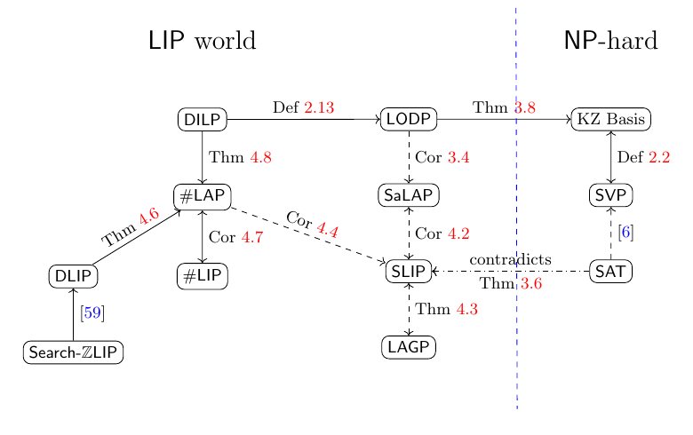

# 借 Irreducible Decomposition 探究 Lattice Isomorphism Problem 的复杂度

> **Exploiting the complexity of the Lattice Isomorphism Problem via Irreducible Decomposition**
> Kaijie Jiang, Yinchen Liu (Tsinghua University)
> CRYPTO 2026 · Lattice Cryptanalysis II + Isogenies (2026-08-17) · **L2 深入解析**
> [ePrint 2026/1139](https://eprint.iacr.org/2026/1139) · [Slides](https://iacr.org/submit/files/slides/2026/crypto/crypto2026/235/235_slides.pptx)

## §1 背景与问题设定

这是一篇复杂度论文：不给攻击、不给方案，回答的是"**Search-LIP 能不能是 NP-hard**"。答案是不能，除非 polynomial hierarchy 塌缩；工具是 lattice 的 irreducible orthogonal decomposition 与 Arthur–Merlin 协议。

### 1.1 表示与记号

全文用 **Gram matrix** 表示 lattice：输入是整数正定对称矩阵 $G\in\mathrm{Sym}^{>0}_n(\mathbb{Z})$，isomorphism 用坐标变换矩阵 $U\in\mathrm{GL}_n(\mathbb{Z})$ 表示。这样避免了实数 basis 的 bit 复杂度问题，也覆盖了全部 integral lattice。

| 符号 | 含义 |
|---|---|
| $L$ | full-rank integral lattice，$G$ 为其某组 basis 的 Gram matrix；坐标向量 $\mathbf{v}\in\mathbb{Z}^n$ 的长度 $\|\mathbf{v}\|_G=\sqrt{\mathbf{v}^{\top}G\mathbf{v}}$ |
| $[G]$ | $\{U^{\top}GU:U\in\mathrm{GL}_n(\mathbb{Z})\}$，同一 lattice 的全部 Gram matrix |
| $\mathrm{Stab}(G)$ | $\{U\in\mathrm{GL}_n(\mathbb{Z}):U^{\top}GU=G\}$，与几何的 $\mathrm{Aut}(L)=\{\phi\in\mathrm{O}_n(\mathbb{R}):\phi(L)=L\}$ 同构（把坐标变换用 basis 共轭回 $\mathbb{R}^n$） |
| $\mathrm{Iso}(G_1,G_2)$ | $\{U:U^{\top}G_1U=G_2\}$；非空时是 $\mathrm{Stab}(G_1)$ 的一个陪集，故 $\|\mathrm{Iso}(G_1,G_2)\|=\|\mathrm{Stab}(G_1)\|$ |
| $s(G)$ | $\|\mathrm{Stab}(G)\|$ |
| $L_1\oplus L_2$ | orthogonal sum：$L=L_1+L_2$，$L_1\cap L_2=\{0\}$，$\langle L_1,L_2\rangle=0$；Gram matrix 上是分块对角 $G_1\oplus G_2$ |
| $\mathrm{Perm}_r$ | $r\times r$ permutation matrix 群 |
| $\tilde{\mathbf{b}}_i,\ \mu_{i,j},\ \pi_i$ | Gram–Schmidt 向量、系数，以及到 $\mathrm{span}\{\tilde{\mathbf{b}}_i,\dots,\tilde{\mathbf{b}}_n\}$ 的正交投影 |

### 1.2 问题族

> **DLIP**：给定 $G_1,G_2$，判定 $\mathrm{Iso}(G_1,G_2)\neq\emptyset$。
> **SLIP**：已知 $\mathrm{Iso}(G_1,G_2)\neq\emptyset$，输出一个 $U\in\mathrm{Iso}(G_1,G_2)$。
> **SaLAP**（本文新定义，Sampling Lattice Automorphism Problem）：给定 $G$，输出 $U\xleftarrow{\mathrm{unif}}\mathrm{Stab}(G)$ 的均匀样本。
> **LAGP**：给定 $G$，输出 $\mathrm{Stab}(G)$ 的一个生成集。
> **#LAP / #LIP**：计算 $s(G)$ / $\|\mathrm{Iso}(G_1,G_2)\|$。
> **DILP**：判定 $G$ 表示的 lattice 是否 irreducible。
> **LODP**：输出 $U\in\mathrm{GL}_n(\mathbb{Z})$ 与 $G_1,\dots,G_k$ 使 $U^{\top}GU=G_1\oplus\cdots\oplus G_k$、每个 $G_i$ irreducible。

**Irreducible lattice**：不存在非零子 lattice $L_1,L_2$ 使 $L=L_1\oplus L_2$。

> **定理（Eichler 1952，Kneser 1954）**：每个 lattice 有唯一的 orthogonal decomposition $L=L_1\oplus\cdots\oplus L_k$，各 $L_i$ irreducible（唯一到重排）。称 $L$ 为 $k$-direct-sum lattice。

这是全文的支柱：irreducible component 之于 lattice，正如 connected component 之于 graph。

**KZ basis**：basis $(\mathbf{b}_1,\dots,\mathbf{b}_n)$ 满足 (1) $\tilde{\mathbf{b}}_i$ 是投影 lattice $\pi_i(L)$ 的最短非零向量；(2) 对 $j<i$，$-\tfrac12<\mu_{i,j}\le\tfrac12$。它可以用至多 $n$ 次 exact-SVP oracle 调用算出。

### 1.3 复杂度工具

- **Turing reduction**：多项式时间 oracle 算法；randomized 版本要求对每个实例以概率 $\ge2/3$ 正确。归约到 sampling problem 时，oracle 每次返回一个新鲜的均匀样本。
- **AM**：两轮 public-coin 协议。Arthur 发随机串，Merlin 回一条消息，Arthur 多项式时间判定；completeness $\ge2/3$、soundness $\le1/3$。常数轮 $\mathrm{AM}[O(1)]=\mathrm{AM}$（Babai–Moran），私币 $\mathrm{IP}[O(1)]\subseteq\mathrm{AM}$（Goldwasser–Sipser：$\mathrm{IP}$ 的轮数加 2 即可换成 public coin）。$\mathrm{coAM}$ 为补类。
- **Boppana–Håstad–Zachos**：$\mathrm{NP}\subseteq\mathrm{coAM}\Rightarrow\mathrm{PH}=\Sigma_2^{\mathrm{P}}$。所以"$\Pi\in\mathrm{AM}\cap\mathrm{coAM}$ 对一切归约到 SLIP 的 $\Pi$ 成立"就意味着 SLIP 不能是 NP-hard。
- **Goldwasser–Sipser set lower bound**：对成员资格可在 AM 中验证的有限集 $C$ 与阈值 $\theta$，存在 AM 协议区分 $\|C\|\ge\theta$ 与 $\|C\|\le\theta/2$（任何常数因子的 gap 都可以）。
- **Beals–Babai**：给定 $\mathrm{GL}_n(\mathbb{Q})$ 中有限群的生成集，BPP（Las Vegas）算出群的阶、判定成员资格。
- **随机生成**：有限群 $H$ 中 $\ell>\log_2\|H\|+\max\{3,2\log_2(1/\epsilon)\}$ 个均匀随机元素以概率 $\ge1-\epsilon$ 生成 $H$；反过来（Babai 1991）由生成集可在 $\mathrm{poly}(\log\|H\|,\log(1/\epsilon))$ 时间内产生每个元素概率为 $(1\pm\epsilon)/\|H\|$ 的近似均匀样本。
- **Feit**：$n>10$ 时 $\mathbb{Z}^n$ 的 automorphism group 是 $n$ 维 lattice 中最大的，$\|\mathrm{Aut}(\mathbb{Z}^n)\|=2^n n!$，故 $\log_2 s(G)<n^2$。
- **LIP 的 randomized self-reduction**（Ducas–van Woerden 2022，本文 Lemma 2.6）：随机算法 $\mathsf{Rerand}(G)$ 输出 $(G'',U)$，$G''=U^{\top}GU$，满足 (a) $G''$ 的分布只依赖 $[G]$；(b) 给定 $G''$，$U$ 在 $\mathrm{Iso}(G,G'')$ 中均匀。实现是 LLL 后做 discrete Gaussian 采样得 $n$ 个线性无关向量，再经 Hermite normal form 规范化。

## §2 此前的成果

**算法。** Plesken–Souvignier (1997) 给出实用的低维 SLIP 算法（slides 称报告到 $n=40$）。Haviv–Regev (SODA 2014) 用广义 isolation lemma 与 SVP oracle 给出 $n^{O(n)}$ 时间的 SLIP 算法，至今最快；Dutour Sikirić–Haensch–Voight–van Woerden (2020) 借 SVP/CVP 定义 canonical form，把 SLIP 归约到 GI，但最短向量数目最坏可能指数级。所有已知 SLIP 算法都以 SVP oracle 为子程序。Orthogonal decomposition 方面，Hemkemeier–Vallentin (1998) 基于 Kneser 方法：给定全部长度 $\le\beta$ 的向量集合（$\beta\ge\lambda_n$，个数记 $\nu$），用 $O(n^6\log^2\beta+\nu n^2)$ 时间分解，但没算枚举这个集合的代价，它至少要解一次 SVP，$\ge2^{n+o(n)}$。

**复杂度。** Dutour Sikirić–Schürmann–Vallentin 证明 DLIP 至少与 GI 一样难；Haviv–Regev 证明 $\mathrm{DLIP}\in\mathrm{SZK}\subseteq\mathrm{AM}\cap\mathrm{coAM}$，所以 DLIP 不太可能 NP-hard。**但这对 search 版本什么也没说**：SLIP 到 DLIP 的一般归约不存在，只有 Szydlo (2003) 的 search-ZLIP $\le$ DLIP，以及 van Gent–van Woerden (2025) 推广到 direct-sum lattice 与 modular lattice。对比 GI：GI $\in\mathrm{NP}\cap\mathrm{coAM}$，且 search GI、decision GI、#GI、#GAP（automorphism group 的阶）全部多项式等价（Mathon 1979）；code equivalence 也有 search-to-decision 归约（Biasse–Micheli 2023）。LIP 的对应关系此前基本空白。另一个方向：Bennett–Dadush–Stephens-Davidowitz (2016) 的 Lattice Distortion Problem（LIP 的推广，求 condition number 最小的映射）在 randomized reduction 下 NP-hard to approximate within any constant。

**LIP 密码学的版图（据 slides 的时间线）。** Ducas–van Woerden (Eurocrypt 2022) 给出 identification、KEM/PKE 与签名的通用框架；HAWK (Asiacrypt 2022) 走 module-LIP 路线并进入 NIST 附加签名第二轮；2024–25 年出现基于 LIP 的 PKE/KEM、commitment（Jiang 等，Eurocrypt 2025）与 FHE（Branco–Malavolta–Maradni，TCC 2025）；2026 年又有 IBE 与 leveled FHE（Bennett–Lai–Stephens-Davidowitz，CRYPTO 2026）以及 ring/blind/anonymous signature。密码分析一侧，ZLIP（$\mathbb{Z}^n$ 的旋转）从 Gentry–Szydlo (2002)、Szydlo (2003)、Lenstra–Silverberg (2014/2017/2019) 到 Bennett 等 (Eurocrypt 2023)、Jiang 等 (Asiacrypt 2023)、Ducas (2023，blocksize $n/2$ 的可证归约)、Basso–Nguyen (2024)；module-LIP 有 Mureau 等 (Eurocrypt 2024)、Luo 等 (Asiacrypt 2024)、Allombert 等 (Eurocrypt 2025)。这些构造与攻击都默认 SLIP 是比 SVP 更难的问题，但 SLIP 的复杂度地位本身一直没有被厘清。

**"不能基于 NP-hardness"的证明框架。** Akavia–Goldreich–Goldwasser–Moshkovitz (2006) 与 Bogdanov–Brzuska (TCC 2015) 证明 size-verifiable one-way function 不能基于 NP-hardness；Liu (TCC 2018) 把框架推广，证明 search $\mathrm{SIVP}_{\omega(n\log n)}$ 不 NP-hard（除非 PH 塌缩）。本文沿用这条 "search $\to$ sampling $\to$ set size" 的路线。Jiang 等 (Asiacrypt 2023) 用 randomized self-reduction 证明了 SaLAP 类问题可归约到 SLIP，本文补上反方向。

## §3 本文的算法与归约

*图 1（论文 Fig. 1）：实线为 Turing reduction，虚线为 randomized Turing reduction，点划线为 black-box separation。红色标号是本文的结果：SLIP 与 SaLAP、LAGP 互相归约（Cor 4.2、Thm 4.3）；#LAP $\le$ SLIP（Cor 4.4）；DLIP、DILP $\le$ #LAP（Thm 4.6、4.8）；#LIP $\equiv$ #LAP（Cor 4.7）；LODP $\le$ SaLAP（Cor 3.4）且 LODP $\le$ KZ basis $\le$ SVP（Thm 3.8）；SAT 到 SLIP 的归约与 Thm 3.6 矛盾。蓝色虚线右侧是 NP-hard 世界，LIP 世界的问题都在左侧。*

### 3.1 SLIP $\to$ SaLAP：分而治之

**归约 A（论文 Proposition 3.3）**
- **输入**：SLIP 实例 $(G,G')$，$\mathrm{Iso}(G,G')\ne\emptyset$，表示 lattice $L\cong L'$，$L$ 为 $k$-direct-sum。
- **oracle**：SaLAP。
- **输出**：$U\in\mathrm{Iso}(G,G')$。
1. 令 $N:=G\oplus G'$（几何上 $N=L\oplus L'$）。调用 SaLAP $m=\mathrm{poly}(n)$ 次，得 i.i.d. 的 $\phi_1,\dots,\phi_m\xleftarrow{\mathrm{unif}}\mathrm{Aut}(N)$。
2. 若某个 $\phi_i$ 满足 $\phi_i(L)=L'$（"lucky"，即 $\mathrm{rank}(\phi_i(L)\cap L)=0$）：输出 $\phi_i|_L\in\mathrm{Iso}(L,L')$。
3. 否则找某个 $\phi_i$ 满足 $1\le\mathrm{rank}(\phi_i(L)\cap L)\le n-1$，把实例拆成两个更小的 SLIP 实例
$$(\phi_i(L)\cap L,\ \phi_i(L')\cap L'),\qquad(\phi_i(L')\cap L,\ \phi_i(L)\cap L'),$$
递归求解得 $\psi_1,\psi_0$，输出 $\psi_0\oplus\psi_1$。

子 lattice 的交、和、正交补都在坐标下用 Hermite normal form 计算，Gram matrix 为 $\mathbf{C}^{\top}N\mathbf{C}$（$\mathbf{C}$ 为整数坐标矩阵）。总共至多 $2nm$ 次 SaLAP 调用，成功概率 $1-\mathrm{negl}(n)$。同一过程顺便算出了 $L$ 的 irreducible decomposition，即 **LODP $\le$ SaLAP**（Cor 3.4）。

### 3.2 AutVer：automorphism group 的阶可在 AM 中验证

$\mathrm{AutVer}:=\{(G,s):s(G)=s\}$。$s\le2^n n!$，二进制表示多项式长。

**协议 B（论文 Fig. 2，IP 协议）**
1. Prover 发 $\mathrm{Stab}(G)$ 的一个生成集 $\{g_1,\dots,g_\ell\}\subset\mathrm{GL}_n(\mathbb{Z})$，$\ell=\Theta(n^2)$。
2. Verifier 逐个检查 $g_i^{\top}Gg_i=G$；用 Beals–Babai 算 $\|\langle g_1,\dots,g_\ell\rangle\|$ 并与 $s$ 比较。
3. Verifier 运行 $\mathsf{Rerand}(G)\to(G'',U)$，把 $G''$ 发给 Prover。
4. Prover 回一个 $V$ 满足 $V^{\top}GV=G''$。
5. Verifier 检查 $V$，算 $g_{\ell+1}:=UV^{-1}$，用 Beals–Babai 判定 $g_{\ell+1}\in\langle g_1,\dots,g_\ell\rangle$。
6. 重复第 3–5 步一次。

### 3.3 主定理的 AM 协议

设 $R$ 是从判定问题 $\Pi$ 到 SaLAP 的 randomized Turing reduction（由归约 A，凡能归约到 SLIP 的 $\Pi$ 都有这样的 $R$）。不失一般性，$R$ 在长度 $|z|$ 的输入上恰好询问 $q$ 次、随机串 $\omega$ 长度固定（用对平凡 lattice $\mathbb{Z}$ 的无意义询问和多余随机 bit 填充）。令 $\tau$ 为 $R$ 运行时间的多项式上界（因此也是每个 oracle 回答长度的上界），$K:=2^{q\tau+3}$。

定义语言
$$C:=\Big\{(z,\omega,U_1,\dots,U_q,p):\ (\omega,U_1,\dots,U_q)\ \text{是}\ R^{\mathsf{Samp}}(z)\ \text{的 accepting valid transcript},\ 1\le p\le\Big\lceil\tfrac{K}{s(G_1)\cdots s(G_q)}\Big\rceil\Big\},$$
其中 $G_i$ 是 $R$ 的第 $i$ 次询问，"valid" 指每个 $U_i\in\mathrm{Stab}(G_i)$。记 $C(z)$ 为固定 $z$ 后的切片。

**协议 C（论文 Fig. 3，判定 $C$ 的 AM 协议）**
1. Verifier 用随机串 $\omega$ 运行 $R(z)$，依次用 $U_i$ 充当 oracle 回答，记录每个询问 $G_i$，检查 $U_i^{\top}G_iU_i=G_i$ 且 $R$ 最终接受。
2. Prover 做同样的模拟，发 $s(G_1),\dots,s(G_q)$。
3. 双方并行运行协议 B 验证这 $q$ 个数（误差放大到指数小）。
4. Verifier 检查 $1\le p\le\lceil K/(s(G_1)\cdots s(G_q))\rceil$。

主定理的 AM 协议就是：对 $C(z)$ 运行 Goldwasser–Sipser set lower bound，阈值 $\theta:=\tfrac23\cdot2^{|\omega|}K$。§4.3 证明 $z\in\Pi$ 时 $\|C(z)\|\ge\theta$，$z\notin\Pi$ 时 $\|C(z)\|\le\tfrac34\theta$。

### 3.4 KZ basis 直接读出 irreducible decomposition

**算法 D（论文 Theorem 3.8）**
- **输入**：full-rank lattice $L$ 的一组 KZ basis $(\mathbf{b}_1,\dots,\mathbf{b}_n)$。
- **输出**：$L$ 的唯一 irreducible decomposition。
1. 建图 $\mathcal{G}_L$：顶点 $\mathbf{b}_1,\dots,\mathbf{b}_n$，$\mathbf{b}_i\sim\mathbf{b}_j$ 当且仅当 $\langle\mathbf{b}_i,\mathbf{b}_j\rangle\ne0$。
2. 求连通分量；第 $i$ 个分量的顶点张成的 lattice 记 $L_i$。
3. 输出 $L=L_1\oplus\cdots\oplus L_k$。

一般 basis 做不到这一点：slides 举例，$\mathbb{Z}^2$ 用 basis $(\mathbf{b}_1,\mathbf{b}_2)$、$\langle\mathbf{b}_1,\mathbf{b}_2\rangle\ne0$ 时图连通，lattice 却可约。KZ basis 的两条条件恰好逼迫每个 basis 向量落进单个 component（§4.4）。KZ basis 用至多 $n$ 次 SVP 得到，代入 Aggarwal–Dadush–Regev–Stephens-Davidowitz 的 $2^{n+o(n)}$ SVP 算法即得 **LODP 的 randomized $2^{n+o(n)}$ 时间与空间算法**（Cor 3.9）。

### 3.5 计数与判定之间的归约

**归约 E：DLIP $\le$ #LAP（论文 Theorem 4.6）**
1. 用 #LAP oracle 算 $c_{01}=s(G_0\oplus G_1)$，$c_{00}=s(G_0\oplus G_0)$，$c_{11}=s(G_1\oplus G_1)$。
2. 输出 1 当且仅当 $c_{00}=c_{01}=c_{11}$。

**归约 F：DILP $\le$ #LAP（论文 Theorem 4.8）**
1. 算 $c_1=s(G)$，$c_{11}=s(G\oplus G)$。
2. 输出 "irreducible" 当且仅当 $c_{11}/c_1^2=2$。

**LAGP $\equiv$ SLIP（randomized，论文 Theorem 4.3）**：LAGP $\le$ SLIP：由 Jiang 等 (2023) 的 SaLAP $\le$ SLIP 得均匀采样，采 $n^2$ 个元素，由 Feit 界与随机生成定理它们以概率 $>1-2^{-n}$ 生成 $\mathrm{Stab}(G)$。SLIP $\le$ LAGP：用生成集与 Babai 的算法得到误差 $(1\pm2^{-n^2})$ 的近似均匀采样，代入归约 A；"lucky" 概率变为 $\ge\tfrac12(1-2^{-n^2})>\tfrac13$，足够。
**#LAP $\le$ SLIP**（Cor 4.4）：先 LAGP 得生成集，再 Beals–Babai 算阶。
**#LIP $\equiv$ #LAP**（Cor 4.7）：#LIP 先用归约 E 判空，非空则 $\|\mathrm{Iso}(G_0,G_1)\|=s(G_0)$；反向 $s(G)=\|\mathrm{Iso}(G,G)\|$。

## §4 为什么能 work

### 4.1 直和的 isomorphism 只能置换 component

> **引理 3.1**：设 $\Lambda=\bigoplus_{i=1}^{r}\Lambda_i$、$\Lambda'=\bigoplus_{j=1}^{r'}\Lambda'_j$ 为 irreducible decomposition。若 $\phi\in\mathrm{O}_n(\mathbb{R})$ 是 $\Lambda\to\Lambda'$ 的 isomorphism，则 $r=r'$，存在置换 $\sigma$ 使 $\phi(\Lambda_i)=\Lambda'_{\sigma(i)}$，且 $\phi=\bigoplus_i\phi|_{\Lambda_i}$。

**证明。** $\Lambda'=\phi(\Lambda)=\bigoplus_i\phi(\Lambda_i)$，正交变换保内积，故这是 $\Lambda'$ 的一个 orthogonal decomposition。每个 $\phi(\Lambda_i)$ irreducible：若 $\phi(\Lambda_i)=\Delta_1\oplus\Delta_2$ 非平凡，则 $\Lambda_i=\phi^{-1}(\Delta_1)\oplus\phi^{-1}(\Delta_2)$ 非平凡，矛盾。由 Eichler–Kneser 唯一性，$\{\phi(\Lambda_i)\}$ 与 $\{\Lambda'_j\}$ 只差重排。$\square$

> **推论 3.2**：$L$ 为 $d$ 维 irreducible lattice，则
> $$\mathrm{Aut}\Big(\bigoplus_{i=1}^{r}L\Big)=\big\{(W\otimes I_d)\cdot\mathrm{diag}(A_1,\dots,A_r):\ W\in\mathrm{Perm}_r,\ A_i\in\mathrm{Aut}(L)\big\}.$$

这就是 automorphism group 的结构：先在每个 copy 内做 automorphism，再整体置换 copy。

### 4.2 归约 A 为什么成功

**每个 $\phi\in\mathrm{Aut}(N)$ 都把 $L$ 的 component 送进 $L$ 或 $L'$。** $N=L\oplus L'$ 的 irreducible component 就是 $L$ 的与 $L'$ 的合在一起；由引理 3.1，$\phi(L_1)$ 是 $N$ 的某个 component，因而整体落在 $L$ 内或 $L'$ 内。

**"crossing" 的概率恰为 $\tfrac12$。** 取任一 $\psi\in\mathrm{Iso}(L,L')$，令 swap 自同构 $\varsigma:=\begin{pmatrix}0&\psi^{-1}\\ \psi&0\end{pmatrix}\in\mathrm{Aut}(N)$。$\phi\mapsto\varsigma\phi$ 是 $\mathrm{Aut}(N)$ 的双射，把事件 $\{\phi(L_1)\subseteq L\}$ 与 $\{\phi(L_1)\subseteq L'\}$ 互换，两事件互补，故各占一半：
$$\Pr_{\phi\xleftarrow{\mathrm{unif}}\mathrm{Aut}(N)}[\phi(L_1)\subseteq L']=\tfrac12 .$$

**拆分公式。** 记 $L$ 的 component 类型多重集为 $T$（$L'$ 的也是 $T$，因 $L\cong L'$）。设 $\Xi\subseteq T$ 为被 $\phi$ 送进 $L'$ 的那些 component。则 $\phi(L)\cap L'=\phi(\Xi)\cong\Xi$，$\phi(L)\cap L=\phi(T\setminus\Xi)\cong T\setminus\Xi$；$L$ 中未被 $\phi(L)$ 覆盖的 component 只能来自 $\phi(L')$，其类型多重集为 $T\setminus(T\setminus\Xi)=\Xi$，故 $\phi(L')\cap L\cong\Xi$；同理 $\phi(L')\cap L'\cong T\setminus\Xi$。于是
$$L=(\phi(L')\cap L)\oplus(\phi(L)\cap L),\quad L'=(\phi(L)\cap L')\oplus(\phi(L')\cap L'),\quad \phi(L')\cap L\cong\phi(L)\cap L',\quad \phi(L')\cap L'\cong\phi(L)\cap L .$$
两个子实例的 isomorphism $\psi_0,\psi_1$ 拼成 $\psi_0\oplus\psi_1\in\mathrm{Iso}(L,L')$。

**为什么两个子实例都严格更小。** crossing 发生时 $\Xi\ne\emptyset$，故 $\mathrm{rank}(\phi(L)\cap L)\le n-1$；若 $\Xi=T$ 就是 lucky，直接结束；否则 $1\le\mathrm{rank}\le n-1$，两个子实例的 component 数 $k_1+k_2=k$、$1\le k_1,k_2\le k-1$。$m$ 个样本中至少一个 crossing 的概率 $\ge1-2^{-m}$。

**$L$ irreducible（$k=1$）时 lucky 概率恰为 $\tfrac12$。** 此时
$$\mathrm{Aut}(N)=\Big\{\begin{pmatrix}A_1&0\\0&A_2\end{pmatrix}:A_1\in\mathrm{Aut}(L),A_2\in\mathrm{Aut}(L')\Big\}\ \cup\ \Big\{\begin{pmatrix}0&D_1\\D_2&0\end{pmatrix}:D_1\in\mathrm{Iso}(L',L),D_2\in\mathrm{Iso}(L,L')\Big\},$$
反对角块就是 lucky 的一半。坐标形式：$U=\begin{pmatrix}0&D_1\\D_2&0\end{pmatrix}\in\mathrm{Stab}(G\oplus G')$ 展开 $U^{\top}(G\oplus G')U=\begin{pmatrix}D_2^{\top}G'D_2&0\\0&D_1^{\top}GD_1\end{pmatrix}$，与 $G\oplus G'$ 相等给出 $D_1^{\top}GD_1=G'$，即 $D_1\in\mathrm{Iso}(G,G')$。

### 4.3 主定理：从 sampling 到 set size

**为什么要先把 search 换成 sampling。** 若 Prover 直接模拟 $R^{\mathrm{SLIP}}$，SLIP 的回答不唯一，Prover 可以挑对自己有利的 isomorphism 来骗 Verifier。换成 SaLAP 后每次询问的**回答分布唯一**（$\mathrm{Stab}(G_i)$ 上的均匀分布），transcript 的概率成为可计算的量。

**协议 B 的 soundness。** 设 $s\ne s(G)$。通过第 2 步意味着 $\langle g_1,\dots,g_\ell\rangle$ 是 $\mathrm{Stab}(G)$ 的阶为 $s$ 的子群，故 $s\le s(G)/2$。第 5 步的 $g_{\ell+1}$ 确实在 $\mathrm{Stab}(G)$ 中：
$$(UV^{-1})^{\top}G(UV^{-1})=V^{-\top}(U^{\top}GU)V^{-1}=V^{-\top}G''V^{-1}=V^{-\top}(V^{\top}GV)V^{-1}=G .$$
它还是均匀的：固定 $V\in\mathrm{Iso}(G,G'')$，映射 $g\mapsto gV$ 是 $\mathrm{Stab}(G)\to\mathrm{Iso}(G,G'')$ 的双射（$(gV)^{\top}G(gV)=V^{\top}GV=G''$），而由 $\mathsf{Rerand}$ 的性质 (b)，给定 $G''$ 后 $U$ 在 $\mathrm{Iso}(G,G'')$ 中均匀，Prover 的 $V$ 只能依赖 $G''$，故 $g_{\ell+1}=UV^{-1}$ 在 $\mathrm{Stab}(G)$ 中均匀。落入阶为 $s$ 的子群的概率 $\le s/s(G)\le\tfrac12$；重复一次后 $\le\tfrac14+2^{-\Theta(n)}\le\tfrac13$。Completeness 显然：诚实 Prover 给出真正的生成集，$g_{\ell+1}$ 必在其中。由 $\mathrm{IP}[O(1)]\subseteq\mathrm{AM}$，$\mathrm{AutVer}\in\mathrm{AM}$。

**$C\in\mathrm{AM}$。** 协议 C 的第 1、4 步是确定性多项式时间，第 3 步是 $q$ 个并行的 AutVer 协议。不在 $C$ 中的元组要么 transcript 无效或不接受（第 1 步拒绝），要么 Prover 报错了某个 $s(G_i)$（AutVer soundness，指数小概率通过），要么 $p$ 越界（第 4 步拒绝）。

**$\|C(z)\|$ 的估计（全文核心计算）。** 固定 $\omega$，oracle 每次独立均匀，一条 valid transcript $(\omega,U_1,\dots,U_q)$ 出现的概率恰为 $1/(s(G_1)\cdots s(G_q))$，于是
$$\Pr[R^{\mathsf{Samp}}(z)\ \text{accepts}]=2^{-|\omega|}\sum_{\text{accepting valid}\ (\omega,U_1,\dots,U_q)}\frac{1}{s(G_1)\cdots s(G_q)} .$$
$z\in\Pi$ 时接受概率 $\ge\tfrac23$：
$$\|C(z)\|=\sum_{\text{acc.\ valid}}\Big\lceil\frac{K}{\prod_i s(G_i)}\Big\rceil\ \ge\ K\sum_{\text{acc.\ valid}}\frac{1}{\prod_i s(G_i)}\ \ge\ \tfrac23\,2^{|\omega|}K .$$
$z\notin\Pi$ 时接受概率 $\le\tfrac13$，且每个 $\omega$ 下回答串至多 $2^{q\tau}$ 种：
$$\|C(z)\|\le\sum_{\text{acc.\ valid}}\Big(\frac{K}{\prod_i s(G_i)}+1\Big)\le\tfrac13\,2^{|\omega|}K+2^{|\omega|}2^{q\tau}=\Big(\tfrac13+\tfrac18\Big)2^{|\omega|}K\le\tfrac12\,2^{|\omega|}K ,$$
最后一步用了 $K=2^{q\tau+3}$，即 $2^{q\tau}=K/8$。取整 $\lceil\cdot\rceil$ 的作用正是让 $C(z)$ 成为整数个元素的集合而不改变量级。Goldwasser–Sipser 协议于是区分两种情形，$\Pi\in\mathrm{AM}$。**coAM**：把 $R$ 的输出取反得到 $\bar\Pi$ 到 SaLAP 的归约，同理 $\bar\Pi\in\mathrm{AM}$。$\square$

> **定理 3.6**：若判定问题 $\Pi$ randomized Turing 归约到 SLIP，则 $\Pi\in\mathrm{AM}\cap\mathrm{coAM}$。
> **推论 3.7**：若 SVP randomized Turing 归约到 SLIP，则 $\mathrm{NP}\subseteq\mathrm{coAM}$（Ajtai：GapSVP NP-hard，GapSVP $\le$ SVP），从而 $\mathrm{PH}=\Sigma_2^{\mathrm{P}}$。

### 4.4 KZ basis 为什么揭示 decomposition

> **Claim**：对 $L$ 的任意 orthogonal decomposition $L=\mathcal{P}_1\oplus\cdots\oplus\mathcal{P}_t$（$\mathcal{P}_i$ 不必 irreducible），每个 KZ basis 向量 $\mathbf{b}_j$ 整体落在某一个 $\mathcal{P}_i$ 中。

**证明（对 $j$ 归纳）。** $j=1$：$\mathbf{b}_1=\tilde{\mathbf{b}}_1$ 是 $L$ 的最短非零向量。写 $\mathbf{b}_1=\sum_i\mathbf{p}_{i,1}$，$\mathbf{p}_{i,1}\in\mathcal{P}_i$，正交性给出 $\|\mathbf{b}_1\|^2=\sum_i\|\mathbf{p}_{i,1}\|^2$。若两个以上分量非零，则某非零 $\mathbf{p}_{i,1}\in L$ 严格更短，矛盾。

归纳步：设 $\mathbf{b}_1,\dots,\mathbf{b}_{j-1}$ 各自落在单个 $\mathcal{P}_i$ 中。令 $X_i:=\mathrm{span}(\{\mathbf{b}_1,\dots,\mathbf{b}_{j-1}\}\cap\mathcal{P}_i)$，$Y_i$ 为 $X_i$ 在 $\mathrm{span}_\mathbb{R}\mathcal{P}_i$ 中的正交补。则 $\mathrm{span}\{\mathbf{b}_1,\dots,\mathbf{b}_{j-1}\}=\bigoplus_iX_i$，其正交补为 $\bigoplus_iY_i$。写 $\mathbf{b}_j=\sum_i\mathbf{p}_{i,j}$，$\mathbf{p}_{i,j}=\mathbf{x}_{i,j}+\mathbf{y}_{i,j}$（$\mathbf{x}_{i,j}\in X_i,\mathbf{y}_{i,j}\in Y_i$），于是 $\tilde{\mathbf{b}}_j=\sum_i\mathbf{y}_{i,j}$。

(i) **至多一个 $\mathbf{y}_{i,j}$ 非零**：$\|\tilde{\mathbf{b}}_j\|^2=\sum_i\|\mathbf{y}_{i,j}\|^2$；若两个以上非零，取某个非零 $\mathbf{y}_{i,j}$，则 $\pi_j(\mathbf{p}_{i,j})=\mathbf{y}_{i,j}$ 是 $\pi_j(L)$ 中比 $\tilde{\mathbf{b}}_j$ 更短的非零向量，与 KZ 条件 (1) 矛盾。记那个唯一的下标为 $i_0$，$\tilde{\mathbf{b}}_j=\mathbf{y}_{i_0,j}$。

(ii) **唯一性观察**：固定 $\tilde{\mathbf{w}}\in\pi_j(L)$，至多有一个 $\mathbf{w}=\tilde{\mathbf{w}}+\sum_{i'<j}\mu'_{i'}\tilde{\mathbf{b}}_{i'}\in L$ 满足全部 $\mu'_{i'}\in(-\tfrac12,\tfrac12]$。因为两个这样的 $\mathbf{w},\mathbf{w}'$ 之差属于 $L\cap\mathrm{span}\{\mathbf{b}_1,\dots,\mathbf{b}_{j-1}\}=\sum_{i'<j}\mathbb{Z}\mathbf{b}_{i'}$，用 $(\mathbf{b}_{i'})$ 与 $(\tilde{\mathbf{b}}_{i'})$ 之间的三角关系从 $i'=j-1$ 倒推到 1，每个系数差都是整数，又落在 $(-1,1)$ 内，故全为 0。

(iii) 向量 $\mathbf{p}_{i_0,j}\in\mathcal{P}_{i_0}$ 的 Gram–Schmidt 残差也是 $\tilde{\mathbf{b}}_j$，且它与 $\mathcal{P}_{i}$（$i\ne i_0$）中的所有 $\mathbf{b}_{i'}$ 正交。给它加上 $\mathcal{P}_{i_0}$ 内 basis 向量的整数组合，可以把它在 $\mathcal{P}_{i_0}$ 内的 Gram–Schmidt 系数调进 $(-\tfrac12,\tfrac12]$，而其他 component 上的系数保持为 0。所得向量与 $\mathbf{b}_j$ 有相同的 $\tilde{\mathbf{b}}_j$、系数都在 $(-\tfrac12,\tfrac12]$，由 (ii) 与 KZ 条件 (2)，它就是 $\mathbf{b}_j$。故 $\mathbf{b}_j\in\mathcal{P}_{i_0}$。$\square$

**定理 3.8 的收尾。** 不同连通分量的 basis 向量两两正交，故 $L=L_1\oplus\cdots\oplus L_k$ 是 orthogonal decomposition。若某个 $L_i=\mathcal{P}_1\oplus\mathcal{P}_2$ 非平凡可约，把它代入 $L$ 的分解，由 Claim 每个 $\mathbf{b}_j\in L_i$ 落在 $\mathcal{P}_1$ 或 $\mathcal{P}_2$ 之一，且两边都非空，正交性使 $L_i$ 对应的子图不连通，矛盾。于是各 $L_i$ irreducible，由唯一性定理这就是唯一分解。$\square$

### 4.5 计数如何判定 isomorphism 与 irreducibility

把 $G_0,G_1$ 的 component 按同构类型分组：
$$G_0\cong\bigoplus_{i=1}^{u_0}\mathcal{E}_i^{\oplus\alpha_i},\qquad G_1\cong\bigoplus_{j=1}^{u_1}\mathcal{F}_j^{\oplus\gamma_j},$$
$\mathcal{E}_i$ 两两不同构、$\mathcal{F}_j$ 两两不同构，重数 $\alpha_i,\gamma_j\ge1$；重排后设 $\mathcal{E}_1\cong\mathcal{F}_1,\dots,\mathcal{E}_{u_c}\cong\mathcal{F}_{u_c}$ 为全部公共类型。由推论 3.2，
$$c_{00}=\prod_{i=1}^{u_0}(2\alpha_i)!\,s(\mathcal{E}_i)^{2\alpha_i},\quad c_{11}=\prod_{j=1}^{u_1}(2\gamma_j)!\,s(\mathcal{F}_j)^{2\gamma_j},\quad
c_{01}=\prod_{i=1}^{u_c}(\alpha_i+\gamma_i)!\,s(\mathcal{E}_i)^{\alpha_i+\gamma_i}\prod_{i=u_c+1}^{u_0}\alpha_i!\,s(\mathcal{E}_i)^{\alpha_i}\prod_{j=u_c+1}^{u_1}\gamma_j!\,s(\mathcal{F}_j)^{\gamma_j}.$$

**归约 E 的正确性。** $G_0\cong G_1$ 时三个直和两两同构，$c_{00}=c_{01}=c_{11}$。不同构时证明 $c_{01}^2<c_{00}c_{11}$：$s(\cdot)$ 因子在两边完全抵消（公共类型 $s(\mathcal{E}_i)=s(\mathcal{F}_i)$），只剩阶乘。非公共类型：$(\alpha_i!)^2<(2\alpha_i)!$。公共类型：不妨 $\alpha\ge\gamma$，
$$\frac{(2\alpha)!\,(2\gamma)!}{((\alpha+\gamma)!)^2}=\frac{(\alpha+\gamma+1)(\alpha+\gamma+2)\cdots(2\alpha)}{(2\gamma+1)(2\gamma+2)\cdots(\alpha+\gamma)},$$
分子分母各 $\alpha-\gamma$ 项，逐项 $\alpha+\gamma+i\ge2\gamma+i$，故比值 $\ge1$，等号当且仅当 $\alpha=\gamma$。因此 $c_{01}^2\le c_{00}c_{11}$，等号要求 $u_c=u_0=u_1$ 且所有 $\alpha_i=\gamma_i$，即 $G_0\cong G_1$，矛盾。所以不同构时 $c_{00}=c_{01}=c_{11}$ 不可能成立。$\square$

**归约 F 的正确性。** $G\cong\bigoplus_i\mathcal{E}_i^{\oplus\alpha_i}$ 时
$$\frac{c_{11}}{c_1^2}=\prod_{i=1}^{u_0}\frac{(2\alpha_i)!}{(\alpha_i!)^2}=\prod_{i=1}^{u_0}\binom{2\alpha_i}{\alpha_i}\ \ge\ 2,$$
等号当且仅当 $u_0=1$、$\alpha_1=1$，即 $G$ irreducible。$\square$

## §5 提升了多少

| 问题 / 关系 | 此前 | 本文 |
|---|---|---|
| SLIP 是否可能 NP-hard | 未知（只知 DLIP $\in$ SZK） | **否**：归约到 SLIP 的语言都在 $\mathrm{AM}\cap\mathrm{coAM}$；SVP $\le$ SLIP $\Rightarrow$ PH 塌缩 |
| SLIP vs. SaLAP | SaLAP $\le$ SLIP（Jiang 等 2023） | 双向等价（randomized） |
| SLIP vs. LAGP | 无 | 等价（randomized），对应 GI $\equiv$ GAP |
| #LAP | 无 | $\le$ SLIP；因此 #LAP 不是 #P-complete（除非 PH 塌缩） |
| DLIP vs. 计数 | 无 | DLIP $\le$ #LAP $\equiv$ #LIP，对应 GI $\le$ #GAP |
| DILP | 无 | $\le$ #LAP |
| LODP | Hemkemeier–Vallentin：需枚举全部长度 $\le\beta$ 的向量，预处理 $\ge2^{n+o(n)}$，再加 $O(n^6\log^2\beta+\nu n^2)$ | $\le$ KZ basis $\le n$ 次 SVP；randomized $2^{n+o(n)}$ 时间与空间 |

与 GI 的对照表里还差两条：GI 有 #GAP $\le$ GI 与 search GI $\le$ #GAP，本文没有给出 SLIP $\le$ #LAP 与 #LAP $\le$ DLIP，留作 open problem。

诚实的界定：这是关于 **black-box (randomized Turing) reduction** 的分离，不排除非黑盒方式基于 NP-hardness；结论是 SLIP "不太可能 NP-hard"，不是 "SLIP 容易"，已知最快算法仍是 Haviv–Regev 的 $n^{O(n)}$ 且要 SVP oracle；LODP 的 $2^{n+o(n)}$ 只是把瓶颈明确归结到 SVP。

## §6 局限与延伸阅读

- **Open**：SLIP $\le$ #LAP？#LAP $\le$ DLIP？两者任一成立都会让 LIP 的 search/decision/counting 关系与 GI 完全对齐，后者还会给出 SLIP 到 DLIP 的一般归约。
- 能否把这些归约反过来用于设计更快的 SLIP 算法，作者列为未来方向。
- 对密码设计的含义：LIP 类方案（HAWK、LIP-based PKE/FHE/commitment）的安全性不能指望 worst-case NP-hardness；这与 LWE/SIS 的处境类似（Liu 2018 对 SIVP 的结果）。

延伸阅读：
- 本文：[ePrint 2026/1139](https://eprint.iacr.org/2026/1139)
- Haviv–Regev, *On the lattice isomorphism problem*, SODA 2014：DLIP $\in$ SZK 与 $n^{O(n)}$ 算法
- Jiang–Wang–Luo–Liu–Yu–Wang, *Exploiting the symmetry of $\mathbb{Z}^n$: randomization and the automorphism problem*, Asiacrypt 2023：SaLAP $\le$ SLIP 的来源
- Bogdanov–Brzuska, *On basing size-verifiable one-way functions on NP-hardness*, TCC 2015：本文沿用的证明框架
- van Gent–van Woerden, *A search to distinguish reduction for the isomorphism problem on direct sum lattices*, [ePrint 2025/1204](https://eprint.iacr.org/2025/1204)：direct-sum lattice 上的 search-to-decision
- Ducas–van Woerden, [ePrint 2021/1332](https://eprint.iacr.org/2021/1332)：LIP 的密码学框架与 randomized self-reduction
