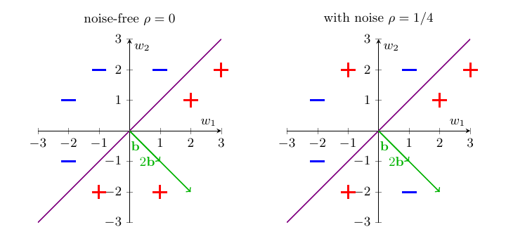
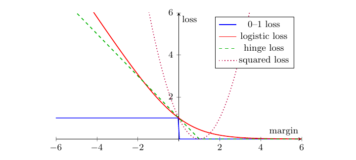

# 从符号泄露恢复 lattice signature 密钥：Halfspace Learning

> **Halfspace Learning for Lattice Signature Key Recovery from Signs**
> Marcus Brinkmann, Nicolai Kraus, Alexander May (Ruhr-University Bochum)
> CRYPTO 2026 · Lattice Cryptanalysis I (2026-08-17) · **L2 深入解析**
> [ePrint 2026/1366](https://eprint.iacr.org/2026/1366) · [Slides](https://iacr.org/submit/files/slides/2026/crypto/crypto2026/306/306_slides.pdf)

## §1 背景与问题设定

Lattice signature（HAWK、Falcon、ML-DSA）靠随机向量 $\mathbf{x}\in\mathbb{Z}^n$ 保护私钥。$\mathbf{x}$ 的坐标采自中心在 0 的近 Gaussian、幅值很小（HAWK 中 $|x_i|\le9$），却存放在 8 位 two's complement word 里：非负数高位全 0、负数高位全 1，于是**正负坐标之间有巨大的 Hamming weight 差**（$0\le x_i\le9$ 至多 3 个 1、负值至少 5 个 1）——这正是功耗侧信道最容易读出的信号。Guerreau–Rossi (TCHES 2024) 已用 SPA 从 HAWK 可靠读出每个 $\mathrm{sign}(x_i)$，但**符号泄露是否足以恢复私钥**被留作 open problem。

本文的答案是把它建模成学习论的经典问题：

> **Learning a Halfspace (LH)**：secret $\mathbf{b}\in\mathbb{Z}^n$ 按已知分布逐坐标采样；oracle 给出 LH-sample
> $$(\mathbf{w}_i,\,y_i),\qquad y_i=\begin{cases}\ \ \,\mathrm{sign}(\langle\mathbf{b},\mathbf{w}_i\rangle)&\text{概率 }1-\rho\\ -\mathrm{sign}(\langle\mathbf{b},\mathbf{w}_i\rangle)&\text{概率 }\rho\end{cases}$$
> （$\mathbf{w}_i$ 称 example、$y_i$ 称 label、$\rho\in[0,\tfrac12)$ 为噪声率），目标恢复 $\mathbf{b}$。

一条内在限制（简单代数）：$\mathrm{sign}\langle\mathbf{b},\mathbf{w}\rangle=\mathrm{sign}\langle c\mathbf{b},\mathbf{w}\rangle$ 对一切 $c>0$ 成立，故 LH-sample 只含 $\mathbf{b}$ 的**方向**信息——幅值必须靠密码场景中已知的 key 分布另行恢复（§3 rescaling）。

*图 1（论文 Fig. 2）：secret $\mathbf{b}=(1,-1)$ 定义的 decision boundary（紫线）把平面分成 label 为 $+$ / $-$ 的两个 halfspace。左：noise-free，存在把正负点完全分开的超平面；右：$\rho=1/4$ 的 label 被翻转，任何超平面都无法完全分开——LP 类方法就此失效，而最优分界线其实没变（§4 定理 3）。*

## §2 此前的成果

三个方案的既有攻击版图：**HAWK**——GR24 拿到 sign 泄露后尝试套 DDGR20 的 hints 框架，发现不经重大修改无法适用，key recovery 悬置。**Falcon**——GMRR22 把泄露转成 Hidden Parallelepiped 问题（Nguyen–Regev 算法）；Zhang–Lin–Yu–Wang (ZLYW23) 已把 sign 泄露建模为 LH，却又把它收紧成更受限的 Learning a Slice、用协方差谱分解求解：需要 **170k** 签名、成功率 25%；后续 LZY+25 改进到 **25k** 签名（每签名利用 4 个坐标）、仍 25%。**ML-DSA**——已知攻击 (LZS+20, DKM+25) 需要**显式泄露 randomness 的某一 bit**（远强于 sign 模型）、数百万签名，经 Integer-LWE + 最小二乘求解。共同的怪现象：学习论里研究了三十年的 LH 求解器文献（Blum et al. 1996 起）在密码侧被整体忽视。

## §3 本文的算法

### 三个方案统一归约到 LH

**HAWK（无噪声 LH）**：签名 $\mathbf{s}=\tfrac12(\mathbf{h}-\mathbf{w}_{\mathrm{sig}})$，其中 $\mathbf{h}=\mathrm{hash}(\mathsf{m})$、$\mathbf{B}\mathbf{w}_{\mathrm{sig}}=\mathbf{x}$（$\mathbf{B}\in\mathbb{Z}^{2n\times2n}$ 为私钥基）。于是 $\mathbf{B}(\mathbf{h}-2\mathbf{s})=\mathbf{x}$，对 $\mathbf{B}$ 的每一行 $\mathbf{b}$：

$$
\langle\mathbf{b},\,\mathbf{h}-2\mathbf{s}\rangle=x\quad(\mathbf{x}\text{ 的某坐标})\ \Longrightarrow\ (\mathbf{w},y)=(\mathbf{h}-2\mathbf{s},\ \mathrm{sign}(x)).
$$

**每个签名送出 $n$ 个 LH-sample**；由 ring 结构，一行 $\mathbf{b}$ 即可恢复整个 $\mathbf{B}$。

**Falcon（主动建模为带噪 LH——本文的巧手）**：签名 $\mathbf{s}=(\mathbf{h},\mathbf{0})-\mathbf{x}\mathbf{B}$，对 $\mathbf{B}^{-1}$ 的每列 $\mathbf{b}$ 有 $\langle\mathbf{b},(\mathbf{h},\mathbf{0})-\mathbf{s}\rangle=x$。把 $\mathbf{b}=(\mathbf{b}^{(1)},\mathbf{b}^{(2)})$、$\mathbf{s}=(\mathbf{s}^{(1)},\mathbf{s}^{(2)})$ 拆半：

$$
\langle\mathbf{b}^{(1)},\,\mathbf{h}-\mathbf{s}^{(1)}\rangle=x+\langle\mathbf{b}^{(2)},\mathbf{s}^{(2)}\rangle,
$$

$\mathbf{h}$ 的系数远大于 $\mathbf{s}^{(1)},\mathbf{s}^{(2)}$，于是把 $\langle\mathbf{b}^{(2)},\mathbf{s}^{(2)}\rangle$ 当噪声、取 $(\mathbf{w},y)=(\mathbf{h}-\mathbf{s}^{(1)},\mathrm{sign}(x))$——降一半维度换一点噪声；解出 $\mathbf{b}^{(1)}$ 后 $\mathbf{b}^{(2)}$ 可由公钥直接算出。

**ML-DSA**：签名坐标满足 $s=\langle\mathbf{b},\mathbf{h}\rangle+x$，故 $\langle(1,\mathbf{b}),(s,-\mathbf{h})\rangle=x$，即 $(\mathbf{w},y)=((s,-\mathbf{h}),\mathrm{sign}(x))$ 是 secret $(1,\mathbf{b})$ 的 LH-sample（只在小概率事件下产生非平凡样本，故签名需求量大）。

### 求解器与 rescaling

- **LP（noise-free）**：解线性不等式可行性问题 $\{\langle\mathbf{u},\mathbf{w}_i\rangle\ge0\text{ if }y_i=+1;\ <0\text{ if }y_i=-1\}$——一个错 label 即整体不可行。
- **Logistic Regression（一般情形，全文主力）**：最小化经验 logistic loss

$$
\hat{\mathbf{u}}=\arg\min_{\mathbf{u}}\sum_{i=1}^{m}\ln\big(1+e^{-\langle\mathbf{u},\mathbf{w}_i\rangle y_i}\big)/\ln2 .
$$

- **Rescaling（引理 5）**：解出 $\mathbf{u}^\star=c\mathbf{b}$ 后，由 key 分布方差 $\sigma^2$ 估计 $\hat c=\|\mathbf{u}^\star\|/(\sqrt n\,\sigma)$（一致方差估计量：$\frac1n\sum_i u_i^2\to c^2\sigma^2$），除回去、逐坐标取整；离散 key 还可用"取整后残差最小"启发式选 $c$。

## §4 为什么能 work（推导）

### 4.1 噪声动不了最优分界线（定理 3——全文的承重墙）

设 label 随机变量 $Y$，最优 0–1 loss 分类器是 Bayes 规则：

$$
f_\star(\mathbf{w})=\mathrm{sign}\Big(\Pr[Y=1\mid\mathbf{w}]-\tfrac12\Big),
\qquad
\Pr[Y=1\mid\mathbf{w}]=\begin{cases}1-\rho,&\langle\mathbf{b},\mathbf{w}\rangle\ge0\\ \rho,&\langle\mathbf{b},\mathbf{w}\rangle<0\end{cases}
$$

只要 $\rho<\tfrac12$，$\Pr[Y=1\mid\mathbf{w}]-\tfrac12$ 的符号与 $\langle\mathbf{b},\mathbf{w}\rangle$ 的符号完全一致，故 $f_\star=\mathrm{sign}\langle\mathbf{b},\cdot\rangle$。唯一性：若另一线性最优解 $\mathbf{u}^\star$ 不是 $\mathbf{b}$ 的正倍数，两个 halfspace 的对称差包含一个开锥；example 分布 full-dimensional support ⟹ 该锥有正概率，其中 $\mathbf{u}^\star$ 与 $\mathbf{b}$ 给出相反 label，与最优性矛盾。$\square$
**含义**：噪声只是均匀抬高错误率，**不移动 0–1 loss 的最小值点**——这就是攻击对 $\rho=35\%$ 仍然成立的结构原因，鲁棒性是定理而不是运气。

### 4.2 从 0–1 loss 到 logistic loss：两步松弛

0–1 loss 的精确最小化 NP-hard 且非凸，标准做法换凸 surrogate。以 margin $y\langle\mathbf{u},\mathbf{w}\rangle$ 为自变量：

*图 2（论文 Fig. 3）：0–1、logistic、hinge、squared loss。前三者中 logistic/hinge 紧贴 0–1 的形状且处处是其上界（最小化 surrogate ⟹ 压低 0–1）；squared loss 却**惩罚大的正 margin**——分类得越对罚得越重。这一格解释了为什么此前基于最小二乘/OLS 的密码攻击 (LZS+20, DKM+25) 需要显式 bit 泄露和更多样本：工具本身不适配 sign 信息。*

第二步松弛是有限样本：经验最小化 $\hat{\mathbf{u}}=\arg\min\sum_{i\le m}\ell(\mathbf{u},\mathbf{w}_i,y_i)$。学习论的一致性定理（Bartlett–Jordan–McAuliffe 等）保证：凸 surrogate 的经验最小化随 $m\to\infty$ 收敛到 0–1 意义下的最优分类器——即 4.1 中的 $c\mathbf{b}$。实验上 hinge 与 logistic 的样本需求相当，但 hinge 在密码维度上计算太贵，故全文选 logistic（即 LR）。

### 4.3 泄露模型为什么现实、样本为什么便宜

sign 就写在表示里：two's complement 中 $j\ge4$ 的任何一位都恰是符号位，Hamming weight 差也单调指示符号——SPA/DPA 的标准目标。样本便宜靠 ring 结构：HAWK/Falcon 每签名给整整 $n$ 个 LH-sample（对比 ZLYW23 每签名 1 个、LZY+25 每签名 4 个——这正是签名需求量 ×1700/×250 改进的直接来源）。Falcon 的带噪建模额外说明：**主动引入噪声换维度减半**在 LR 框架里是划算的，而在 LP/Slice 框架里根本不可表达。

### 4.4 end-to-end 攻击里的现实细节：symbreak

HAWK 验签要求 $\mathbf{w}_{\mathrm{sig}}$ 的第一个非零系数为正（symbreak 条件，防 $(\mathbf{s},\mathbf{h})\mapsto(-\mathbf{s}+2\mathbf{h},\mathbf{h})$ 的 weak forgery：$\mathbf{w}_{\mathrm{sig}}^\dagger=-\mathbf{w}_{\mathrm{sig}}$ 范数不变）。签名过程会按此条件**整体翻转** $\mathbf{w}_{\mathrm{sig}}$——若攻击者察觉不到翻转，收到的 label 全体反号、等价于随机。本文在参考实现上证明 symbreak 分支本身可被侧信道可靠识别，从而在 ChipWhisperer 平台完成首个自动 end-to-end HAWK key recovery（实测噪声 $\rho<3.5\%$，1,600 个签名）。

## §5 提升了多少

模拟泄露、128-bit 安全级、noise-free（论文 Table 1）：

| 方案 | 工作 | 签名数 | 求解器 | 时间 | 成功率 |
|---|---|---|---|---|---|
| HAWK | **本文（首个）** | **30** | LP | 10 min | 100% |
| Falcon | ZLYW23 | 170k | – | 30 min | 25% |
| | LZY+25 | 25k | – | – | 25% |
| | **本文** | **100** | LR | 10 s | 100% |
| ML-DSA | **本文（sign 模型下首个）** | 190k | LR | 5 s | 100% |

噪声容忍（同为惊人之处）：HAWK $\rho=35\%$ 仍 100% 成功（110k 签名、2 小时）；Falcon $\rho=15\%$ 成功率 20%（5.1k 签名）、$\rho=25\%$ 成功率 5%；ML-DSA $\rho=35\%$ 100%（9 千万签名）。诚实的界定：ML-DSA 的签名量与既有工作同数量级，本文的贡献是把泄露模型从"显式 bit"弱化到"sign"；Falcon 高噪声下成功率明显衰减；攻击不含 lattice reduction / enumeration，与 hybrid 方法结合是明显的增强方向。

## §6 局限与延伸阅读

对策只有一个词：masking——而 Falcon 与 HAWK 的规范明说**其 Gaussian sampler 尚无已知 masking 方案**,这正是本文最响的警报：sign 是最粗粒度的泄露，连它都足以在 30–100 个签名内破 128-bit 密钥。开放方向：与 DDGR20 hints/lattice 方法混合以进一步压样本量或提高 Falcon 噪声下成功率。

- 本文：[ePrint 2026/1366](https://eprint.iacr.org/2026/1366)，攻击代码与实测 trace：github.com/nicolkraus/halfspace
- Guerreau–Rossi, *A not so discrete sampler: power analysis attacks on HAWK*, TCHES 2024——泄露来源与被本文解决的 open problem
- Nguyen–Regev, *Learning a parallelepiped*, 2006——被 LH 路线取代的上一代几何学习攻击
