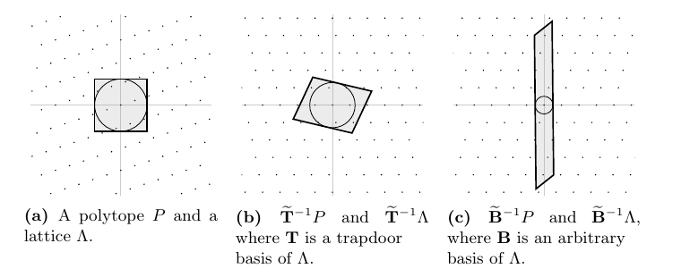
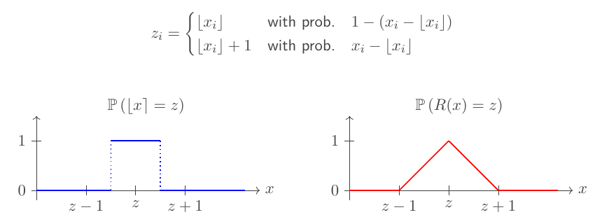
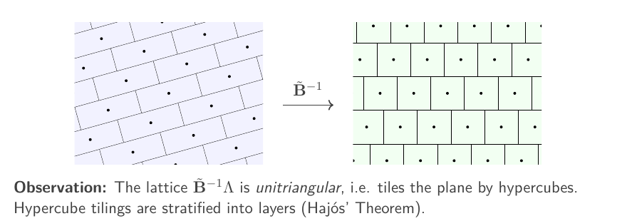

# 不用 discrete Gaussian 的 preimage sampleable functions

> **Preimage sampleable function families without discrete Gaussians**
> Eamonn W. Postlethwaite, Filip Trenkić (King's College London)
> CRYPTO 2026 · Lattice-Based Cryptography (2026-08-17) · **L2 深入解析**
> [ePrint 2026/1208](https://eprint.iacr.org/2026/1208) · [Slides](https://iacr.org/submit/files/slides/2026/crypto/crypto2026/553/553_slides.pdf)

## §1 背景与问题设定

GPV08 的 hash-and-sign 范式（FALCON 的理论原型）中，签名 = 用 trapdoor basis 对 $\Lambda_q^\perp(\mathbf{A})=\{\mathbf{y}\in\mathbb{Z}^m:\mathbf{A}\mathbf{y}=\mathbf{0}\bmod q\}$ 的 coset 做 discrete Gaussian sampling。Gaussian sampler 是整条流水线上实现最难、物理防护最贵的组件（论文引 FALCON/HAWK 的功耗分析攻击，TCHES 2022/2024 为动机）。本文的问题：

> 给定 polytope $P\subset\mathbb{R}^d$、lattice $\Lambda$ 与一组 trapdoor basis，能否在 $\mathrm{poly}(d)$ 时间采样出与 $U(P\cap\Lambda)$（或任意 coset 上的 $U(P\cap(\mathbf{y}_0+\Lambda))$）statistical distance 可忽略的分布，并由此构造 **CR-PSF**（collision resistant preimage sampleable functions：$\mathsf{TrapGen}/\mathsf{SampDom}/\mathsf{SampPre}$ 三元组，要求 (i) domain 采样的像接近均匀 (ii) 有 trapdoor 者可采 preimage 且分布正确 (iii) preimage 有 $\omega(\log n)$ min-entropy (iv) 无 trapdoor 抗碰撞——满足即得 sEUF-CMA 签名）？

记号（**重命名声明**：论文以 $(\mathbf{M},\mathbf{v})$ 记 facet 表示，为避免与期望迭代数 $M$、其他向量冲突，本文改记 facet 法向 $\boldsymbol{\eta}_i$、截距 $\rho_i$）：

| 符号 | 含义 |
|---|---|
| $P=\{\mathbf{y}:\langle\boldsymbol{\eta}_i,\mathbf{y}\rangle\le\rho_i,\ i\in[f]\}$ | polytope，$f$ 个 facets |
| $r(P;\mathbf{c})=\min_i\frac{\rho_i-\langle\boldsymbol{\eta}_i,\mathbf{c}\rangle}{\|\boldsymbol{\eta}_i\|}$，$r(P)=\max_{\mathbf{c}}r(P;\mathbf{c})$ | 以 $\mathbf{c}$ 为心的 inradius / inradius（$\mathbf{c}$ 到第 $i$ 张 hyperplane 的距离即分式） |
| $P'=(1+\delta)(P-\mathbf{c})+\mathbf{c}$，$P''=(1-\delta)(P-\mathbf{c})+\mathbf{c}$ | 膨胀 / 收缩，$\delta\in(0,1)$ |
| $\widetilde{\mathbf{B}},\ \|\widetilde{\mathbf{B}}\|,\ s_1(\cdot)$ | basis $\mathbf{B}$ 的 GSO、其最长列、最大 singular value |
| $\varepsilon=f\exp(-\delta^2 r(P;\mathbf{c})^2/2)$，$M$ | 贯穿全文的误差量、期望迭代次数上界 |
| $d$；$m,n,q$ | 维数；实例化时取 $d=m$，$\mathbf{A}\in\mathbb{Z}_q^{n\times m}$，$q$ 素数，$6n\log_2 q\le m\in O(n\log q)$ |

一个 paper-specific 概念：称 $P$ **effective**，若"判定 $\mathbf{y}\in P$"与"采样 $U(P)$"均可 $\mathrm{poly}(d)$ 完成。当 $f\notin\mathrm{poly}(d)$（如 $\ell_1$ ball 有 $f=2^d$）时 facet 表示不可计算，effective 是替代计算模型；且 effectiveness 在 dilation、平移、$\mathrm{GL}_d(\mathbb{R})$ 作用下保持（引理 7）——后文反复使用。另一条贯穿的对应：$q$-ary lattice 上的 $\ell_1$ norm = 编码里的 **Lee metric**。

## §2 此前的成果

**GPV08（Gaussian 基线）。** Klein sampler 在 $s\ge\|\widetilde{\mathbf{B}}\|\cdot\omega(\sqrt{\log d})$ 时对任意 lattice、任意中心采 discrete Gaussian，输出集中于半径 $s\sqrt d=\|\widetilde{\mathbf{B}}\|\cdot\omega(\sqrt{d\log d})$ 的球。这是效率标尺：本文最小 inradius 比它大约 $\sqrt{d/\log d}$ 倍——"去 Gaussian"目前要付参数代价。

**Kannan–Vempala（STOC 1997）。** 几何界的源头：inradius $\Omega(d\sqrt{\log f})$ 的 polytope 内近似均匀采**整点**，骨架即"膨胀 → 采实点 → randomised rounding → 拒绝"。搬进密码学差三口气：只处理 $\mathbb{Z}^d$；只保证**常数** statistical distance；$P'$ 用"逐 facet 外移常数"构造——不保 effective，对 $f=2^d$ 直接卡死。

**Plançon–Prest（PKC 2021）。** 最接近的前作："膨胀 + **确定性** rounding（RoundOff / NearestPlane）+ 拒绝"。两处硬伤都源自确定性：(1) 正确性要求每个 $\mathbf{z}\in P\cap\Lambda$ 的整块 $\mathbf{z}+\mathcal{P}_{1/2}(\widetilde{\mathbf{B}})$ 装进 $P'$，迫使每个 facet 至少外移 $\xi\ge\frac{\sqrt d}2\|\widetilde{\mathbf{B}}\|$；(2) 接受率只能启发式近似 $\mathrm{vol}(P)/\mathrm{vol}(P')$。他们留下 open question：能否从更小的 $P$ 采样？本文答案：inradius 要求小 $\sqrt{\log f}/\sqrt d$ 倍（$f\in\mathrm{poly}$ 时约省 $\sqrt{d/\log d}$），且接受率可证明。

**Lyubashevsky–Wichs（PKC 2015）。** 用 MP12 trapdoor 采"前半可自由指定分布、后半被 trapdoor 结构锁死"的两段式分布——**采不出**标准 polytope 上的均匀分布，preimage entropy 非最大。超立方体宽度这一项与本文持平（见 §5），但"均匀"做不到。

**FuLeeca → FuLeakage。** NIST 附加签名候选 FuLeeca 在 Lee metric 下给出 PSF，"preimage 不泄露 trapdoor"仅有启发式论证；CRYPTO 2024 的 FuLeakage 用 learning attack 击破。Hörmann–van Woerden 随即写道：如何把 GPV 框架适配到 Lee metric 仍是 open question。本文的 $\ell_1$ 实例化（preimage 均匀性**被证明**）正面回答。

空档汇总：需要**非启发式**、支持**任意 lattice 与 coset**、**可忽略 statistical distance**、polytope 尽量小、对指数多 facets 也能跑的均匀 sampler——此前无一方案同时满足。

## §3 本文的算法

**RNP（randomised nearest plane）**：输入 basis $\mathbf{B}$、目标 $\mathbf{x}\in\mathbb{R}^d$；采噪声 $\mathbf{e}\leftarrow U(\mathcal{P}_{1/2}(\widetilde{\mathbf{B}}))$（GSO 基本平行体上的均匀点），返回 $\mathbf{z}=\mathsf{NearestPlane}(\mathbf{B},\mathbf{x}+\mathbf{e})$。$\mathbf{B}=\mathbf{I}_d$ 时恰为 KV97 的逐坐标随机舍入。

**SampPoly**：输入 $(\mathbf{B},P,\mathbf{c},\delta)$；构造 $P'$（**整体 dilation**，非逐 facet 平移——由引理 7 保 effective，这一步拆掉 KV97 的第三口气）；循环 $\mathbf{x}\leftarrow U(P')$、$\mathbf{z}\leftarrow\mathsf{RNP}(\mathbf{B},\mathbf{x})$ 直到 $\mathbf{z}\in P$。

**通用 CR-PSF**（函数 $\mathbf{y}\mapsto\mathbf{A}\mathbf{y}\bmod q$，定义域 $P\cap\mathbb{Z}^m$）：

- $\mathsf{TrapGen}$：Alwen–Peikert 2011 生成统计接近均匀的 $\mathbf{A}$ 与 $\Lambda_q^\perp(\mathbf{A})$ 的 basis $\mathbf{T}$，$\|\widetilde{\mathbf{T}}\|\in O(\sqrt m)$；
- $\mathsf{SampDom}$：$\mathsf{SampPoly}(\mathbf{I}_m,P,\mathbf{c},\delta)$（hypercube 情形可直接均匀采整点）；
- $\mathsf{SampPre}(\mathbf{u})$：任取特解 $\mathbf{y}_0$ 使 $\mathbf{A}\mathbf{y}_0=\mathbf{u}$，返回 $\mathbf{y}_0+\mathsf{SampPoly}(\mathbf{T},P-\mathbf{y}_0,\mathbf{c}-\mathbf{y}_0,\delta)$，即在 $P\cap(\mathbf{y}_0+\Lambda)$ 上均匀采样。

抗碰撞假设：在差体 $(P-P)\cap\mathbb{Z}^m$ 中找 $\mathbf{A}\mathbf{z}=\mathbf{0}$ 的非零解难。$\ell_\infty/\ell_1$ ball 时 $P-P=2P$，由三角不等式这就是 $\mathrm{SIS}^{\infty}_{2w}/\mathrm{SIS}^{1}_{2w}$（$w$ 为 ball 宽度）。全程只用均匀 bits、$[0,1]$ 上的仿射变换与 NearestPlane——零 Gaussian。

*图 1（论文 Fig. 1）：核心几何原理。(a) polytope $P$ 与 lattice $\Lambda$；(b) 经 trapdoor basis 的 GSO 逆变换 $\widetilde{\mathbf{T}}^{-1}$ 后，$P$ 轻微变形、inradius 仍大，采样可行；(c) 任意坏基的 $\widetilde{\mathbf{B}}^{-1}$ 把 $P$ 压成薄片、inradius 过小，采样失效。**trapdoor 性 = 几何非退化性**。*

## §4 为什么能 work（推导）

先在 unitriangular lattice（$\widetilde{\mathbf{B}}=\mathbf{I}_d$，即 $\mathbb{Z}^d$ 及其推广）上把三件事证实——**逐点均匀性、接受率、statistical distance**——再用共轭等变性搬到任意 lattice。

### 4.1 命中概率的闭式：从示性函数到 tent

确定性舍入的失败根源：$\Pr[\lfloor\mathbf{x}\rceil=\mathbf{z}]$ 是 $\mathbf{x}$ 的示性函数（吸引域内 1、外 0），边界格点的吸引域被 $P'$ 切掉多少完全受局部几何摆布。随机舍入把它换成连续的 tent：对 $\mathbb{Z}^d$，第 $j$ 个坐标独立地

$$
\Pr[z_j\ \text{被选中}]=1-|x_j-z_j|\quad(|x_j-z_j|\le1),
$$

（直接计算：$z_j=\lfloor x_j+e_j\rceil$，$e_j\sim U[-\tfrac12,\tfrac12)$。）故（引理 11）

$$
\Pr[\mathsf{RNP}(\mathbf{B},\mathbf{x})=\mathbf{z}]=\prod_{j=1}^{d}\big(1-|x_j-z_j|\big),
$$

对 $\mathbf{x}\leftarrow U(P')$ 取平均即

$$
\Pr_{\mathbf{x}\leftarrow U(P')}[\mathsf{RNP}=\mathbf{z}]
=\frac{1}{\mathrm{vol}(P')}\int_{P'}\prod_j\big(1-|x_j-z_j|\big)\,d\mathbf{x}
=\frac{\Pr[\mathbf{z}+\mathbf{Y}\in P']}{\mathrm{vol}(P')},\tag{4.1}
$$

其中 $\mathbf{Y}$ 各坐标 iid、密度为 $[-1,1]$ 上的 tent $1-|\cdot|$。均匀性问题就此化为纯几何问题：**tent 噪声会不会把 $P$ 内的点推出 $P'$？**

*图 2（slides p.13）：左为 $\Pr[\lfloor x\rceil=z]$ 的阶梯示性函数（worst-case），右为 $\Pr[R(x)=z]$ 的 tent（平滑、可被集中不等式控制）。整套分析的可行性从这一步替换开始。*

### 4.2 每个 facet 一次 Azuma：$\varepsilon$ 的来历

膨胀给每个 facet 的余量：$P'$ 的截距为 $\rho_i'=\rho_i+\delta(\rho_i-\langle\boldsymbol{\eta}_i,\mathbf{c}\rangle)$（把 $P-\mathbf{c}$ 的截距 $\rho_i-\langle\boldsymbol{\eta}_i,\mathbf{c}\rangle$ 放大 $1+\delta$ 倍再平移回来），于是归一化余量

$$
\frac{\rho_i'-\rho_i}{\|\boldsymbol{\eta}_i\|}=\delta\cdot\frac{\rho_i-\langle\boldsymbol{\eta}_i,\mathbf{c}\rangle}{\|\boldsymbol{\eta}_i\|}\ \ge\ \delta\, r(P;\mathbf{c}).\tag{4.2}
$$

设 $\mathbf{z}\in P$，则 $\langle\boldsymbol{\eta}_i,\mathbf{z}\rangle\le\rho_i$，故 $\mathbf{z}+\mathbf{Y}\in P'$ 的充分条件是每个 $i$ 有 $\langle\boldsymbol{\eta}_i,\mathbf{Y}\rangle\le\rho_i'-\rho_i$。$\langle\boldsymbol{\eta}_i,\mathbf{Y}\rangle$ 的逐坐标部分和构成 martingale（每步增量以 $|\eta_{i,j}|$ 为界、条件期望 0——tent 密度对称），Azuma 不等式给出

$$
\Pr\big[\langle\boldsymbol{\eta}_i,\mathbf{Y}\rangle\ge\rho_i'-\rho_i\big]
\le\exp\Big(-\frac{(\rho_i'-\rho_i)^2}{2\|\boldsymbol{\eta}_i\|^2}\Big)
\overset{(4.2)}{\le}e^{-\delta^2 r(P;\mathbf{c})^2/2}.
$$

对 $f$ 个 facets 做 union bound：

$$
\Pr[\mathbf{z}+\mathbf{Y}\in P']\ \ge\ 1-\varepsilon,\qquad \varepsilon=f\cdot e^{-\delta^2 r(P;\mathbf{c})^2/2}.\tag{4.3}
$$

指数里是（膨胀比例 × inradius）²、系数是 facet 数——这一个式子解释了全文所有参数张力：facets 指数多的 polytope（$f=2^m$）要多付 $\sqrt{\log f}=\sqrt m$ 的 inradius，"逼近球好且 facets 少"的 polytope 是 open question 里的圣杯。

### 4.3 三明治 ⟹ statistical distance

结合 (4.1)(4.3) 与平凡上界 $\Pr[\mathbf{z}+\mathbf{Y}\in P']\le1$：

$$
\frac{1-\varepsilon}{\mathrm{vol}(P')}\ \le\ \Pr[\mathsf{RNP}=\mathbf{z}]\ \le\ \frac{1}{\mathrm{vol}(P')}\qquad\forall\,\mathbf{z}\in P\cap\Lambda.
$$

条件在"接受"上：分子 $\in[1-\varepsilon,1]/\mathrm{vol}(P')$，分母 $=\sum_{\mathbf{z}'\in P\cap\Lambda}\Pr[\mathsf{RNP}=\mathbf{z}']\in[1-\varepsilon,1]\cdot|P\cap\Lambda|/\mathrm{vol}(P')$，故输出分布逐点满足

$$
\Pr[\text{输出}=\mathbf{z}]\in\Big[1-\varepsilon,\ \tfrac1{1-\varepsilon}\Big]\cdot\frac{1}{|P\cap\Lambda|}
\ \Longrightarrow\
\Delta\big(\mathsf{SampPoly},\,U(P\cap\Lambda)\big)\le\frac12\cdot\frac{\varepsilon}{1-\varepsilon}.\tag{4.4}
$$

（每点偏差 $\le\frac{\varepsilon}{(1-\varepsilon)|P\cap\Lambda|}$，求和再乘 $\tfrac12$。）KV97 的"常数 statistical distance"就此升级为显式界：$\varepsilon$ 可忽略即可。

### 4.4 接受率与格点计数（对偶论证）

用收缩体 $P''$。对 $\mathbf{x}\in P''$，可证 $\mathsf{RNP}(\mathbf{B},\mathbf{x})=\mathbf{x}+\mathbf{Y}$（同样的 martingale 结构，NearestPlane 递归使求和顺序倒转），(4.2)(4.3) 的对称论证给出 $\Pr[\mathbf{x}+\mathbf{Y}\in P]\ge1-\varepsilon$。两步走：

**(i) 格点下界。** 从 $U(P'')$ 出发，每个 $\mathbf{z}$ 至多分得 $1/\mathrm{vol}(P'')$（同 4.1 上界），故

$$
1-\varepsilon\ \le\ \Pr_{\mathbf{x}\leftarrow U(P'')}[\mathsf{RNP}\in P]\ \le\ \frac{|P\cap\Lambda|}{\mathrm{vol}(P'')}
\ \Longrightarrow\
|P\cap\Lambda|\ \ge\ (1-\varepsilon)\,\mathrm{vol}(P'').\tag{4.5}
$$

**(ii) 接受率。** 从 $U(P')$ 出发，用 (4.1)(4.3) 的下界逐点求和，再代入 (4.5)：

$$
\Pr_{\mathbf{x}\leftarrow U(P')}[\mathsf{RNP}\in P]\ \ge\ \frac{|P\cap\Lambda|(1-\varepsilon)}{\mathrm{vol}(P')}\ \ge\ (1-\varepsilon)^2\Big(\frac{1-\delta}{1+\delta}\Big)^{d}
\ \Longrightarrow\
M\le\frac{1}{(1-\varepsilon)^2}\Big(\frac{1+\delta}{1-\delta}\Big)^{d}.
$$

这就是对 PP21 启发式体积比的**可证明**替代。(4.5) 与其反向（同法可得 $|P\cap\Lambda|\le M(1-\varepsilon)\mathrm{vol}(P)$）合成一个独立有趣的副产品——**格点计数定理**（定理 4）：任意 polytope 与任意 unitriangular lattice 满足 $\mathrm{vol}(P)$ 与 $|P\cap\Lambda|$ 至多差 $M(1-\varepsilon)$ 倍。§4.6 的 min-entropy 靠它兑现。

### 4.5 调 $\delta$：唯一的张力

$\big(\tfrac{1+\delta}{1-\delta}\big)^d\approx e^{2\delta d}$，故 $\delta\in O(\log d/d)\Rightarrow M\in\mathrm{poly}(d)$、$\delta\in O(1/d)\Rightarrow M\in O(1)$；但 $\delta$ 变小使 $\varepsilon=fe^{-\delta^2r^2/2}$ 变大——张力全在 $\delta$。解平衡点（以 $f\in\mathrm{poly}(d)$、$\delta=C\log d/d$ 代入）：

$$
\frac{\delta^2r^2}{2}-\log f\in\omega(\log d)
\iff \frac{C^2(\log d)^2r^2}{2d^2}\in\omega(\log d)
\iff r\in\omega\Big(\frac{d}{\sqrt{\log d}}\Big),
$$

一般情形得推论 2：可忽略 statistical distance 的多项式时间采样要求 $r(P)\ge\|\widetilde{\mathbf{B}}\|\cdot\omega(d/\sqrt{\log d})$（$f\in\mathrm{poly}(d)$）或 $\ge\|\widetilde{\mathbf{B}}\|\cdot\Omega(d\sqrt{\log f}/\log d)$（$f\notin\mathrm{poly}(d)$）；再要 $M\in O(1)$ 则加强为 $\omega(d\sqrt{\log d})$ 与 $\Omega(d\sqrt{\log f})$。

### 4.6 从 $\mathbb{Z}^d$ 到任意 lattice：$\widetilde{\mathbf{B}}^{-1}$ 而非 $\mathbf{B}^{-1}$

自然想法是变换 $\mathbf{B}^{-1}\Lambda=\mathbb{Z}^d$，但 polytope 跟着变形，inradius 缩小 $s_1(\mathbf{B})$ 倍——可生成的 trapdoor 只有 $s_1(\mathbf{T})\in O(m)$，太贵。关键观察：改用 $\widetilde{\mathbf{B}}^{-1}$。变换后 $\widetilde{\mathbf{B}}^{-1}\Lambda$ 一般不是 $\mathbb{Z}^d$，但必是 **unitriangular lattice**（$\widetilde{\mathbf{B}}^{-1}\mathbf{B}$ 是对角线全 1 的上三角阵，GSO 定义直接给出）；由 Hajós 定理这类 lattice 恰是单位超立方体铺砌，RNP 的逐层递归在其上保持 martingale 性质，4.1–4.5 全部照用——推广到 unitriangular 恰好够用、不多付一分。

*图 3（slides p.19）：左为一般 lattice 的基本平行体铺砌，右为经 $\widetilde{\mathbf{B}}^{-1}$ 后的单位超立方体铺砌（unitriangular，Hajós 分层结构）。RNP 需要的正是右边这种"逐层可随机舍入"的几何。*

形式化：SampPoly 对 $\mathrm{GL}_d(\mathbb{R})$ 共轭等变，$\mathsf{SampPoly}(\mathbf{B},P,\mathbf{c},\delta)\sim\mathbf{S}^{-1}\mathsf{SampPoly}(\mathbf{S}\mathbf{B},\mathbf{S}P,\mathbf{S}\mathbf{c},\delta)$；取 $\mathbf{S}=\widetilde{\mathbf{B}}^{-1}$，inradius 损失由

$$
r(\mathbf{S}P)\ \ge\ \frac{r(P)}{s_1(\mathbf{S}^{-1})}=\frac{r(P)}{s_1(\widetilde{\mathbf{B}})}=\frac{r(P)}{\|\widetilde{\mathbf{B}}\|}
$$

控制（线性映射把半径 $r$ 的球送进含半径 $r/s_1(\mathbf{S}^{-1})$ 球的椭球；$\widetilde{\mathbf{B}}$ 列正交故 $s_1(\widetilde{\mathbf{B}})=\|\widetilde{\mathbf{B}}\|$）。收益：AP11 trapdoor 给 $\|\widetilde{\mathbf{T}}\|\in O(\sqrt m)$，对比 $s_1(\mathbf{T})\in O(m)$——**GSO 一换省下整个 $\sqrt m$**，全文杠杆最大的一步。图 1 的 (b)(c) 即此。coset 采样只需先平移 $-\mathbf{y}_0$ 再加回。

### 4.7 组装成 CR-PSF：剩下两条腿

定理 6 在 $P\subseteq(-q/2,q/2)^m$、$\mathrm{vol}(P)/q^n\in2^{\omega(\log n)}$、$r(P)\in\omega(m^{3/2}/\sqrt{\log m})\cap\Omega(m^{3/2}\sqrt{\log f}/\log m)$（即 $\|\widetilde{\mathbf{T}}\|=O(\sqrt m)$ 代入 4.5）下逐条验证 CR-PSF：

**像的均匀性（leftover hash lemma）。** 设点集 $V\subset\mathbb{Z}^m$ 两两 mod $q$ 不同余（$P\subseteq(-q/2,q/2)^m$ 保证 $V=P\cap\mathbb{Z}^m$ 如此）。先备一条简单事实：$q$ 素、$\mathbf{g}\ne\mathbf{g}'\in V$ 时 $\mathbf{g}-\mathbf{g}'$ 有 mod $q$ 可逆坐标，故对均匀 $\mathbf{A}$，$\mathbf{A}(\mathbf{g}-\mathbf{g}')$ 均匀于 $\mathbb{Z}_q^n$，$\Pr[\mathbf{A}\mathbf{g}=\mathbf{A}\mathbf{g}']=q^{-n}$。于是碰撞概率

$$
\Pr_{\mathbf{g},\mathbf{g}'\leftarrow U(V)}[\mathbf{A}\mathbf{g}=\mathbf{A}\mathbf{g}']=\frac1{|V|}+\Big(1-\frac1{|V|}\Big)q^{-n}
\ \Longrightarrow\
\Delta\big((\mathbf{A},\mathbf{A}\mathbf{g}),(\mathbf{A},U(\mathbb{Z}_q^n))\big)\le\frac12\sqrt{\frac{q^n-1}{|V|}},
$$

而格点计数（4.4 节）给 $|V|\ge\mathrm{vol}(P)/\mathrm{poly}$，配合 $\mathrm{vol}(P)/q^n\in2^{\omega(\log n)}$ 即可忽略。

**min-entropy。** 每个 coset 的点数 $|P\cap(\mathbf{y}_0+\Lambda)|\ge\frac{\mathrm{vol}(P)}{M(1-\varepsilon)\,\mathrm{vol}(\Lambda)}\in2^{\omega(\log n)}$（$\mathrm{vol}(\Lambda)\le q^n$），故 preimage 分布 min-entropy $\in\omega(\log n)$。至此 (i)–(iv) 闭合，步步显式。

## §5 提升了多少

| 方案 | 输出分布 | 关键要求 | 分析 |
|---|---|---|---|
| GPV08 (Klein) | discrete Gaussian | 集中半径 $\|\widetilde{\mathbf{B}}\|\omega(\sqrt{d\log d})$，比本文最小 $r(P)$ 短 $\sqrt{d/\log d}$ | 可证明；需 Gaussian，难 mask |
| PP21 | polytope 均匀 | facet 外移 $\xi\ge\frac{\sqrt d}2\|\widetilde{\mathbf{B}}\|$ | 接受率启发式 |
| LW15 | 受限分布 | hypercube 宽度与本文 $M\in O(1)$ 档持平 | 非均匀，entropy 非最大 |
| **本文** | **polytope 均匀** | **$\xi=\delta r\in\|\widetilde{\mathbf{B}}\|\omega(\sqrt{\log d})$（$f\in\mathrm{poly}$）** | **statistical distance 与迭代数全可证明** |

三种实例化的 SIS norm 界 $\beta$（论文 Table 2；左 $M\in\mathrm{poly}(m)$ / 右 $M\in O(1)$）：

| $P$ | facets $f$ | norm | $\beta$ (poly) | $\beta$ ($O(1)$) |
|---|---|---|---|---|
| orthoplex $B^1_m(w)$ | $2^m$ | $\ell_1$ | $\Omega(m^{5/2}/\log m)$ | $\Omega(m^{5/2})$ |
| $\mathcal{H}_m(w)=B^1_m(w\sqrt m)\cap B^\infty_m(w)$ | $2^m+2m$ | $\ell_1$ / $\ell_2$ | $\Omega(m^{5/2}/\log m)$ / $\Omega(m^{9/4}/\log m)$ | $\Omega(m^{5/2})$ / $\Omega(m^{9/4})$ |
| **hypercube $B^\infty_m(w)$** | $2m$ | $\ell_\infty$ | $\omega(m^{3/2}/\sqrt{\log m})$ | $\omega(m^{3/2}\sqrt{\log m})$ |

三个实例各司其职：hypercube 参数最好（且 SampDom 可直接采整点）；orthoplex 参数最差但意义最大——它就是 Lee metric 情形，回答 HvW24 的 open question，指数 facets 正是"effective + 整体 dilation"机制的用武之地；$\mathcal{H}_m$（取自 BBRS24）逼近 Euclidean ball（$B^2_m(w)\subset\mathcal{H}_m(w)\subset B^2_m(w\sqrt[4]m)$），同时给出 $\mathrm{SIS}^1$（$\beta=2w\sqrt m$）与 $\mathrm{SIS}^2$（$\beta=2w\sqrt[4]m$）两条归约，展示框架通用性。论文用 norm 不等式加体积启发式给相对困难序：$\mathcal{H}_m$ 的 $\mathrm{SIS}^2$ 不难于 hypercube 的 $\mathrm{SIS}^\infty$，后者（启发式）不难于 orthoplex 的 $\mathrm{SIS}^1$——hypercube 是框架内当前最优。

诚实核算：所有 $\beta$ 都**明显差于** Gaussian 基线（slides 直言距 GPV 的 $\beta=\omega(m\sqrt{\log m})$ 仍远，摘要写明参数更差）；换来的是最大 entropy 的均匀 preimage、只用均匀 bits 的实现、全链条可证明——FuLeakage 已演示过在 preimage 分布上赌启发式的代价。

## §6 局限与延伸阅读

Open questions 恰好对应 (4.3) 的两个旋钮：**(1) 更好的 polytope**——找 $f\in\mathrm{poly}(d)$、内外半径接近的 Euclidean ball 好逼近（等周不等式意义下的好解），$\mathrm{SIS}^2$ 归约即刻收紧，框架即插即用；**(2) 更紧的 inradius 条件**——整数格上 KV97 条件只在 $\sqrt{\log f}$ 因子内是紧的，去掉它对 $f\notin\mathrm{poly}$ 的实例收益最大。另注意本文是渐近构造，无具体参数与实现，与 FALCON 的实际对比（含 masking 开销是否真省）完全开放。

- 本文：[ePrint 2026/1208](https://eprint.iacr.org/2026/1208)
- GPV 框架原文：[ePrint 2007/432](https://eprint.iacr.org/2007/432)
- Plançon–Prest, *Exact lattice sampling from non-Gaussian distributions*, PKC 2021——被超越的直接前作，对照读最见 randomised rounding 之效
- Bambury–Beguinet–Ricosset–Sageloli, *Polytopes in the Fiat–Shamir with aborts paradigm*, CRYPTO 2024——$\mathcal{H}_m$ 出处，另一条去 Gaussian 路线
- Hörmann–van Woerden, *FuLeakage*, CRYPTO 2024——启发式论证翻车实录，反衬可证明性
